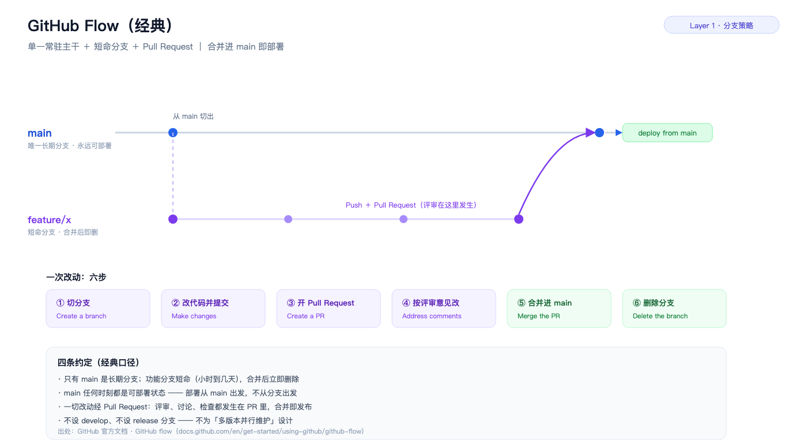
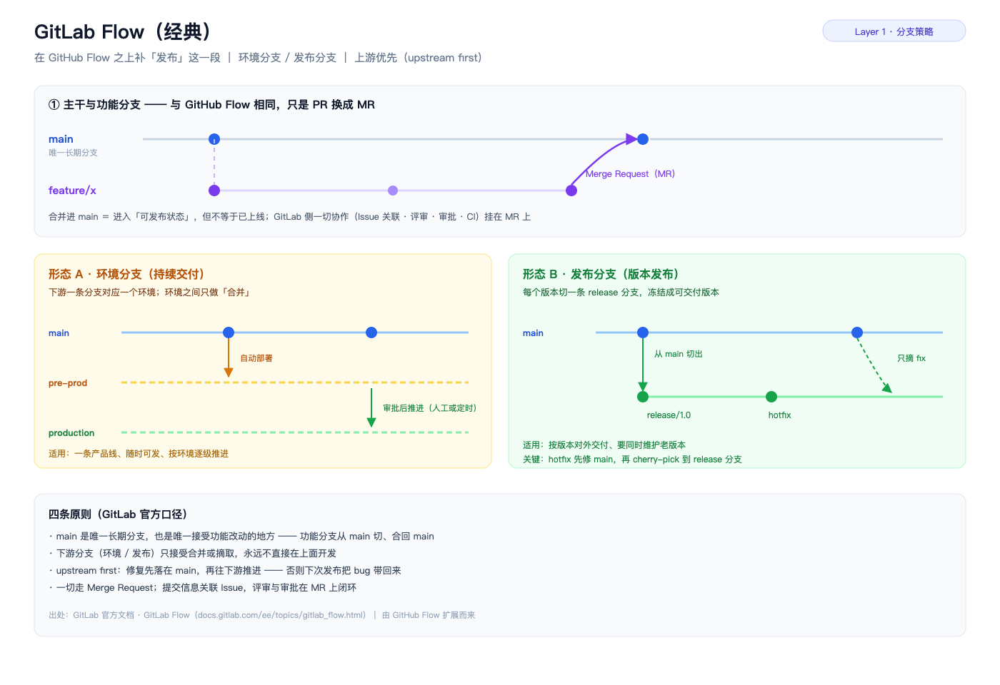
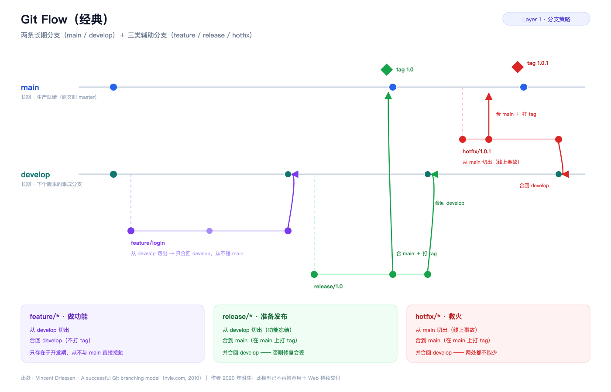
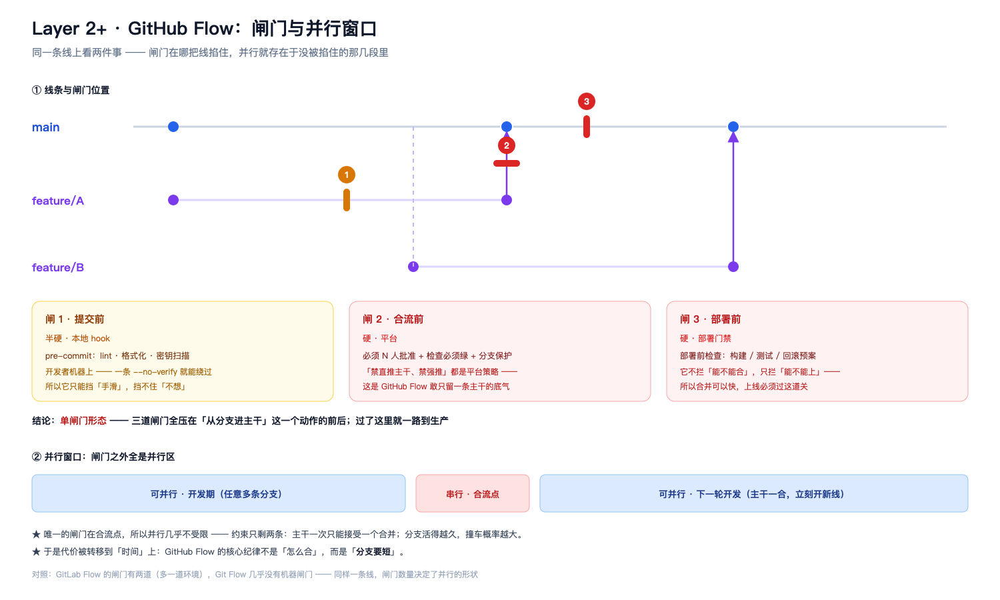
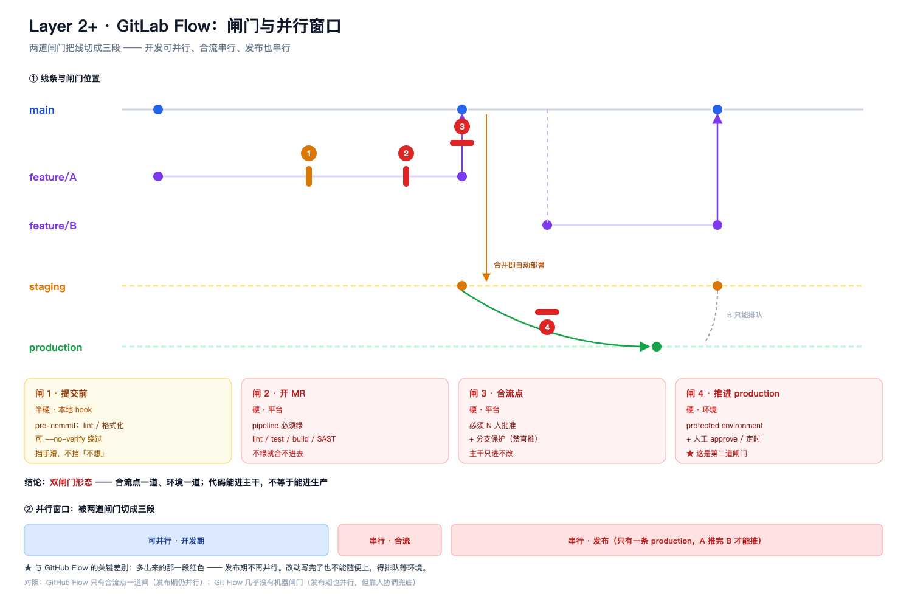
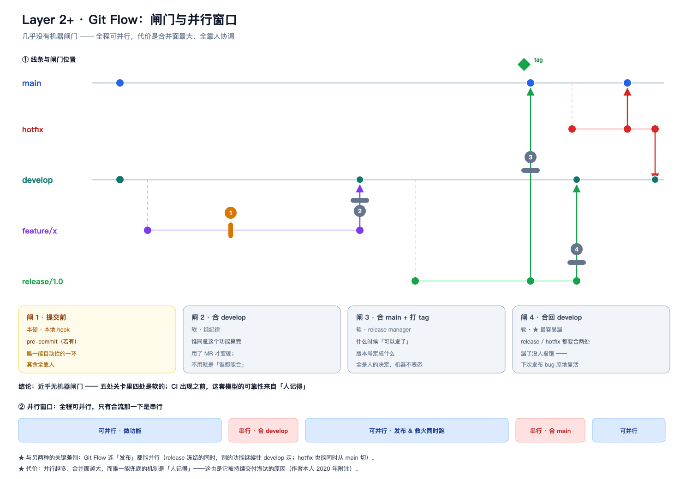
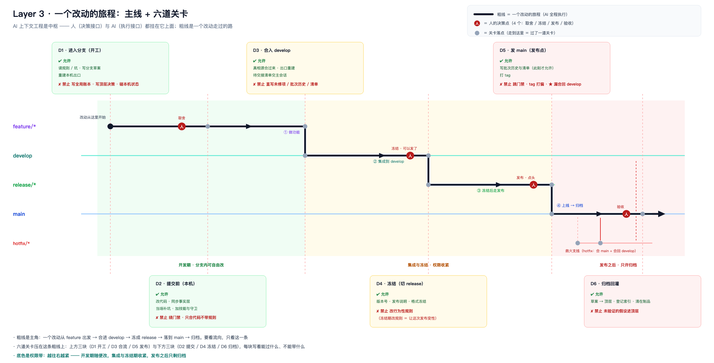
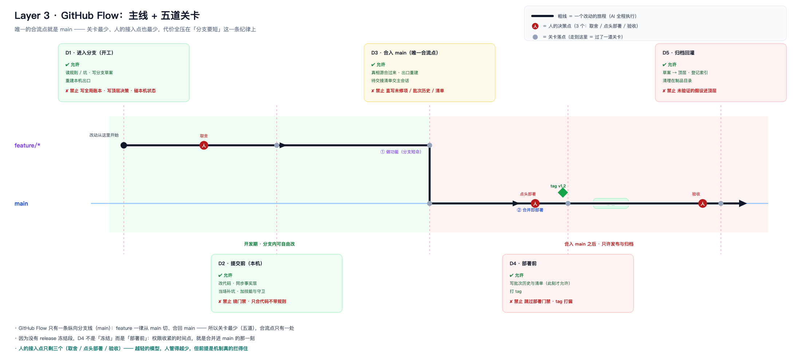
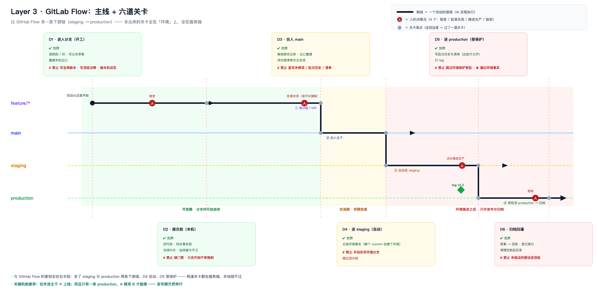

# AI 上下文工程体系架构图 · 分层推进

> **推进方式**：不做一次性全景图，**按层推进**——每层先「表达」（讲清是什么，不动笔），落定后再「出图」（只画这一层）。**层序由人定。**
> **口径纪律**：讲经典模式时**只讲经典口径 + 出处**，不掺本项目落地实现；落地实现留给后面的层。
> **当前进度**：**L1 / L2 / L3 已完成**（分支策略 · 闸门与并行 · 主线与关卡，共 9 张图）。**L4 待指令。**

---

## 1. 为什么第一层是 Git（Layer 1 的注脚）

**结论：AI 时代绕不开的不是「分支拓扑」，而是变更的隔离、审阅、合流这三件硬需求；分支只是它们当前的实现形式。**

这三个需求跟「改动是谁写的」无关——未完成的改动不能污染主线、每个变更要有可讨论的锚点、任何历史状态要能定位与回退。人写代码需要，AI 写代码更需要：AI 改变的是**生产端**（产量↑、并发↑），方向是**加剧**对隔离与合流的依赖。

| 维度 | 人写代码时代 | AI 时代 | 结论 |
|:--|:--|:--|:--|
| 分支拓扑 | main + develop + release + hotfix | main 独大 + 短命分支 | **在简化** |
| 分支寿命 | 天到周 | 分钟到小时 | **在缩短** |
| 变更隔离 | 一功能一分支 | 一分支 / 一工作区 / 一沙箱 | **更刚需**（并发度上去了） |
| 审阅点 | PR / MR | 同（而且成了唯一瓶颈） | **重心转移** |
| 发布锚点 | release 分支 + tag | tag + 环境分支 | **保留** |

三条判断：

1. **在退场的是「分支模型的复杂度」，不是分支策略本身** —— Git Flow 那套多长期分支失宠，是因为发布节奏从「批次」变成「随时」，不是因为它逻辑错。
2. **在上升的是「变更单元的大小」** —— AI 把写代码变成秒级，唯一没提速的是人的评审注意力；所以热起来的不是新分支模型，而是 stacked PR、小步提交、自动 review，全都在解决「怎么让每个变更单元小到人能高效看完」。
3. **绕得开「分支」这个词，绕不开「版本图 + 隔离 + 合流」这件事** —— 若将来 AI 的工作单位变成沙箱快照或 patch 队列，「分支」会变淡，但底层仍是同一张有向版本图，只是换了名字。

---

## 2. Layer 1 · 三种经典分支模型

### 2.1 GitHub Flow（个人仓库 · GitHub）

- **只有 main 是长期分支**；功能分支短命，合并后立即删除
- **main 任何时刻都可部署** —— 部署从 main 出发，不从分支出发
- 官方六步：切分支 → 改代码并提交 → 开 Pull Request → 按评审意见改 → 合并 → 删除分支
- **不设 develop、不设 release 分支** —— 不为「多版本并行维护」设计

> 出处：GitHub 官方文档 · GitHub flow（`docs.github.com/en/get-started/using-github/github-flow`）

### 2.2 GitLab Flow（公司仓库 · GitLab）

它是**在 GitHub Flow 之上补「发布」这一段**；主干与功能分支那部分相同，只是 PR 换成 MR。多出来的是**下游接法**，官方两条形态：

- **形态 A · 环境分支**（持续交付）：一条下游分支对应一个环境（main → pre-prod → production），环境之间**只做合并**，逐级推进
- **形态 B · 发布分支**（版本发布）：每个版本切一条 `release/x.y` 冻结交付；**hotfix 必须先修 main，再 cherry-pick 到 release 分支**

两种形态共同的地基是 **upstream first**：只有 main 接受功能改动，下游分支只被合并、**从不被直接改**。违反了，生产上修的 bug 会在下一次发布时复活。

> 出处：GitLab 官方文档 · GitLab Flow（`docs.gitlab.com/ee/topics/gitlab_flow.html`）

### 2.3 Git Flow（经典重模型）

**两条长期分支 + 三类辅助分支**：

| 分支 | 从哪切 | 合到哪 |
|:--|:--|:--|
| `feature/*` | develop | **只回 develop**（从不碰 main） |
| `release/*` | develop | main（**在 main 上打 tag**）＋ 合回 develop |
| `hotfix/*` | main | main（**在 main 上打 tag**）＋ 合回 develop |

- main 只放生产就绪、已发布的代码（原文叫 `master`）
- develop 是「下一个版本的集成分支」，所有功能汇到这里
- **`release/*` 与 `hotfix/*` 都必须合两处** —— 漏掉「合回 develop」= 把修复弄丢

> 出处：Vincent Driessen · A successful Git branching model（nvie.com, 2010）｜作者 2020 年附注：**此模型已不再推荐用于 Web 持续交付**

---

## 3. Layer 1 小结：三者是一条演化线

| 模型 | 常驻分支 | 发布锚定 | 适用 |
|:--|:--|:--|:--|
| **Git Flow** | main + develop | release 分支 + tag 打 main | 多版本并行维护（盒装 / 长期支持） |
| **GitHub Flow** | 仅 main | 合并即部署（无显式发布段） | 单一产品线、随时可发 |
| **GitLab Flow** | main（+ 环境 / 发布分支） | tag + 环境分支 / release 分支 | 有明确环境阶段或按版本对外交付 |

一句话：**GitHub Flow 到 main 就结束了；GitLab Flow 承认「合并之后还有环境要过」；Git Flow 则是把「开发中」和「已发布」彻底拆成两条并行主线** —— 重、稳、但合流的账要一笔笔算清。

---

## 4. Layer 2 · 闸门与并行（每种策略一张，长在 L1 的线条上）

**层定义**：L1 是静态拓扑（分支长什么样），**L2 是把 L1 的线条跑起来**——一次改动沿着这些线走到哪、主干什么时候前进、每一步由什么兜底。**三张图各自沿用自己那张 L1 的分支线条，不混排。**

**每张图的读法**：上半部是分支线条（＝L1）＋ 闸门位置，下半部是每道闸门「拦什么、放什么」，再下面是**并行窗口**——被闸门切出来的几段里，哪几段能同时开线。

> **闸门就是「每一步由什么兜底」的落点**。没闸门的那几步不是不重要，是它们只靠纪律（图上的软色块）——所以「流」和「闸门」本来就是同一张图的两面，本层只出一张。

### 4.1 GitHub Flow：闸门与并行窗口

- **主干从不等**：A 还没合进 main，B 已经开工 —— 合流点只有一个（main），重头戏是**主干永远可部署**
- **单闸门形态**：三道闸门（提交前 / 合流前 / 部署前）全压在「从分支进主干」这一个动作的前后
- 因此**并行几乎不受限**：开发期想开几条线开几条线；代价转移到时间上 —— 核心纪律不是「怎么合」，而是**分支要短**
- 闸门用料：审阅 / 合流 / 部署是硬的（平台与门禁），提交是半硬（本地 hook，`--no-verify` 能绕）

### 4.2 GitLab Flow：闸门与并行窗口

- **合流进主干 ≠ 上线**：还要穿过 staging → production 这两段
- **双闸门形态**：合流点一道、环境再一道 —— 两道闸门把线切成三段：**开发可并行 / 合流串行 / 发布也串行**
- **环境是串行闸门**：只有一条 production，A 推进时 B 只能排队
- 闸门几乎全在服务端：开 MR（pipeline 必须绿）→ 审批 + 合流（N 人批准 + 分支保护）→ 进 staging（自动）→ 进 production（protected environment + 审批）

### 4.3 Git Flow：闸门与并行窗口

- 一次发布至少**两次合流**：feature → develop，release → main（打 tag）+ 合回 develop
- **三类辅助分支可以同时存在**（做功能 / 冻结发布 / 线上救火），都汇到 develop —— 并行度靠「分支多」换来，合并面最大
- **近乎无机器闸门**：五处关卡里四处是软的；CI 出现之前，靠评审习惯 + release manager 的人工协调
- **全程可并行** —— 连发布都能并行（release 冻结的同时别的功能继续往 develop 走，hotfix 也能同时从 main 切）
- 最容易漏的一步：**合回 develop** —— 漏了就等于把修复丢掉

### 4.4 横向看：强制力从哪来、并行的代价在哪

**判断一句话：这条规则能不能被一次 `--no-verify` 或一次网页点击绕过？** 三种模型对这个问题的假设完全不同：

| 策略 | 强制力主要来自 | 机器拦得住吗 |
|:--|:--|:--|
| **GitHub Flow** | 平台服务端（分支保护 + 必须审批 + 检查必须绿） | 拦得住 —— 所以敢只留一条主干 |
| **GitLab Flow** | 平台 + 环境自身（protected environment） | 拦得住，且环境上再拦一道 |
| **Git Flow** | 纪律 + release manager 人工协调 | 几乎全靠「人记得」——它诞生在 CI 之前 |

**并行真正的代价在共享面**：每条线各占一份工作区（隔离），但远端仓库 / CI / 发布出口 / 账本类文件是共享的，**离共享面越近越要串行**。

| 污染路径 | 症状 | 对策 |
|:--|:--|:--|
| 本地构建污染 | 本地全过，CI 挂了 | 把 CI 的干净检出当作唯一可信验证 |
| 共享文件撞车 | 每次合都在同一处打架 | 同一时间只让一条线写「账本类」文件 |
| 晚合并放大冲突 | 分支放久了，冲突成倍长 | 分支寿命压短；定期把主干合回分支 |

---

## 5. Layer 3 · 主线 + 关卡（每种策略一张）

**层定义**：L1 是分支形状，L2 是流，**L3 是"这条流上，上下文工程允许什么、禁止什么"**。

**三个概念合并成一个**：AI 上下文工程是中枢，**人是它的「决策接口」，AI 是它的「执行接口」**——两者不单占泳道，只以标记出现在主线上（人的四个决策点、AI 的全程执行）。

**画法**：一条加粗的主路径（一个改动的旅程）从 feature 出发、沿线跳到主干/下游，**关卡压在这条粗线上**，标牌上下交错。底色是权限带，越往右越紧。

**图例**：大圆点（红、内书「人」）＝ **人的决策点**；小圆点（灰）＝ **关卡落点**（改动走到这里 ＝ 过了一道关卡）。两者不要混数——图上小圆点数量远多于决策点。

### 5.1 Git Flow（实验版 · 最复杂）

主路径：feature → develop → release → main，**六道关卡全压在两次合流上**。

**六道防线**（图上 D1–D6）：

| 防线 | ✔ 允许（可直写） | ✘ 禁止（不许碰） |
|:--|:--|:--|
| **D1 进入分支（开工）** | 读入口 / 规范 / 坑 · 在分支在制品目录写草案 · 重建本机出口 | 写全局账本 · 写顶层决策目录 · 碰本机状态 |
| **D2 提交前（本机）** | 改代码 · 同步事实层 · 当场补坑 · 加技能与守卫 | 绕门禁（`--no-verify`）· **只合代码不带规则** |
| **D3 合入 develop** | 真相源随分支合过来 · 出口重建 · 待交接清单交主会话 | **直接写未修项 / 批次历史 / 目录清单** |
| **D4 冻结（切 release）** | 版本号 · 发布说明 · 格式冻结 | **改行为性规则**（冻结期改规则＝发布变性） |
| **D5 发 main（发布点）** | 写批次历史与清单（**此时才允许**）· 打 tag | 跳过部署门禁 · tag 打偏 · **★ 漏合回 develop** |
| **D6 归档回灌** | 草案 → 顶层（RFC / 知识库）· 登记索引 · 更新蓝图 · 清在制品 | **未验证的假设进顶层** |

**防线之间是权限带**（底色即语义）：开发期最松（分支内自由改）→ 集成与冻结期收紧 → **发布之后只剩归档**。

**三处 ★ 是 Git Flow 特有的漏点**：D3 账本不许直写 · D5 校验合回 develop · D6 未验证不许进顶层。

### 5.2 GitHub Flow（最轻）

主路径：feature → main，**只有一个合流点，所以只有五道关卡**。因为没有 release 冻结段，D4 从「冻结」换成「部署前」——**权限收紧的时间点就是合并进 main 的那一刻**。

人的接入点只剩**三个**（取舍 / 点头部署 / 验收）：越轻的模型，人管得越少，但前提是机制真的拦得住。

### 5.3 GitLab Flow（多一条下游链）

主路径：feature → main → staging → production，**六道关卡里有两道在环境上**（D4 进 staging 自动、D5 进 production 受保护）。

与 GitHub Flow 的差别全在右半段：多了两条下游线，多出来的关卡**全在服务端**（本地绕不过）；而且只有一条 production，**发布期天然串行**。

### 5.4 三种策略的关卡对照

| 策略 | 关卡 | 合流点 | 人的接入点 | 权限收紧的时刻 |
|:--|:--:|:--:|:--:|:--|
| **GitHub Flow** | 5 | 1（main） | **3** | 合入 main |
| **GitLab Flow** | 6 | 1（main）＋ 2 道环境 | 4 | 合入 main，再收一次在环境 |
| **Git Flow** | 6 | **2**（feature→develop、release→main） | 4 | 冻结时收一次，发布时再收 |

一句话：**AI 上下文工程的作用，就是把「人记得」变成「线拦得住」。**

---

## 6. 层次进度

| 层 | 主题 | 状态 |
|:--:|:--|:--|
| **L1** | Git 分支策略 · 三种经典模式 | ✅ 已出图（3 张） |
| **L2** | 闸门与并行（含「流」）· 每种策略一张（长在 L1 的线条上） | ✅ 已出图（3 张） |
| **L3** | 主线 + 关卡（上下文工程允许什么 / 禁止什么）· 每种策略一张 | ✅ 已出图（3 张） |
| **L4** | 待定 | ⏳ 等指令 |

**L4 候选方向**（等人拍板，不在本层展开）：

1. **范围边界**（资产三分：真相源 / 账本 / 本机状态，以及合并那道接缝）
2. **工程自治**（机制自治、决策不自治；可量化的三个指标）
3. **本地状态与多工具出口**（软链 / 生成物 / 换机重建）

---

## 7. 文件清单（本目录）

| 文件 | 是什么 |
|:--|:--|
| `L1-github-flow.svg` | GitHub Flow 经典模式（矢量原件） |
| `L1-gitlab-flow.svg` | GitLab Flow 经典模式（含两种形态 + upstream first） |
| `L1-git-flow.svg` | Git Flow 经典模式（两条长期 + 三类辅助） |
| `L2-gate-1-github-flow.svg` | GitHub Flow：闸门位置 + 并行窗口（单闸门形态） |
| `L2-gate-2-gitlab-flow.svg` | GitLab Flow：闸门位置 + 并行窗口（双闸门形态） |
| `L2-gate-3-git-flow.svg` | Git Flow：闸门位置 + 并行窗口（近乎无机器闸门） |
| `L3-1-main-path-git-flow.svg` | 主线 + 六道关卡 —— 一个改动的旅程，以及上下文工程在每道关卡上允许 / 禁止什么 |
| `L3-2-main-path-github-flow.svg` | GitHub Flow：主线 + 五道关卡（唯一合流点；D4 是部署前而非冻结） |
| `L3-3-main-path-gitlab-flow.svg` | GitLab Flow：主线 + 六道关卡（多两条下游环境线，两道关卡在服务端） |
| `png/*.png` | 上述各图的位图版（**正文嵌入的就是它**；SVG 是矢量原件，改图改 SVG 再重渲染） |
