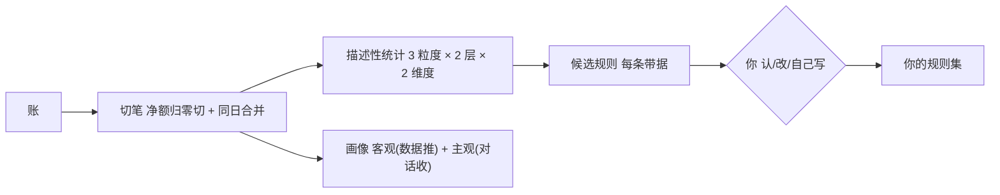
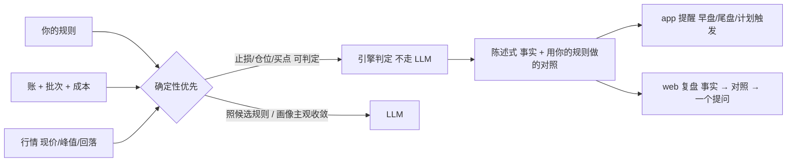

# 交易插件重做 设计文档 · final（合并正文）

**轮次**：final（合并稿）· 2026-10-06 · **编写**：设计文档编写者（subagent · 派单 `D-20261006-03`）
**上游**：`./requirement.md`（2026-10-06 人拍板定稿 · 硬约束）· `./decisions.md`（人拍板 S1/S2 · U1–U6 · V1–V3）
**审核输入**：`./review-v3-backend-20261006.md`（判**不收敛**：战略 2 未闭环 + 新引 P1×2）· `./review-v3-product-20261006.md`（判**不收敛**：3 点复核 + 新引 P1×2）

> **本文件取代** `design-v2-20261006.md` / `design-v3-20261006.md` 成为**唯一正文**；v2 / v3 退为历史、保留可追溯。
> **口径一致性声明**：全文只此一份正文；凡与前两稿冲突处，**以本稿为准**（治的正是「增量稿未回写正文 → 同一份设计自相矛盾」）。
> 本稿写「**怎么做**」。需求里「不做」的四项（`X-01` 下单 · `X-02` 用户端行情入口 · `N-01` 规则分享 · `N-02` 周期层）**不进设计**。

---

## 修订记录

| 版本 | 日期 | 依据 | 改了哪一节 · 改了什么 |
|:--|:--|:--|:--|
| **r1** | 2026-10-06 | 派单 `D-20261006-03` | 合并正文初稿（取代 v2 / v3），585 行 |
| **r2** | 2026-10-06 | `review-v4-backend` **P1-1 / P1-2** · `review-v4`（产品）**P1-1**（派单 `D-20261007-01`）| ① **§4.1** 补 3 条实存落盘路径（`cash-adjustments.json` / `candidates/` / `lot-stoploss.json`）：表 **24 → 27 行**，连带 **§13.2** 未收录 **5 → 8 项**（自评风险 5 的「登记补契约」总数 8 → 11 项）；② **§10.1** 规则 1 补口语变体（`买了` / `卖了` / `抛出` / `购入` …）+ 反向回归改为**逐类覆盖 6 类规则的示例**（消除假绿）；③ **§1** 数量声明改准：`ContextContributor` **两个 → 三个**（`Trading` / `Market` / `TradingProfile`）|

---

## 本轮回应

> 逐条对应**两份 v3 审核**的编号与**派单 7 项**。**无「未回应」项**；**无新增「★ 未决」**（V1–V3 已由人拍板，见 `decisions.md`）。

### 一、对 `review-v3-backend` 的回应（共 7 行 · 覆盖 10 项）

| 上轮编号 | 结论 | 本稿怎么改（落点）|
|:--|:--|:--|
| **S1** 关插件闸门扩面仍漏「记忆 / 上下文注入面」+ `has-activity` 二选一未定 | **已改（闭环）** | §11.3 落成**六面闸门表**（Feed · 时间线 · 搜索 · 领域活动度 · **记忆面** · **上下文注入面**）+ **逐面验收清单 6 条** + **「关 → 开」可逆断言** + **写侧端点清单**；`/has-activity` **定性为「门控」**（不留「或」）|
| **S2** §9 仍不可靠（补的 10 行无去留 /「完整对拍留 backlog」与「§9 是验收基线」冲突） | **已改（闭环）** | §9 落成**四列**（`端点 / 去留 / 理由 / 判据`）· **共 31 行**（含补回的 `memory-cards/`）· **退役类给反向判据**（有测试 / 有生产调用 / 有前端入口 → 不许默认删）· **删除「完整对拍留 backlog」这句**，改为「**本表即基线（31 组）**；编码期若发现表外端点，**先补表再动手**」|
| **新引 P1-1** 增量稿未回写正文 → 交付物自相矛盾 | **已改（闭环）** | 本稿即 `design-final`，**v3 的每条更正已并入正文**：§8.1（`TradingContextContributor` = **活的 · 改造**）与 §8.2、§9 **三处口径一致**；全文**不再出现「死代码 → 删除」**|
| **新引 P1-2** §9「补 11 组」实为 10 行（假精确） | **已改（闭环）** | 补回漏掉的 `data/{userId}/trading/memory-cards/` 一行；本稿**每处「N 组 / N 条 / N 项」后紧跟可数清单**，数量与行数逐一对齐（§4.1 = 27 行 · §8.2 = 2 个白名单 · §9 = 31 行 · §11.3 = 6 面）|
| **P1-1** Contributor 误标死代码（部分闭环） | **已闭环** | §8.1 更正 + **§8.2 逐字段白名单**（点名两个 Contributor 都是**改造项**）+ §9 第 28 行同步改写；并统一两个贡献者的同名标题 |
| **P1-3 / P1-4** promote 脱敏不成立 / 落点共享同日覆盖 + 非 owner 静默丢弃（部分闭环） | **已闭环** | §10 三件事：① 脱敏**规则枚举**（6 类，含 `request.note()` **与** `request.sections()`）+ 反向回归；② 落点**定死一种**（去「或」）；③ 非 owner **落自己的候选区**（非 403）|
| **P1-6** §4.1 与现状 + 冻结契约不符（部分闭环） | **已闭环** | §4.1 落成**三列**（`现状 / 目标 / 迁移`）· **共 27 行**（r1 落 24 行 · r2 补 3 条实存路径），逐项对齐 `data-format-freeze.md`；**前稿写错的 4 条（`ledger/` `positions/` `watchlist/` `imports/save/`）显式「撤回」**；契约未覆盖项标「**登记补契约**」|

### 二、对 `review-v3-product` 的回应（共 3 点 + 新引 2 条）

| 上轮点 | 结论 | 本稿怎么改 |
|:--|:--|:--|
| **点 1** S2 不闭环（「升为准入条件」≠ 产出） | **采纳「已登记门禁 · 仍未闭环」的定性**（不再列入「本轮已改」） | 新增 **§13.3 编码准入条件**：列出**待落产物**——① 定位扩容 RFC 的**要点**（定位变更 + 与 87 课知识库的关系）② roadmap **要增 / 改的条目**；**本分支不创建 RFC 文件**，只把要点写进设计并登记待交接 |
| **点 2** 增量稿与正文自相矛盾（新引 P1-新1） | **已改** | 本稿为**合并正文**（见上 §8.1 / §8.2 / §9 三处一致），且 §13 的「§9 为验收基线」与 §9 实体**同稿**——矛盾载体消失 |
| **点 3** 「11 组」对源属实 / 对自身不属实 / 真丢一组（新引 P1-新2） | **已改** | §9 补回 `memory-cards/`；立**可机械核对**口径：数量声明后紧跟可数清单 |

### 三、对派单 7 项的回应（`D-20261006-03`）

| 派单项 | 落点 |
|:--|:--|
| 1 · §9 四列 + 补 `memory-cards/` + 删除类反向判据 | §9（31 行 · 四列 · 退役类判据）|
| 2 · §8.1 / §8.2 / §9 口径一致 + 逐字段白名单 | §8.1 / §8.2 / §9#28 |
| 3 · 关插件闸门补两面 + 6 面验收 + 可逆断言 + `has-activity` 定性 | §11.3 |
| 4 · promote 三件（脱敏枚举 / 落点定死 / 非 owner 口径） | §10 |
| 5 · §4.1 三列对齐冻结契约 | §4.1（27 行）|
| 6 · S2 落点写成「编码准入条件」 | §13.3 |
| 7 · 数量声明可机械核对 | 全文（§4.1 · §8.2 · §9 · §11.3 四处显式计数）|

**未采纳 / 保留**：无。v1 的 T1–T10、v2 的 T11–T15 **全部维持**。

---

## 设计

### 1. 归属与分层

| 问题 | 答案 |
|:--|:--|
| 产品层 | **L6 交易反哺**（含闭环终点：复盘 → 候选 → 知识库，见 §10）|
| 代码域 | `domain/trading`（**插件**，随 `Account.plugins` 生灭）|
| 依赖方向 | `interfaces → application → domain/trading`；行情 / 推送 / LLM 归 `infrastructure`（依赖倒置）；**跨域只经 `application` 编排**（B6）|
| 与 kernel 的关系 | kernel 只提供**插件门控**（`PluginRegistry` / `PluginService`）与通用待办 / 推送 / 存储；**交易「理解」一律不进 kernel 记忆**（§11.4）|

| 层 | 本设计承担 |
|:--|:--|
| `interfaces` | `TradingController`（web / app 共用 API）· `TradingCaseController` · `TradingEvidenceController` · `TradingPlanController` · `TradingRoundController` · `EquityCurveController` · admin 侧公共数据导入 / `conflicts` |
| `application` | `TradingAppService`（**唯一编排点**）：导入 · 对账 · 分析 · 规则 · 三环 · 计划 |
| `domain/trading` | 六个子模块（§2）+ 端口（`TradingRuleSettingsPort` / `TradingMarketStagePort` / `TradingRoundPort` / `KlineSource` / `MarketDataSource`）+ **三个 `ContextContributor`**（`Trading` / `Market` / `TradingProfile`；**其中两个为改造项**、一个**保留**）|
| `infrastructure` | 行情源（tdx → 腾讯 → 新浪）· 通达信文本解析 · 文件存储 · 推送 · `infrastructure/ai`（仅候选规则与画像主观收敛）|
| `kernel` | 插件门控 + **通用待办链**（交易来源打 `source=trading`，受关插件闸门，§11.4）|

> **已知例外（如实登记）**：`TradingKnowledgeSource` 现位于 **kernel 包**，与本节「kernel 只提供门控 + 通用件」不符。本设计**接受现状为技术债**（迁移属跨层重构，单列），仅在 §9#27 保留其能力并注明包位置。

### 2. 模块切分（六个子模块 + 横切）

| # | 子模块 | 职责（一句话）| 关键产物 | 对应需求 |
|:--:|:--|:--|:--|:--|
| 1 | `ingest` 入库 | 把一份导出**认出来 · 洗干净 · 去重 · 排好序**再交给账 | 归一事件 / 快照 + 原始文件 | `R-01` `R-12` |
| 2 | `ledger` 账 | **单一真源**：成交 · 持仓 · 现金 · 成本 · 派生的唯一计算地；对账只在它内部做 | 账 + 对账结论 | `R-02` `G-01` `G-02` |
| 3 | `rounds` 一笔 | 按口径切「笔」+「批次」，边界是**一等对象** | 笔 / 批次 / 边界 | `R-03` |
| 4 | `analytics` 理解 | 三粒度 × 两层 × 两维度的**描述**；候选规则原料；画像 | 统计 / 候选 / 画像 | `R-05` `R-13` `G-07` |
| 5 | `rules` 规则 | 三来源（自建 / 导入 / 从数据长）· 三态（候选 / 已认 / 自定义）· 只存**文本 + 参数** | 规则集 | `R-06` |
| 6 | `advisory` 三环 | 买 / 持 / 卖三环的**对照**与**陈述式**输出 | 对照结论 / 提醒 | `R-07` `R-11` |

横切三个：`cases` 案例库（`R-10`）· `watchlist` 自选留历史（`R-09`）· `plan` 计划（`R-11`）——共用 `charts` 通用画图能力（K 线 + B/S/T 标记 + 止损线 / 峰值浮盈线，`R-04`）。

**依赖约束**：`ingest → ledger` · `rounds → ledger` · `analytics → rounds + ledger` · `rules → analytics`（候选来源）· `advisory → rules + ledger + 行情`。**反向无依赖**（`ledger` 不感知规则、`analytics` 不感知推送）→ 可单独重算。**`cases` / `watchlist` 只依赖行情，不依赖 `ledger`**。

### 3. 数据流（四条主链）

**① 入库链**（`R-01` `R-02` `R-12` · 验收 1 / 5 / 6 / 8）

要点：① **内部排序**（事件在前、快照最后）——用户**不用记顺序**；② **两源不重复入账**；③ **资金流水是资金侧主源**；④ 识别失败与品种不支持一律**如实拒绝**（§11.2）；⑤ 批量导入**先预检（`dryRun`）**，丢行**逐行报「行号 + 原文 + 原因」**。

**② 理解链**（`G-03` `G-05` `R-03` `R-05` `R-06` `R-13` · 验收 2 / 3）

切笔细则：**净额归零即一笔结束** · **同日「卖光 → 买回」合回同一笔** · **建仓完毕 = 首次卖出前的最后一次买入** · **不做底仓特例** · **切笔只发生在跨日清仓之后**。人工边界 `{symbol, 锚定日, 锚定那笔买入, source: auto|manual, 备注}`，**人工 > 自动**。

**描述与对照分开产出**：无规则的人只出「描述」，如实说「我还没有你的规则，判不了守没守」。

**③ 对照链**（`R-07` `R-11` · 验收 7 / 10）

**说话前四要素闸门**——成本 / 批次 · 我的线（止损价 / 放飞线）· 行情（现价 / 峰值 / 回落）· 持有时间（从建仓完毕算）；**缺一样就别开口**。提醒只用**你定的线**、只**陈述**，**不说「该止损了」**。**止损 / 清仓分开说**。

**④ 纠错链**（`R-08` · 验收 8）

| 错在 | 怎么修 | 派生怎么跟 |
|:--|:--|:--|
| 快照（持仓股 / 资金股份）| 重导一次即覆盖 | 重算 |
| 事件（成交 / 资金流水）| 就地改 / 删（确认后直接改，**用户面不留痕**）| 重算 |
| 派生（持仓 / 成本 / 盈亏 / 笔）| 不手修 | 改源后**自动重算** |
| 切笔边界 | 人工切 / 合 | 重算 |
| 规则 / 止损价 | 改规则 | 重算对照 |

发现机制：**简单校验**（余额链断层 / 对账 drift / 丢行提示）→ 指出「哪里不对」。**后路**：原始导入文件留存 `imports/{yyyy-MM}/`（U6：长期留 + 银行账号脱敏）。**系统侧修改日志**见 §4.3。

### 4. 落盘与数据模型（`File First`）

#### 4.1 目录表（三列 · 逐项对齐 `data-format-freeze.md`）

> **口径**：以**冻结契约**（`data-format-freeze.md` v1.0.0）为准；**契约与磁盘不一致处显式标出**。前稿（v2 §4.1）写错的路径**一律撤回**（「迁移」列注明）。**共 27 行**（r1 = 24 行 · r2 补 3 条实存路径，见「修订记录」）。

| # | 现状（代码 writer / 磁盘）| 目标 | 迁移 |
|:--:|:--|:--|:--|
| 1 | `trading/positions.md`（契约 §2.6 · 磁盘实存）| **不变** | 无需 |
| 2 | `trading/trades/{yyyy-MM}.json`（契约 §2.13 · 磁盘实存）| **不变** | 无需（**撤回**前稿的 `ledger/`）|
| 3 | `trading/account.json`（`AccountSnapshotFileRepository` · 磁盘实存）| 不变 | 无需（契约未收录 → **登记补契约**）|
| 4 | `trading/imports/{yyyy-MM}/*.txt`（磁盘实存）| 不变 | 无需（**撤回**前稿的 `imports/save/`）；U6 脱敏**只对新导入**，存量原样保留 |
| 5 | `trading/watchlist.json`（`WatchlistFileRepository` · 磁盘实存）| 不变 | 无需（**撤回**前稿的 `watchlist/` 目录方案）；契约未收录 → **登记补契约** |
| 6 | `trading/sold.json`（`SoldTradeFileRepository` · 磁盘实存）| 不变 | 无需（契约未收录 → **登记补契约**）|
| 7 | `trading/transfers.json`（`TransferFileRepository` · 磁盘实存）| 不变 | 无需（契约未收录 → **登记补契约**）|
| 8 | `trading/reviews/{yyyy-MM-dd}_review.md`（契约 §2.12）| 不变 | 无需 |
| 9 | `trading/reviews/promote/`（**本设计新增**）| 新增 | 见 §10.2 落点；`.gitignore:83` `data/*/trading/` 已覆盖（`git check-ignore` 实测通过）→ **登记补契约** |
| 10 | `trading/pushes/{yyyy-MM-dd}.json`（契约 §2.8）| 不变 | 无需 |
| 11 | `trading/market_snapshot.json`（契约 §2.9）| 不变 | 无需 |
| 12 | `trading/push-settings.json`（契约 §2.14）| 不变 | 无需 |
| 13 | `trading/trade-log/{yyyy-MM-dd}.json`（契约 §2.15）| 不变 | 无需 |
| 14 | `trading/rules.yaml`（契约 §2.16）| 不变 | 无需 |
| 15 | `trading/knowledge.md`（契约 §2.16 配套）| 不变 | 无需 |
| 16 | `trading/cases/_index.json` + `trading/cases/{buyDate}_{symbol}.json`（契约 §2.17）| 不变 | 无需 |
| 17 | `trading/market-stage.json`（契约 §2.19）| 不变 | 无需 |
| 18 | `trading/advice-history/{yyyy-MM}.json`（契约 §2.20）| 不变 | 无需 |
| 19 | `trading/profile.md`（契约 §2.21 · `TradingProfileService`）**vs 磁盘 `trading/profile-v1.md`** | `trading/profile.md` | **差异项**：磁盘遗留文件先核对内容再归一化（**不丢数据**）；如判须保留旧名 → 走 MAJOR 变更流程 |
| 20 | `trading/snapshot-anchor.json`（契约 §2.22）| 不变 | 无需 |
| 21 | `trading/sync-state.json`（契约 §2.23）| 不变 | 无需 |
| 22 | `trading/plans/{yyyy-MM-dd}.json`（RFC `20261003` · 磁盘实存）| 不变 | 无需（契约未收录 → **登记补契约**）|
| 23 | `trading/audit/{yyyy-MM}.jsonl`（**本设计新增**，§4.3）| 新增 | `.gitignore:83` 已覆盖 → **登记补契约** |
| 24 | `trading/memory-cards/*.md`（磁盘实存 9 个文件 · **全仓无代码引用**）| **归档保留 · 不接入** | **无迁移**（B3：数据保留不删）；本设计**不依赖**它，也不新写 |
| 25 | `trading/cash-adjustments.json`（`CashAdjustmentFileRepository` · 磁盘实存）| 不变 | **U2 迁移目标**（§9#4 存量 `principal` → 一次性出入金调整事件）；契约未收录 → **登记补契约** |
| 26 | `trading/candidates/`（`LearnTradingCandidateFileRepository` · 磁盘实存）| 不变 | 无需（learn 侧写入、供交易知识库审核）；契约未收录 → **登记补契约** |
| 27 | `trading/lot-stoploss.json`（`LotStopLossOverrideRepository` · 磁盘实存）| 不变 | 无需（§9#9 批次止损的用户覆盖数据，U2 一并核对搬移）；契约未收录 → **登记补契约** |

**「目标」口径外的两处更正**（前稿写错、本稿撤回）：

1. `market/` → 全局行情在 **`data/market/`**（非用户层），**不是** `data/{userId}/trading/market/`（契约 §2.18）；
2. 本设计新增目录（#9 `reviews/promote/` · #23 `audit/`）**不需要**新 gitignore 规则（`data/*/trading/` 已覆盖，B25 出口动作已实测）。

#### 4.2 派生量恒等式

`系统现金 = 上次快照值 + Σ 已计入流水与转账 + Σ 调整`；本金**不靠手填**——`净投入 = 转存 − 转取`由事件推出（`G-06`）。

#### 4.3 修改日志（用户面不留痕 + 可追溯复算）

| 面 | 落法 |
|:--|:--|
| 用户面 | 就地改 / 删，**无版本、无痕迹** |
| 系统侧 | `trading/audit/{yyyy-MM}.jsonl` 保留**不可见修改日志**：`{时间, 记录 id, 字段, 前值, 后值, 来源}`——**仅供复算审计**，不进任何用户可见面、不进 AI 上下文 |
| 与 `advice-history` 的边界 | `advice-history/` = **用户可见**的建议留痕（§9#15）；`audit/` = **不可见**的改账日志。**两套不许混用** |
| 失败策略 | 审计写失败 → **不让业务静默成功**（fail-visible）|

### 5. 接口

**输入分流**——三条入口，不混：

| 输入 | 走哪 | 为什么 |
|:--|:--|:--|
| **批量文件导入**（资金流水 / 历史成交 / 持仓股 / 资金股份 / 清仓股 / 自选）| **trading 域端点** `POST /trading/import`（保留既有 `/trades/import` `/positions/import` `/imports/cash` `/sold/import` `/watchlist/import`）| 成批、需表头识别与归一化，属域内 `ingest` |
| **随手记一笔 / 一句话**| **`POST /api/v1/records`**（+ 意图分流）→ **当日候选** → **`/trading/trade-log/confirm`** 入账 | 属**通用记录**（ARCHITECTURE 唯一输入入口）；域侧被动消费 Record 并归集候选 |
| **截图入账** | **`POST /trading/screenshots`** → 候选 → confirm | **保持既有口径**：**刻意不进 Feed / 时间线**（不得改判进 `/records`，否则是隐私与展示面静默扩容）|

**端点（按需求分组，全部 `X-User-Id` + trading 插件门控）**：

| 组 | 端点（示意）| 对应 | 面 |
|:--|:--|:--|:--|
| 导入 | `POST /trading/import`（`kind` 分派 + `dryRun` 预检 + **一次全收**）| `R-01` `R-12` `R-02` | web |
| 账 / 对账 | `GET /trading/account` · `GET /trading/integrity` · `POST /trading/reconcile` | `G-01` `G-02` | web（app 只读结论）|
| 资金层 | `GET /trading/equity-curve` · `GET /trading/pnl-periods` | `G-07` | web（app 亦呈现）|
| 一笔 | `GET /trading/rounds` · `PUT /trading/rounds/{id}` · `POST /trading/rounds/boundaries` | `R-03` | web |
| 图表 | `GET /trading/kline?symbol=&window=`（B/S/T 标记 · 止损线 · 峰值浮盈线）| `R-04` | web |
| 分析 | `GET /trading/analysis/{global\|symbol\|round}` | `R-05` | web（结论进 app）|
| 规则 | `GET/PUT /trading/rules` · `POST /trading/rules/candidates` · `POST /trading/rules/{id}/accept` | `R-06` | web |
| 三环 | `GET /trading/advisory/{buy\|hold\|sell}`（陈述 + 四要素依据）| `R-07` | app + web |
| 纠错 | `PUT/DELETE /trading/trades/{id}` · 重导快照 | `R-08` | web |
| 自选 / 案例 | `GET/POST /trading/watchlist` · `/trading/cases` | `R-09` `R-10` | web |
| 计划 / 提醒 | `GET/PUT /trading/plans` · `POST /trading/plans/{date}/status` | `R-11` | app 收 / web 看 |
| 画像 | `GET /trading/profile` | `R-13` | web |
| 反哺（S1）| `POST /trading/reviews/{date}/promote` | §10 | web |
| 择时 | `GET/PUT /trading/market-stage` | §11 | web + app（红绿切换条）|
| admin | `POST /admin/market/import`（行情包 / 活跃市值）· `GET /admin/trading/knowledge/conflicts` | 约束 · 分系统 · §10 | admin |

**接口契约三条**：① 「缺数据」一律出 `null` + `reason`，**不出 0**（验收 5）；② 分析类响应**每个数字带可回溯引用**（验收 4）；③ 三环响应**只带 `statement` + `basis[]` + `ruleRef`**，**契约层不含建议字段**（验收 10）。

### 6. 三端呈现

| 功能 | web（坐下来）| app（随身）| admin |
|:--|:--|:--|:--|
| `R-01` 记录 | 导入（一次全收）· 逐笔编辑 | **手动记一笔 / 一句话 / 截图入账** | — |
| `R-02` 对账 | 差额可见 + 断点定位 | — | — |
| `R-03` 一笔 | 图上 / 列表上人工切笔 | — | — |
| `R-04` 图表 | K 线 + 指标 + 买卖点 | — | — |
| `R-05` 分析 | 三粒度明细 | **只给结论入口** | — |
| `R-06` 规则 | 自建 / 导入 / 认候选 | — | — |
| `R-07` 三环 | 看依据 | **收提醒** | — |
| `R-08` 纠错 | 就地改 | — | — |
| `R-09` `R-10` 自选 / 案例 | 全功能 | — | — |
| `R-11` 提醒 | — | **收提醒** | — |
| `R-12` 一次交文件 | 是 | （不能导入）| — |
| `R-13` 画像 | 页面（客观 + 主观）| — | — |
| **资金层**（`G-07`）| 资金曲线 + 分周期盈亏 | 资金曲线（只读）| — |
| **择时**（活跃市值）| 红绿切换条 | 红绿切换条（只读）| **公共数据导入** |
| 行情 / 活跃市值 | — | — | **只导公共数据**（`X-02`）；**行情抓取归 L5 自动** |

**持仓**是「同一功能两端不同摆法」的样板：web = 表格 + 逐行编辑；app = 一行行的卡 + 点开看结论。**不许出现「某功能只在一端、且未声明」**——上表即声明（本轮补回**资金层**与**择时**两行）。

### 7. 术语表

| 术语 | 定义 | 口径来源 |
|:--|:--|:--|
| **笔（round）** | 建仓 → 清仓的完整过程；复盘与规则的**单位**；一笔 = 多个批次 | 需求「业务规则」· RFC `20261003` |
| **批次（lot）** | **每一次买入**；持仓与操作的粒度；同标的 + 同方向 + 同日合并为一批 | RFC `20260825` |
| **做 T** | 同一天「先卖后买」（含清仓后买回）= 同一笔的过程，**不切新笔** | 需求「业务规则」|
| **建仓完毕** | 首次卖出之前的**最后一次买入** | 需求 |
| **边界** | 笔的切分点；**一等对象**，人工可覆盖自动 | D3 |
| **放飞** | 部分减仓（保留底仓）；**与清仓分开说** | 需求「提醒口径」|
| **减仓 / 清仓** | 减仓 = 卖部分；清仓 = 全卖（持仓归零，触发复盘）| 需求 |
| **锚定** | 券商快照 = 账的真值基准（锚点）| RFC `20260912` |
| **drift** | 派生持仓 ≠ 最近锚点 + 锚点后净变化 | RFC `20260912` |
| **余额链** | 资金流水逐笔余额连续性；断层 = 漏导 | D1 |
| **有据 / 无据** | 锚定日依据显式化（EXPLICIT / FILE_DATE / CLOSED_DAY = 有据 · CLOCK = 无据）| `P2-交易84` |

> 术语表**只存本设计稿内**，不动全局 glossary（收敛到全局属主会话动作，§13）。

### 8. 理解 → Context 注入契约

**唯一注入点在 kernel 的 `ContextContributor` / `KnowledgeSource`**（roadmap §3.2）。**不另建注入通道**——自建通道会多一个「关不掉」的注入面。

#### 8.1 既有贡献者去留

> **与 §9 同口径**：`TradingContextContributor` 是**活的 · 改造项**，**不是死代码、不删除**。全文**不再出现「死代码 → 删除」**。

| 贡献者 / 通道 | 现状（实测）| 去留 | 注入什么 |
|:--|:--|:--|:--|
| `TradingContextContributor` | `supports()` 恒 false · `enrich()` 恒空，**但 `globalContext()` 是活的**（`ContextEngine` 每轮调用），正在注入**成本 / 现价 / 盈亏% + 总市值 / 浮动盈亏 / 现金余额** | **保留 · 改造**（**删除的只有两个空方法**，不是整类）| 改造后只出**结构 + 比例 + 现价**（§8.2 白名单①）；标题改为「## 持仓结构（不含规模）」|
| `MarketContextContributor` | 生效（`scene=trading`）：表头即「代码\|名称\|**数量**\|**成本价**\|现价\|**市值**\|盈亏\|盈亏%」，末尾再补**总市值 / 浮动盈亏 / 现金余额** | **保留 · 改造** | 改造后表格列 → 「代码\|名称\|现价\|盈亏%」；**删汇总行**；标题「## 大盘与持仓行情」|
| `TradingProfileContributor` | 生效（`scene=trading\|decision`）| **保留** | 画像文本（客观统计 + 主观签名）|
| `TradingKnowledgeSource`（既有）| 生效 | **保留** | 规则 / 知识：**用户私有 `data/{userId}/trading/knowledge.md` 优先**，**owner** 回落 `os/`，**其他用户不注入**（防跨用户泄漏）；owner 判定键 `${adai.plugins.owner-user-id:adai}` 须在配置层显式声明 |

#### 8.2 逐字段白名单（两个贡献者 · 共 2 个）

**白名单 ①（`TradingContextContributor`）**

| 类别 | 出 | 不出 |
|:--|:--|:--|
| 标的 | 代码 · 名称 | — |
| 结构 | 是否持有 · 持有**个数**（「当前持有 N 个仓位」）| — |
| 比例 | **盈亏%** · **仓位占比**（V3：比例可出）| — |
| 价格 | **现价**（需求：现价与止损保留）| — |
| 规模 | — | **股数** · **成本价** · **市值** · **浮动盈亏金额** · **现金余额** · **总资产** |

**白名单 ②（`MarketContextContributor`，`scene=trading`）**

| 类别 | 出 | 不出 |
|:--|:--|:--|
| 大盘 | 指数点位 · 涨跌幅（公共行情）| — |
| 持仓表 | 代码 · 名称 · 现价 · 盈亏% | **数量列** · **成本价列** · **市值列** · **盈亏金额列** |
| 汇总 | — | **总市值** · **浮动盈亏** · **现金余额** |

**共用契约**：

| 维度 | 契约 |
|:--|:--|
| **触发** | 详情仅在 `scene=trading\|decision` 注入；其他场景只出一句「存在画像」（宁缺毋滥，防幻觉）|
| **脱敏层** | 属**第 ② 层（出边界脱敏，服务端）**——见 §11.1；**不是**端上显示打码 |
| **体量上限** | 单贡献者默认：行情 ≤ 持仓数行 · 画像 ≤ 12 行 · 规则摘要 ≤ 8 行；**超限截断并标注**（默认值可调，见自评风险）|
| **关插件闸门** | 插件关 → 贡献者全部返回空（`ContextEngine` 已有 contributor 门控）；**记录注入面**另见 §11.3 |
| **可断言** | 每个白名单配**一条断言测试**：构造持仓（含量 / 成本 / 市值 / 现金）→ 断言注入文本**不含**该批数字、**含**代码与盈亏% |

### 9. 既有能力清单 + 去留（四列）

> **本表即 U1 渐进重构的验收基线**（与 §13 同稿，不再另设「完整对拍留 backlog」）。若编码期发现**表外端点**，**先补本表再动手**。
> 依据：`overview.md` §2 端点总览 + `review-v2-backend` §七差异表 + **代码 / 前端 / 测试实测**（只读）。
> **共 31 行**。**去留枚举**：`保留` / `保留 · 改造` / `替换 · 收窄` / `退役` / `归档保留`。**退役类必须给反向判据**（有测试 / 有生产调用 / 有前端入口 → 不许默认删）。

| # | 能力组（端点 / 机制）| 去留 | 理由 | 判据（实测）|
|:--:|:--|:--|:--|:--|
| 1 | 三源账本 + 锚定 + drift 对账 `/integrity` `/anchor` `/sync` | 保留 · 改造 | 真钱账、生产事故验证过；U1 不许推倒 | 有测试（`TradingLedgerIntegrityTest` · `TradingLedgerGoldenReplayTest` · `TradingAnchorGuardTest` · `TradingAnchorBasisTest` · `TradingAnchorDateNormalizeTest` · `TradingSyncStateRepositoryTest`）+ 有前端入口（web / app）|
| 2 | 账户快照 / 组合 `/account` `/portfolio` `/positions/daily` | 保留 · 改造 | `G-01` 的呈现面；并入新 `GET /trading/account` 口径 | 有测试（`AccountSnapshotFileRepositoryTest` · `AccountControllerTest`）+ 有前端入口（web / app）|
| 3 | 逐笔流水主源 + 余额哨兵 `/trades`(GET/POST/PUT/DELETE) `/imports/save` | 保留 · 改造 | D1 资金侧主源；脱敏移到入库前 | 有测试（`TradingHistoryFileRepositoryTest` · `TradingAppServiceTest` · `CashHealthNoteTest`）+ 有前端入口（web / app）|
| 4 | 出入金 / 本金 `/transfer` `/transfers` `/principal` | **退役**（**写侧** `PUT /principal`）| `G-06`：本金由事件推出，不靠手填 | **反向判据三项全中**：有测试（`CashAdjustmentFileRepositoryTest`）· 有生产调用（`TransferFileRepository` / `CashAdjustmentFileRepository`）· **有前端入口（web + app 均有 `trading/principal`）⇒ 不许默认删**。故**只退役写入口、保留读侧**；存量 `principal` 迁移为**一次性出入金调整事件**；前端入口移除属编码期动作 |
| 5 | 批量文件导入（五类）`/trades/import` `/positions/import` `/imports/cash` `/sold/import` `/watchlist/import` | 保留 · 改造 | `R-12` 一次全收 + 表头识别 fail-closed | 有测试（`TradingImportParserTest` · `PositionCurrentPriceImportTest` · `TradingAppServiceTest`）+ 有前端入口（web）|
| 6 | 批量 / 解析录入 `/trades/batch` `/trades/parse` | 保留 · 改造 | `R-01` 语义输入（既有形态）| 有测试（`TradingParseAppServiceTest` · `TradingImportParserTest`）+ 有前端入口（app `trades/parse`）|
| 7 | 候选入账（记录 / 截图）`/trade-log` `/trade-log/confirm` `/trade-log/date` `/trade-log/meta` `/trades/{tradeId}/meta` `/screenshots` | 保留 | `R-01` 的 app 半边；截图**不进 Feed / 时间线** | 有测试（`TradeLogCandidateTest` · `TradeLogCollectServiceTest` · `TradingScreenshotAppServiceTest`）+ 有前端入口（app）|
| 8 | 切笔（一笔）`/rounds` | 保留 · 改造 | 对齐 §7 口径；加人工边界一等对象 | 有测试（`TradingRoundServiceTest` · `TradingLotServiceTest`）+ 有前端入口（web / app）|
| 9 | 批次 + 批次止损 `/lots` `/lots/{lotId}/stop-loss` | 保留 | 与「批次 = lot」术语对齐 | 有测试（`TradingLotServiceTest` · `LotStopLossOverrideRepositoryTest` · `NegativeCostPositionTest`）+ 有前端入口（web / app）|
| 10 | 资金层呈现 `/equity-curve` `/pnl-periods` | 保留 · 补入 §6 | `G-07`「资金层」的呈现面（前稿 §6/§9 双缺） | 有测试（`EquityCurveControllerTest` · `EquityCurveServiceTest`）+ 有前端入口（web / app）|
| 11 | 清仓股 + 卖出评价 + 情绪 `/sold` `/sold/score` `/sold/{symbol}/psychology` `/sold/{symbol}/psychology-questions` `/sold/{symbol}/psychology/answer` | 保留 | §3③ 卖点尺子闭环的**输入源** + 画像主观层原料 | 有测试（`SoldScoreServiceTest` · `SoldTradeVerdictTest`）+ 有前端入口（web / app `sold` · `sold/score`）|
| 12 | 规则集 + 候选 + 认下 `/rules` `/rules/candidates` `/rules/{id}/accept` | 保留 | `R-06` 三来源 / 三态 | 有测试（`DefaultTradingRuleEngineTest` · `TradingRuleSettingsRepositoryTest` · `TradingRuleDegradationTest` · `RuleKnowledgeContractTest`）+ 有前端入口（web）|
| 13 | 四要素铁证 / evidence 底座 `/evidence/*` | 保留 | 验收 4 / 7；「缺证据不发」 | 有测试（`TradingEvidenceControllerTest` · `TradingEvidenceServiceTest`）+ 内部调用（推送 / 建议）|
| 14 | 建议引擎 `/advice` | **替换 · 收窄** | 现状方向词违反验收 10 / B1 → 收窄为「陈述 + 你的规则对照」，契约层去建议字段 | 有测试（`TradingAdviceAppServiceTest` · `TradingDecisionNarratorTest`）+ 有前端入口（app `advice`）|
| 15 | 建议留痕 `/advice-history` | 保留 · 改造 | 四要素铁证的 ④；与 §4.3 的 `audit/` **划界** | 有测试（`AdviceHistoryFileRepositoryTest` · `AdviceOutcomeServiceTest`）+ 有前端入口（web）|
| 16 | 定时推送 + 行情异动推送 + 撤回 `TradingSessionPushService` · `MarketAlertService` · `DELETE /pushes/{id}` | 保留 · 改造 | `R-07` `R-11`；文案去建议 + **一天上限**（★V1 已拍板：全局 ≤8/日、超限合并）| 有测试（`TradingSessionPushServiceTest` · `CashHealthNoteTest`）+ 有前端入口（web / app 撤回）|
| 17 | 推送控制（用户开关）`/push-settings` | 保留 | 既有逃生口；与「不推送」配套 | 有测试（`PushSettingsTest`）+ 有前端入口（web / app）|
| 18 | 行情链路 + 健康 `/market-data/health`（tdx → 腾讯 → 新浪）| 保留 | 归 L5 / infrastructure；**admin 不导行情** | 有测试（`TencentMarketDataSourceTest` · `TdxFileKlineSourceTest` · `SinaKlineDataSourceTest`）+ 有前端入口（web / app）|
| 19 | 活跃市值（择时）`/market-stage` | 保留 · 补入 §6 | 时段推送 / 知识注入的择时权威源；端口保留 ≠ 能力表态 | 有测试（`TradingMarketStageRepositoryTest`）+ 有前端入口（web / app 红绿切换条）|
| 20 | 自选股 + 买点扫描 `/watchlist` `/watchlist/{symbol}` `/buy-points` | 保留 · 改造 | `R-09`；落 §4（最早出现口径）| 有测试（`WatchlistFileRepositoryTest` · `WatchlistBuyPointServiceTest` · `BuyPointDetectorTest`）+ 有前端入口（web / app）|
| 21 | 案例库 + 相似度 `/cases` `/cases/{id}` `/cases/import` `/cases/match` `/cases/{id}/insight` | 保留 | `R-10`；**不依赖 `ledger`** | 有测试（`TradingCaseControllerTest` · `TradingCaseFileRepositoryTest` · `CaseSimilarityEngineTest` · `CaseFeatureExtractorTest` · `CaseImportParserTest` · `CaseConsensusTest` · `CaseVerifyBackfillSchedulerTest`）+ 有前端入口（web）|
| 22 | 画像（认知）`/profile`(GET/PUT) + 认知 5 端点 | 保留 · **补入口** | `R-13` / 验收 11 | 有测试（`TradingProfileContributorTest` · `TradingProfileServiceTest`）+ **前端零入口**（本轮补 —— 这正是本条要改的点）|
| 23 | 次日计划 + 日状态 `/plans` `/plans/{date}` `/plans/{date}/status` `/plans/{date}/review` | 保留 · 改造 | `R-11`；§11.4 分家（落 trading，不回 kernel）| 有测试（`TradingPlanControllerTest` · `TradingPlanServiceTest` · `TradingPlanFileRepositoryTest`）+ 有前端入口（web / app）|
| 24 | 纠错（就地改）`PUT/DELETE /trades/{id}` + 重导快照 | 保留 · 改造 | `R-08`；加 §4.3 系统侧审计日志 | 有测试（`TradingControllerTest` · `TradingAppServiceTest`）+ 有前端入口（web）|
| 25 | 复盘 + promote 反哺 `/review` `/reviews` `/reviews/{date}/promote` | 保留 · 改造 | S1：保留闭环；**落点与脱敏按 §10 重写** | 有测试（`TradingReviewAppServiceTest` · `TradingClearanceTriggerTest`）+ 有前端入口（web / app）|
| 26 | admin 公共数据 + conflicts `/admin/market/import` `/admin/trading/knowledge/conflicts` | 保留 | §10 L6 闭环 · admin 面 | 有测试（`AdminControllerTest`）+ 有前端入口（admin `market_tab` / `reviews_tab`）|
| 27 | 87 课知识链 `TradingKnowledgeSource` | 保留 | §10 反哺终点；其他用户不注入（防泄漏）| 有测试（`RuleKnowledgeContractTest` · `PluginIsolationTest`）；**包位置在 kernel 属已知技术债**（§1）|
| 28 | 上下文贡献者 `TradingContextContributor` / `MarketContextContributor` | **保留 · 改造**（**不删除**）| §8.1 / §8.2：两条正在跑的注入链，须按白名单收窄 | 有测试（`TradingContributorsCashSourceTest` · `TradingProfileContributorTest`）+ **有生产调用**（`ContextEngine` 每轮调 `globalContext()`）⇒ **反证「死代码」判断不成立** |
| 29 | 活动检测 `/has-activity` | **补门控** | 唯一无插件门控的端点；§11.3 要求按端点枚举门控 | 有测试（`TradingControllerTest`）+ 有前端入口（app 复盘横幅 · admin 复盘页）⇒ **不删、只补门控**（定性见 §11.3）|
| 30 | 工具（代码补全 / 查询）`/lookup` `/search` | 保留 | §3① 归一化「代码补全」依赖它 | 有前端入口（web）+ 内部调用（`NameToSymbolResolver`）|
| 31 | 其他目录 `data/{userId}/trading/memory-cards/` | **归档保留 · 不接入** | 「交易理解放 trading 域」的**未表态目录**，本轮表态：**归入历史资产，不进新设计** | **无测试 / 无生产调用 / 无前端入口**（全仓**无代码引用**，仅 RFC `20260905` 与文档提及）；磁盘实存 **9 个文件** → 按 B3 **保留不删** |

**本表无「直接删除」项**：唯一的删除动作是 §9#4 的**写入口退役**，且其反向判据三项全中 → 按「不许默认删」口径只做**退役 + 保留读 + 数据迁移**。

### 10. L6 反哺闭环承接（S1）

**闭环不变**：复盘 → `POST /trading/reviews/{date}/promote` → **候选文件** → 人工审核融合 → 重建 `knowledge/context` → 经 `TradingKnowledgeSource` 注入。本稿只改**候选文件的落点与脱敏**。

#### 10.1 脱敏规则（枚举 · 共 6 类）

| # | 规则（正则族）| 命中示例 | 落盘结果 |
|:--:|:--|:--|:--|
| 1 | **股数**：`(持有\|买入\|卖出\|成交\|买了\|卖了\|抛出\|购入\|抛售\|买进\|增持\|减持\|加仓\|减仓)\s*[\d,]+(\.\d+)?\s*股`（**书面语 + 口语变体**）| 「卖出 500 股」·「今天**卖了** 500 股」| 「卖出 N 股」/「卖了 N 股」|
| 2 | **价格**：`(成本\|现价\|止损位\|止损价\|买入价\|卖出价\|成交价)\s*[\d,.]+` | 「成本 1400」 | 「成本（已脱敏）」|
| 3 | **金额**：`(市值\|成交金额\|浮动盈亏\|现金余额\|本金\|总资产)\s*[\d,.]+\s*(万\|千\|亿)?` | 「成交金额 5200 元」 | 「成交金额（已脱敏）」|
| 4 | **持仓规模句**：`持有\s*[\d,]+\s*股` · `持仓\s*[\d,.]+\s*(万\|千\|亿)` 变体 | 「持有 1,400 股」 | 「持有 N 股」|
| 5 | **`request.note()` 全文** | 备注里写「今天卖了 500 股」 | 同规则 1–4 过一遍（**此前完全不过滤**）|
| 6 | **`request.sections()` 全文** | 章节标题里带金额 | 同规则 1–4 过一遍（**此前完全不过滤**）|

- **不脱的**：标的名（公开信息 + 规则引用需要语境）· 大盘指数等公开行情 · **比例**（V3：比例可出）。
- **反向回归（必做 · 逐类覆盖 6 类规则的示例）**：① 股数「卖出 500 股」＋口语「今天卖了 500 股」② 价格「成本 1400」③ 金额「成交金额 5200 元」④ 持仓规模句「持有 1,400 股」⑤ `note` 全文「今天卖了 500 股」⑥ `sections` 全文（章节标题里带金额）——**逐条**断言落盘内容不含原文数字 / 金额；并断言 `note` 与 `sections` 两条路径**也**被清洗（不再只塞恰好命中规则 1 / 3 的那一句 → 消除假绿）。
- **落点防护**：候选文件**不再写入 git 跟踪目录**（消除「脱敏漏一处就进版本库」的暴露面，见 §10.2）。

#### 10.2 落点（**定死一种 · 去「或」**）

**唯一落点**：`data/{userId}/trading/reviews/promote/{yyyy-MM-dd}_{主题}.md`

- **按用户隔离**（`userId` 在路径里，不在文件名后缀里凑数）；
- **永不覆盖**：同日同名 → 追加 `-2` / `-3` 序号（**删除**既有「文件名只带日期 + `REPLACE_EXISTING`」的写法）；
- **服务端不写 `os/`**：`os/trading-engine/99-inbox/` 的人工审核融合步骤**保留**，改由 **admin / 人工流程**把候选提升进 `os/`（服务端不再直写 git 跟踪目录）；
- 落点在 `.gitignore:83`（`data/*/trading/`）覆盖内（`git check-ignore` 实测通过）。

#### 10.3 非 owner 的处置口径（**选定一个**）

**选定：落自己的候选区**（**不是 403**）。

理由：① `TradingKnowledgeSource` 对非 owner `return ""`（不注入）→ 原设计下非 owner promote 的内容**写的人自己也读不到 = 静默丢弃**；② §10.2 的落点天然按 `userId` 隔离，**非 owner 落自己的候选区零额外成本**；③ 与需求「人人可用」一致——**不把新用户挡在门外**。

> 因此：`promote` 对**所有** trading 插件用户开放，各自落各自候选；**owner 的候选**才有人工提升进 `os/trading-engine/99-inbox/` 的下一跳。

### 11. 边界（红线落地）

#### 11.1 隐私与打码（两层 · 打码层级必须标注）

| 层 | 在哪 | 行为 | 服务谁 |
|:--:|:--|:--|:--|
| **① 显示打码** | **端上** | 数据到了端上，**默认 `••••`，点 👁 可显形**（本地解开）| **递手机**场景（V2 拍板 = B）|
| **② 出边界脱敏** | **服务端**（DTO 序列化层 + `ContextContributor` 层）| **根本不带**数量与金额 | **AI 红线**（需求「约束 · 隐私」）|

| 面 | 层级 | 落法 |
|:--|:--:|:--|
| 端上打码 | **①** | **数量与成本打码，现价与止损保留**——三端共用同一 DTO 字段策略 |
| 分享 / 导出 | **②** | 默认剥离金额字段（**服务端出参即不含**）|
| AI 上下文 | **②** | **能不出就不出；必须出时出「结构」不出「规模」**（§8.2 两个白名单）；代码 · **比例** · 价格 · 规则文本 · 形态可出 |
| promote 候选 | **②** | §10.1 六类规则 |
| 多账号 | **②** | **隔离**（家人各用自己的账号）|

#### 11.2 品种与拒绝

限制**只在「账」**：`600/601/603/605` · `000/001/002/003` 才入账；其他（科创 / 创业 / 北交所 / ETF / 可转债 / 港美股）**如实拒绝、不静默**（表头识别同理 fail-closed）。**`cases` / `watchlist` / 行情不受主板限制**；图表「有行情即可画」，**买卖点标记仅当该标的有账时才出现**。

#### 11.3 可配置（插件生灭）——**六面闸门 + 逐面验收 + 可逆**

**承诺**：关 → 受控**端点** 403 + **六个面都不再含交易条目** + 不推送；**数据保留不删**，重开即有。

**六面闸门表（共 6 面 · 统一「读侧过滤」）**

| # | 面 | 读侧落点（实测）| 现状 | 目标 |
|:--:|:--|:--|:--|:--|
| 1 | Feed 记录折叠 | `FeedAppService`（认 `domain=trading` 的 record 做成交折叠）| 无门控 | 关插件 → 过滤 |
| 2 | 时间线 | `TimelineProjection` | 无门控 | 关插件 → 过滤 |
| 3 | 搜索 | `SearchService` | 无门控 | 关插件 → 过滤 |
| 4 | 领域活动度 | `DomainActivityService` | 无门控 | 关插件 → 过滤 |
| 5 | **记忆面** | `BriefAppService`（`memoryService.findByDate` 注入段）| **无门控** | 关插件 → 过滤（交易 record 会写记忆）|
| 6 | **上下文注入面** | `ContextEngine.loadRelatedRecords`（最近记录摘要拼「相关历史记录」）| **无门控** | 关插件 → 过滤（否则 AI 仍读到「买入 京东方A 1000 股@5.20」）|

**逐面验收清单（6 条）**——关插件后逐个断言：

1. `Feed` 不含任何 `domain=trading` 条目；
2. 时间线不含；
3. 搜索（含全文）不含；
4. 领域活动度不含；
5. **简报的记忆段**不含交易记忆；
6. **AI 上下文的「相关历史记录」**不含交易记录。

**可逆断言（1 条）**：`关 → 开` 后六面**全部恢复**，且 `data/{userId}/trading/` 的**文件数在「关前 / 关后 / 重开后」三次相等**（证明「保留不删」不是「顺手清掉」）。

**写侧清单**（B36 要求按**端点**枚举）：关插件期间以下写入口 403 —— `POST /trades` · `/trades/batch` · `/trades/parse` · `/trades/import` · `/positions/import` · `/imports/save` · `/imports/cash` · `/sold/import` · `/watchlist/import` · `/transfer` · `/principal` · `/rules` · `/plans` · `/rules/candidates` · `/trade-log/confirm` · `/screenshots` · `/reviews/{date}/promote`。

**两条不随插件开关的路径（必须显式处置）**：

- `RecordController` 的**交易候选归集**：关插件时**短路**（不归集、不写 `domain=trading`），与写侧清单同口径；
- 对话「动作 → kernel 待办」：写进 kernel `todos/` 时打 `source=trading`，**ContextEngine / 推送按插件开关过滤**（§11.4）。

**`/trading/has-activity` 定性（二选一 · 选定一个）**：**门控**（与 §9#29 一致）。理由：它是交易域读端点、直接暴露「有没有交易」；其全部调用方（app 交易页复盘横幅 · admin 复盘页）本身只在插件开启的用户场景下有意义。**admin 若需跨用户查看，走 admin 侧端点**（§5 admin 组），不走该用户端点。

#### 11.4 记忆归属与「两个计划」分家

| 概念 | 落哪 | 随插件开关 |
|:--|:--|:--|
| 交易的**账**与**理解**（画像 / 规则）| **trading 域**（`data/{userId}/trading/`）| ✅ 随 |
| `R-11` **次日计划** | **trading `plans/`** | ✅ 随（**不回 kernel**）|
| 对话里的「**动作**」→ kernel **通用待办** | kernel `todos/`（builtin）| ❌ 关不掉 → **打 `source=trading` + `sourceRecordId`，ContextEngine / 推送按插件开关过滤** |

#### 11.5 不编 / 降级

行情取不到就明说（不用旧值冒充 · 降级要标出）；没交数据就只说事实、明说缺什么；派生量缺字段 → `—`，**绝不渲染成 0**。

#### 11.6 第一原则（B1）

所有用户可见输出（含推送 / 复盘 / 分析总结）不得出现系统视角标签（问：/ 答：/ 建议 / 该买 / 该卖）。

### 12. 需求追溯矩阵

| 需求 | 设计落点 | 需求 | 设计落点 |
|:--|:--|:--|:--|
| `G-01`–`G-07` | §2 六模块 · §3 四链 · §6（`G-07` 资金层行）| 验收 1 | §3① + §6（web 导入 + app 记录）|
| `R-01` | §3① §5（分流三条）| 验收 2 | §3② 候选规则 |
| `R-02` | §3① 余额链 · §4.2 | 验收 3 | §3② + §3④ 重算 |
| `R-03` | §2.3 §3② §7 | 验收 4 | §5 契约② + §4.3 修改日志 |
| `R-04` | §2 横切 charts | 验收 5 | §5 契约① |
| `R-05` | §3② | 验收 6 | §3① §4.2 |
| `R-06` | §2.5 §3② | 验收 7 | §3③ 卖点尺子闭环 |
| `R-07` | §2.6 §3③ | 验收 8 | §3④ |
| `R-08` | §3④ §4.3 | 验收 9 | §11.1（两层）|
| `R-09` `R-10` | §2 横切 · §9#20/#21 | 验收 10 | §5 契约③ + §9#14 |
| `R-11` | §3③ §6 §11.4 | 验收 11 | §2.4 画像 + §9#22（补入口）|
| `R-12` | §3① 内部排序 · §5 | 验收（注入）| §8 |
| `R-13` | §2.4 §9#22 | 验收（反哺）| §10 |
| **不做** `X-01` | 不进设计（§9#14 收窄建议引擎）| **不做** `X-02` | 不进设计（§6 admin 只导公共数据）|
| **不做** `N-01` | 不进设计（规则分享）| **不做** `N-02` | 不进设计（周期层）|
| **U 项** | §9 去留表（31 行）· §13 | **§5 契约** | 契约①②③（上表两列）|

### 13. 落地路线与交接

#### 13.1 路线

**U1 = 渐进重构**（人拍板）：分批替换 `ingest → ledger → rounds → analytics → rules → advisory`，**每批保持插件可用**（不停机）；**§9 去留表（31 行）= 验收基线**。**U2 = 迁移 + 逐笔对拍**（借 §4.3 修改日志做对拍，§4.1 三列表给路径口径）。**U3 / U4 / U5 / U6** 已定（引擎 + 模板为主 · 提醒加天上限 · 显式全量回放 · 原始文件长期留）。

#### 13.2 交接主会话（非本分支改，守 batch1 纪律）

| 动作 | 落点 |
|:--|:--|
| S2：补「定位扩容」RFC + roadmap 增 / 改 Trading 条目（**要点见 §13.3**）| `.agents/direction/rfc/` · `product-roadmap.md` |
| `P2-交易81`（将被验收 1 覆盖）· `P2-交易66`（无解 → 待实施）回写 | `.agents/records/REVIEW.md` |
| P29–P32 + `process-issues-20261006.md` 6 条 | `.agents/rules/process/review-driven.md` · `.agents/toolkit/roles/` |
| 冻结契约补录（§4.1 里 **8 项「契约未收录」** + **2 项新增目录** + **1 项差异**（`profile.md`））| `.agents/knowledge/reference/contracts/data-format-freeze.md` |

**登记待排（非阻断，人点头才动手）**：`P2-交易88` · `P2-交易66` 残余（历史出入金补录入口）· `P2-交易87`（`dayStatus` 接入复盘 / 提醒）· **交易是否落 kernel `Record` 流水线**（与 §11.4 边界需人确认）。

#### 13.3 编码准入条件（S2 落点 · **本分支只记要点、不创建文件**）

> **定性（采纳产品官）**：S2 = **已登记为门禁 · 仍未闭环**（不列「已改」）。以下两条产物落地前**不进编码**。

**① 定位扩容 RFC（待落 · 要点）**

- **定位变更**：从「建议引擎 / owner 专属」→「**人人可用的交易记录与照见**」（有规则的人照纪律，没规则的人先看见自己）；
- **与 87 课知识库的关系**：`os/trading-engine`（87 课）是 **owner 的私有知识资产**，经 `TradingKnowledgeSource` **仅对 owner 注入**；新用户的规则走「**从自己的数据里长出来**」，**不注入他人知识**（防越界 + 防失真）；
- **与既有 RFC 的关系**：`20260902-trading-memory-positioning.md`（approved）记的是**上一轮**定位（建议引擎 → 交易记忆）；本次记**增量**（交易记忆 → 人人可用 + 规则自生长），不与之冲突、需在 RFC 里显式承接；
- **不做的边界**：规则分享（`N-01`）、周期层（`N-02`）、用户端行情入口（`X-02`）**明写不做**。

**② roadmap 要增 / 改的条目（待落 · 要点）**

| 位置 | 动作 | 内容 |
|:--|:--|:--|
| L6 行 | **改** | 补「**目标用户扩容（人人可用）**」措辞，与 RFC 同口径 |
| Trading OS 行 | **改** | 补「**候选规则自生长**（从数据长规则）」；「规则分享」标**先不做** |
| 未修项关联 | **增** | 挂 `P2-交易81`（新用户初始化顺序）为关联项 |

---

## 取舍

> v1 的 T1–T10、v2 的 T11–T15 **全部维持**；下表为 final 新增（由两份 v3 审核驱动）。

| # | 选择 | 为什么不选另一条 |
|:--:|:--|:--|
| T16 | **合并成一份 `design-final` 正文**，v2 / v3 退为历史 | v3 的「增量稿 + 正文双真源」已被两份审核实证为**新引 P1 的温床**（改动没回写正文 → 同一份设计自相矛盾）；增量形态省的是当轮字数，赔的是**基线可信度** |
| T17 | §9 定为**四列 + 31 行 + 无「留 backlog」** | 一个**已知不完整**的表当验收基线 = 实施期静默丢功能；宁可**本轮把表做实**，也不把风险后置 |
| T18 | 闸门**统一在读侧过滤**（六个面），而不是「关插件时清理数据」 | 读侧过滤 → 存量与新增**一致地被隐藏**、**可逆**、**无需迁移**；清理数据会**直接违反「数据保留不删」**（等于 P0 数据丢失）|
| T19 | `/has-activity` **门控**（不是只读例外） | 它是**交易域读端点**、直接暴露交易活动；留「例外」会让 B36「按端点枚举门控」出现第一道口子（今天一个例外，明天就会有第二个）|
| T20 | promote 落点改到 **`data/{userId}/trading/reviews/promote/`**（服务端不再直写 `os/`）| ① 同日覆盖与「定位扩容后多用户互相覆盖」一次性消失；② 非 owner 不再静默丢弃；③ **服务端不写 git 跟踪目录**，脱敏漏一处的暴露面从「进版本库」降为「留在自己数据里」。**闭环步骤仍保留**（人工提升进 `os/` 改由 admin / 人工流程执行）|
| T21 | 非 owner 选「**落自己的候选区**」而非 403 | 403 = 把新用户挡在门外（与需求「人人可用」直接冲突），且非 owner 在当前实现里本就是**静默丢弃**；按用户隔离落点是**零额外成本**的正确解 |
| T22 | 白名单按「**结构 / 比例 / 价格 可出，规模 不出**」逐字段写死 | 只写一句「收窄为代码 / 比例 / 形态」不可验收（审核会问「哪个字段」）；逐字段白名单 + 一条断言测试 = **可机械核对** |

## ★ 未决（需人拍板）

**已清空**——U1–U6 / V1–V3 均已由人拍板（见 `decisions.md`），本稿无新增未决项。
**唯一仍需人的一步在门外**：§13.3 的 S2 两条产物（RFC + roadmap 条目）属**方向文档级**改动，按「分支上只动 workspace」纪律，**登记交主会话**，编码前必须落地。

## 自评风险

我认为**最可能被打回**的五处（主动暴露）：

1. **§10.2 把候选落点从 `os/` 改到 `data/{userId}/`**——这是**对人拍板 S1 的实现层改动**（闭环保留、第一跳落点变了）。若审核者认为「S1 = 保留原样落 `os/`」，本条会被判**擅自改拍板结论**。我的依据：S1 拍的是「**保留闭环**」，而 P1-4 点的是**同日覆盖 + 非 owner 静默丢弃**——两者在原落点上**不可同时成立**。**请审核者明确这一点**：若判必须落 `os/`，退路是「文件名 = `{date}_{userId}_{主题}.md` + 非 owner 仍落自己候选区」，但同日多主题仍需序号，落点规则会更绕。
2. **§9 的 31 行仍非「逐端点穷举」**——是按**能力组**归并（组内端点已逐个列出）；组外若有漏，基线仍会失真。**回应**：已把 `review-v2-backend` §七差异表（**该表自身 11 组**）**全部并入 §9**，并在 §4.1 新增两条落盘目录（#9 `reviews/promote/` · #23 `audit/`）；**判据列逐条给了测试 / 生产调用 / 前端入口**，可被机械复核。
3. **§11.3 六面闸门是「设计承诺」，不是「已实现」**——现状六面**全部无门控**（含记忆面与上下文注入面）。验收清单**依赖编码实现**；若实施期只改 4 面，本条等于没写。**回应**：六面 + 写侧清单 + 可逆断言都写成**可断言条目**，建议编码期每条配一条回归测试。
4. **§8.2 的默认体量上限（画像 ≤12 行等）仍是我自定的默认值**——可能被判「越权取值」。**回应**：默认值可在实现期调，且已写明「可调」；真正的取值类问题（V1–V3）已由人拍板。
5. **§4.1 的「登记补契约」共 11 项**（**8 项未收录**：`account.json` · `watchlist.json` · `sold.json` · `transfers.json` · `plans/` · `cash-adjustments.json` · `candidates/` · `lot-stoploss.json`；**2 项新增目录**：`reviews/promote/` · `audit/`；**1 项差异**：`profile.md` vs 磁盘 `profile-v1.md`）——若审核者认为「设计不该替契约开口子」，会被判**范围外**。**回应**：这些是**磁盘实存且代码在写**的既有事实；本稿只**如实登记**、不改契约文件（属主会话动作，§13.2）、不改冻结契约文件本身。

**其余自评**：`R-01`–`R-13` 与验收 1–11 追溯（§12）已逐条核过；「不做」四项（`N-01` `N-02` `X-01` `X-02`）**分列**且确认未混入设计；两份 v3 审核的编号（后端 S1/S2 + P1×6 + 新引 P1×2 · 产品 3 点 + 新引 P1×2）与派单 7 项**逐条有回应**；四处数量声明（§4.1 = 27 · §8.2 = 2 · §9 = 31 · §11.3 = 6）**与表行 / 列表项数逐一对齐**。

---

**给审核者**：本稿是**合并正文**（取代 v2/v3），两份 v3 审核的**战略级 2 条 + P1×6 + 新引 P1×4** 与派单 7 项已逐条落点。**请重点判两件事**：① 上述 4 类阻塞项是否**真闭环**；② 本稿**有没有新引 P1**（v2 / v3 两轮的教训：每轮都有新引）。
