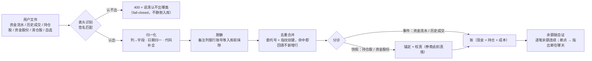
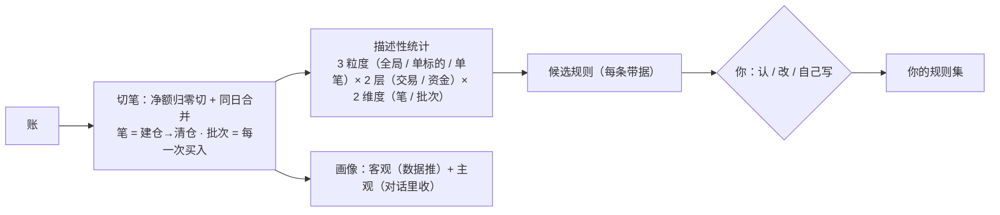
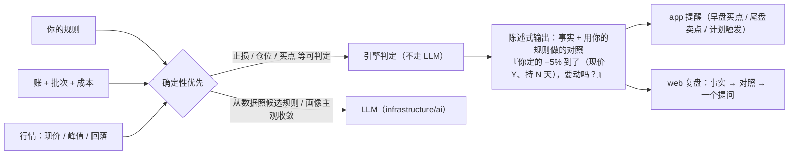

# trading-plugin-redesign 设计文档 v1

**轮次**：v1 · 2026-10-06 · **编写**：设计文档编写者（subagent）
**上游**：`./requirement.md`（2026-10-06 人拍板定稿，硬约束）· 上一轮审核：无（v1）
**素材**：`./input.md`（D1–D9，可论证 / 改写 / 推翻）

> 本稿只写「**怎么做**」。需求里「不做」的（`X-01` 下单 / `X-02` 用户端行情入口 · `N-01` 规则分享 · `N-02` 周期层）**不进设计**。

## 本轮回应

**首轮**——无上一轮审核可回应。

对齐方式：把需求定稿的「范围（`R-01`–`R-13`）· 验收标准（1–11）· 约束（隐私 / 品种 / 可配置 / 分系统）」逐条落成机制；设计输入 D1–D9 中与需求一致的收进本稿，**不一致或需人定的移入「★ 未决」**。追溯矩阵见 §7，无空缺项。

## 设计

### 1. 归属与分层（先答「属于哪一层」）

| 问题 | 答案 |
|:--|:--|
| 产品层 | **L6 交易反哺**（`ARCHITECTURE.md` 五层）|
| 代码域 | `domain/trading`（**插件**，随 `Account.plugins` 生灭）|
| 依赖方向 | `interfaces → application → domain/trading`；行情 / 推送 / LLM 归 `infrastructure`（依赖倒置）；**跨域只经 `application` 编排**（边界 B6）|
| 与 kernel 的关系 | kernel 只提供**插件门控**（`PluginRegistry` / `PluginService`）与通用推送 / 存储；**交易记忆一律不进 kernel**（见 §8.4）|

| 层 | 本设计承担 |
|:--|:--|
| `interfaces` | 三面控制器：`TradingController`（web / app 共用 API）· `TradingCaseController` · `TradingEvidenceController` · admin 侧行情导入控制器 |
| `application` | `TradingAppService`（**唯一编排点**）：导入编排 · 对账 · 分析 · 规则 · 三环 · 计划 |
| `domain/trading` | 六个子模块（§2）+ 端口（`TradingRuleSettingsPort` / `TradingMarketStagePort` / `TradingRoundPort` / `KlineSource` / `MarketDataSource`）|
| `infrastructure` | 行情源（腾讯 / 东财兜底）· 通达信文本解析 · 文件存储 · APNs / 站内推送 · `infrastructure/ai`（仅候选规则与画像主观收敛）|
| `kernel` | 插件门控 + 计划类待办链（唯一例外，见 §8.4）|

### 2. 模块切分（六个子模块）

| # | 子模块 | 职责（一句话）| 关键产物 | 对应需求 |
|:--:|:--|:--|:--|:--|
| 1 | `ingest` 入库 | 把一份导出**认出来 · 洗干净 · 去重 · 排好序**再交给账 | 归一事件 / 快照 + 原始文件 | `R-01` `R-12` |
| 2 | `ledger` 账 | **单一真源**：成交 · 持仓 · 现金 · 成本 · 派生的唯一计算地；对账只在它内部做 | 账 + 对账结论 | `R-02` `G-01` `G-02` |
| 3 | `rounds` 一笔 | 按口径切「一笔」+「批次」，边界是**一等对象** | 笔 / 批次 / 边界 | `R-03` |
| 4 | `analytics` 理解 | 三粒度 × 两层 × 两维度的**描述**；候选规则原料；画像 | 统计 / 候选 / 画像 | `R-05` `R-13` |
| 5 | `rules` 规则 | 三来源（自建 / 导入 / 从数据长）· 三态（候选 / 已认 / 自定义）· 只存**文本 + 参数** | 规则集 | `R-06` |
| 6 | `advisory` 三环 | 买 / 持 / 卖三环的**对照**与**陈述式**输出 | 对照结论 / 提醒 | `R-07` `R-11` |

横切三个：`cases` 案例库（`R-10`）· `watchlist` 自选留历史（`R-09`）· `plan` 计划（`R-11` 计划触发）——共用 `charts` 通用画图能力（K 线 + B/S/T 标记 + 止损线 / 峰值浮盈线，`R-04`）。

**依赖约束**：`ingest → ledger` · `rounds → ledger` · `analytics → rounds + ledger` · `rules → analytics`（候选来源）· `advisory → rules + ledger + 行情`。**反向无依赖**——`ledger` 不感知规则、`analytics` 不感知推送，故可单独重算。

### 3. 数据流（四条主链）

**① 入库链**（`R-01` `R-02` `R-12` · 验收 1 / 5 / 6 / 8）

要点：① **内部排序**——事件类在前、快照类最后（快照是"券商此刻的真值"，永远最后）；用户**不用记顺序**（`R-12`）。② **两源不重复入账**——资金流水先建账，历史成交按编号 / 指纹**合并回填**。③ **资金流水是资金侧主源**（一份含成交 + 资金事件 + 余额），历史成交是**成交维度**第二源。④ 识别失败与品种不支持一律**如实拒绝**（§8.2）。

**② 理解链**（`G-03` `G-05` `R-03` `R-05` `R-06` `R-13` · 验收 2 / 3）

切笔细则（与需求「业务规则」逐字对齐）：**净额归零即一笔结束** · **同一天"卖光 → 买回"合回同一笔**（做 T 不切新笔）· **建仓完毕 = 首次卖出前的最后一次买入**（记在每一笔上）· **不做底仓特例**（识别不出 → 如实说判不了）· **切笔只发生在跨日清仓之后**。人工边界 `{symbol, 锚定日, 锚定那笔买入, source: auto|manual, 备注}`，**人工 > 自动**。

描述与对照**分开产出**（`G-07`）：无规则的人只出「描述」，并如实说「我还没有你的规则，判不了守没守」——**不拿别人的规则替他判**。

**③ 对照链**（`R-07` `R-11` · 验收 7 / 10）

**说话前的四要素闸门**——成本 / 批次 · 我的线（止损价 / 放飞线）· 行情（现价 / 峰值 / 回落）· 持有时间（从建仓完毕算）；**缺一样就别开口**（说「我缺 X，说不了」）。提醒只用**你定的线**、只**陈述**，**不说「该止损了」**（`R-07` · 验收 10）。**止损 / 清仓分开说**（清仓 = 全卖，与减仓 / 放飞一部分分开）。**卖点尺子闭环**：你的清仓股分析 → 候选卖点规则 → 你认 → 下次用它评你（验收 7）。

**④ 纠错链**（`R-08` · 验收 8）

| 错在 | 怎么修 | 派生怎么跟 |
|:--|:--|:--|
| 快照（持仓股 / 资金股份）| 重导一次即覆盖 | 重算 |
| 事件（成交 / 资金流水）| 就地改 / 删（确认后直接改，不留痕）| 重算 |
| 派生（持仓 / 成本 / 盈亏 / 笔）| 不手修 | 改源后**自动重算** |
| 切笔边界 | 人工切 / 合 | 重算 |
| 规则 / 止损价 | 改规则 | 重算对照 |

发现机制：**简单校验**（余额链断层 / 对账 drift / 丢行提示）→ 指出「哪里不对」。**后路**：原始导入文件留存 `imports/save/`，改错了能重导。

### 4. 落盘与数据模型（`File First`）

`data/{userId}/trading/`（隐私，gitignore 保护 · 单账户期 `userId` 即账户，模型**预留 `accountId` 一层**）：

| 路径 | 装什么 | 性质 |
|:--|:--|:--|
| `imports/save/` | 原始导入文件（后路，不改）| 原始 |
| `ledger/` | 逐笔流水 · 转账 / 出入金 · 现金调整 | 事件（真相）|
| `positions/` `account.json` | 持仓 / 成本 / 现金 / 本金 | 派生 + 少量手填 |
| `snapshots/` | 持仓股 / 资金股份快照 + 锚定日 | 快照（锚）|
| `rounds/` | 笔 + 批次 + **人工边界** | 派生（可人工覆盖）|
| `watchlist/` | 自选股**按日快照**（最早 / 最后出现）| 快照 |
| `plans/` | 次日计划 / 日状态 | 事件 |
| `cases/` | 案例库 | 事件 |
| `rules.yaml` `profile/` | 规则集 · 画像（客观 + 主观）| 配置 |
| `market/`（全局）| 行情包 · 活跃市值（**admin 导入**）| 公共资产 |

**派生量恒等式**（可查）：`系统现金 = 上次快照值 + Σ 已计入流水与转账 + Σ 调整`。本金**不靠手填**——`净投入 = 转存 − 转取`由事件推出（`G-06`）。

### 5. 接口（按需求分组，全部走 `X-User-Id` + trading 插件门控）

| 组 | 端点（示意）| 对应 | 面 |
|:--|:--|:--|:--|
| 导入 | `POST /trading/import`（`kind` 分派 + `dryRun` 预检 + **一次全收**）| `R-01` `R-12` `R-02` | web |
| 账 / 对账 | `GET /trading/account` · `GET /trading/integrity` · `POST /trading/reconcile` | `G-01` `G-02` | web（app 只读结论）|
| 一笔 | `GET /trading/rounds` · `PUT /trading/rounds/{id}` · `POST /trading/rounds/boundaries` | `R-03` | web |
| 图表 | `GET /trading/kline?symbol=&window=`（B/S/T 标记 · 止损线 · 峰值浮盈线）| `R-04` | web |
| 分析 | `GET /trading/analysis/{global\|symbol\|round}` | `R-05` | web（结论进 app）|
| 规则 | `GET/PUT /trading/rules` · `POST /trading/rules/candidates` · `POST /trading/rules/{id}/accept` | `R-06` | web |
| 三环 | `GET /trading/advisory/{buy\|hold\|sell}`（陈述 + 四要素依据）| `R-07` | app + web |
| 纠错 | `PUT/DELETE /trading/trades/{id}` · 重导快照 | `R-08` | web |
| 自选 / 案例 | `GET/POST /trading/watchlist` · `/trading/cases` | `R-09` `R-10` | web |
| 计划 / 提醒 | `GET/PUT /trading/plans` | `R-11` | app 收 / web 看 |
| 画像 | `GET /trading/profile` | `R-13` | web |
| admin | `POST /admin/market/import`（行情包 / 活跃市值）| 约束 · 分系统 | admin |

**接口契约三条**：① 「缺数据」一律出 `null` + `reason`，**不出 0**（验收 5）；② 分析类响应**每个数字带可回溯引用**（哪几天 / 哪几笔算的，验收 4）；③ 三环响应**只带 `statement` + `basis[]` + `ruleRef`**，**契约层不含建议字段**（验收 10）。

### 6. 三端呈现（每功能归谁 / 怎么摆）

| 功能 | web（坐下来）| app（随身）| admin |
|:--|:--|:--|:--|
| `R-01` 记录 | 导入（一次全收）· 逐笔编辑 | **手动记一笔 / 截图入账** | — |
| `R-02` 对账 | 差额可见 + 断点定位 | — | — |
| `R-03` 一笔 | 图上 / 列表上人工切笔 | — | — |
| `R-04` 图表 | K 线 + 指标 + 买卖点 | — | — |
| `R-05` 分析 | 三粒度明细 | **只给结论入口** | — |
| `R-06` 规则 | 自建 / 导入 / 认候选 | — | — |
| `R-07` 三环 | 看依据 | **收提醒** | — |
| `R-08` 纠错 | 就地改 | — | — |
| `R-09` `R-10` 自选 / 案例 | 全功能 | — | — |
| `R-11` 提醒 | — | **收提醒** | — |
| `R-12` 一次交文件 | 是 | （不能导入）| — |
| `R-13` 画像 | 页面（客观 + 主观）| — | — |
| 行情 / 活跃市值 | — | — | **导入**（`X-02`）|

**持仓**是「同一功能两端不同摆法」的样板：web = 表格 + 逐行编辑；app = 一行行的卡 + 点开看结论。**不许出现"某功能只在一端、且未声明"**——上表即声明。

### 7. 需求追溯矩阵

| 需求 | 设计落点 | 需求 | 设计落点 |
|:--|:--|:--|:--|
| `G-01`–`G-07` | §2 六模块 · §3 四条链 | 验收 1 | §3① + §6（web 导入 + app 记录）|
| `R-01` | §3① §5 | 验收 2 | §3② 候选规则 |
| `R-02` | §3① 余额链 · §4 恒等式 | 验收 3 | §3② 切笔 + §3④ 重算 |
| `R-03` | §2.3 §3② | 验收 4 | §5 契约② |
| `R-04` | §2 横切 charts | 验收 5 | §5 契约① |
| `R-05` | §3② | 验收 6 | §3① §4 |
| `R-06` | §2.5 §3② | 验收 7 | §3③ 卖点尺子闭环 |
| `R-07` | §2.6 §3③ | 验收 8 | §3④ |
| `R-08` | §3④ | 验收 9 | §8.1 |
| `R-09` `R-10` | §2 横切 | 验收 10 | §5 契约③ |
| `R-11` | §3③ §6 | 验收 11 | §2.4 画像 |
| `R-12` | §3① 内部排序 | `N-01` `N-02` `X-01` `X-02` | **不进设计** |
| `R-13` | §2.4 画像 | | |

### 8. 边界（红线怎么落地）

**8.1 隐私**（约束 · 验收 9）——打码与脱敏都做在「**出**」的边界（DTO 序列化层 + context contributor 层），存储层保真值以支撑对账：

| 面 | 落法 |
|:--|:--|
| 端上打码（统一口径）| **数量与成本打码，现价与止损保留**——三端共用同一 DTO 字段策略，不各端各写一套 |
| 分享 / 导出 | 默认剥离金额字段（服务端出参即不含）|
| AI 上下文 | **能不出就不出；必须出时出"结构"不出"规模"**——数量 / 金额 / 成本价不出；代码 · 比例 · 价格 · 规则文本 · 形态可出。配：能不走 LLM 的判定不走 · 脱敏在出边界 · 透明可解释 |
| 多账号 | **隔离**（家人各用自己的账号）|

**8.2 品种与拒绝**——限制**只在「账」**：`600/601/603/605` · `000/001/002/003` 才入账；其他（科创 / 创业 / 北交所 / ETF / 可转债 / 港美股）**如实拒绝、不静默**（表头识别同理 fail-closed）。**自选 / 案例 / 行情不受主板限制**。

**8.3 可配置（插件生灭）**——交易的一切随插件：关 → 端点 403 + **账与理解都不注入** + 不推送；**数据保留不删**，重开即有。

**8.4 记忆归属**（D9）——交易的「理解」（画像 / 规则）放 **trading 域**，**不进 kernel 记忆**（kernel 级关不掉）；唯一例外是**对话里的"动作"**落 kernel 通用待办链。

**8.5 不编 / 降级**——行情取不到就明说（不用旧值冒充 · 降级要标出）；没交数据就只说事实、明说缺什么（不猜）；派生量缺字段 → `—`，**绝不渲染成 0**。

**8.6 第一原则（B1）**——所有用户可见输出（含推送 / 复盘 / 分析总结）不得出现系统视角标签（问：/ 答：/ 建议 / 该买 / 该卖）。

## 取舍

| # | 选择 | 为什么不选另一条 |
|:--:|:--|:--|
| T1 | **资金流水当资金侧主源、历史成交当成交维度**（两源各司其职，不合并成一张表）| 合并会丢口径：流水带余额可**链式自证**、成交带委托号可**精确去重**，合一必牺牲一头 |
| T2 | 切笔用**净额归零 + 同日合并**，不用「清仓股摘要」| 清仓股把同一只票的多笔合并了，**只能当摘要不能当真相** |
| T3 | 人工边界做成**一等对象**（非覆盖计算结果）| 要可追溯 / 可撤销 / 自动让位（人工 > 自动）；覆盖式会让"为什么这么切"消失 |
| T4 | **确定性优先**：止损 / 仓位 / 买点走引擎，LLM 只用于照候选规则与画像主观收敛 | 成本 + 可回溯 + 不编（验收 4 / 5）；LLM 判定会破坏「每个数字点得进去」|
| T5 | 打码放在**出边界**，存储保真 | 在库 / 文件里打码会让对账与重算失真；打码是**呈现**问题不是**数据**问题 |
| T6 | 交易理解放 trading 域、**不进 kernel 记忆** | kernel 记忆关不掉——放进去就违反「关了插件不再提交易」（§8.3 / §8.4）|
| T7 | 分析**现算不落盘**（只落源头与派生）| 落"分析结果"＝多一个会漂移的真相源；数据量小、现算足够 |
| T8 | 图表默认 **±15/30 根**窗口，不画全历史 | 图只给"这一笔"上下文；全历史会让单笔视图失焦 |
| T9 | 导入顺序**内部化**（事件在前 / 快照最后）| 顺序是系统的责任，不该变成用户的记忆负担（`R-12`）|
| T10 | 三面切分：admin = 公共数据 / 治理 · web = 坐下分析 · app = 随身 | 避免"某功能只在一端"的意外（需求「分系统」）|

> 凡「两个方案都行、选哪个」的取值问题，本稿**不自行拍板**——一律进 §9。

## ★ 未决（需人拍板）

> 以下 6 项**未定前，本设计不进编码**。每项给「方案 A / 方案 B + 代价」，**请拍板**。

- **★ U1 重做的落地方式**（成本与范围权衡 · 本项不定则其余落法悬空）
  - A **全量重写** `domain/trading`：干净、贴合新需求；代价高、存量端点与三端 UI 需重做、期间插件不可用。
  - B **渐进重构**：保留端点与数据、按模块逐个替换（`ingest → rounds → analytics → advisory`）；代价低、可分批验收；风险是新旧口径长期并存。
  - 来源：需求「重做」未指定方式；`R-03` 切笔与 `R-05` 分析与现状差异较大。
- **★ U2 存量数据迁移口径**：现有 `data/{userId}/trading/` 的真实账目**迁移**还是**重导**？迁移要什么验收（与现状逐笔对拍？）· 失败如何回退。
- **★ U3 分析总结与候选规则是否走 LLM**（质量 vs 成本 vs "不编"）
  - A 全程引擎 + 模板（可回溯最好，表达偏机械）；B 总结走 LLM、数字仍由引擎给（读起来自然，多一次调用与成本，需防编造）。
- **★ U4 提醒的时点与频率上限**（app 打扰度 vs 不漏）：早盘 / 尾盘 / 计划触发的**具体时点**与**一天最多几条**；超限合并还是丢弃。
- **★ U5 历史成交回放窗口**：现状是**近 N 日隐式窗口**（更早只补流水、不动持仓）；改成**显式全量回放**还是保留窗口？影响对账正确性与导入耗时（`R-02`）。
- **★ U6 原始导入文件留存期**：`imports/save/` 留多久（隐私 vs 纠错后路 vs 磁盘）；到期自动清理还是只提示。

> 另有 3 项**登记待排（不阻断本设计，但要人点头才动手）**：`P2-交易88`（动作 → 待办 → 记忆粒度错配）· `P2-交易66`（本金自证：数据源已具备，见 §4）· **交易是否落 kernel `Record` 流水线**（与 §8.4「不进 kernel 记忆」的边界需人确认，`REVIEW.md` 有存量 P2 项）。

## 自评风险

我认为**最可能被打回**的四处（主动暴露）：

1. **U1 未定就往下走**——若审核者认为"重做方式"是设计前提而非未决项，本稿整体会判 P1（设计悬空）。**立场**：这正属"两个方案都行"的取值取舍，按主链必须升级给人，不自行拍板。
2. **切笔算法的边界情形未穷举**——需求只给「净额归零切 / 同日合并 / 建仓完毕 / 不做底仓特例」，但**连续建仓中插入部分卖出**、**同日买回量大于卖出量**、**只有卖出无建仓**三类只写了"如实说判不了"兜底，没给完整判定表——可能被 `code-backend-reviewer` 判 P1。倾向：v2 补一张边界判定表。
3. **打码与可用性冲突**——「数量与成本打码、现价与止损保留」在**三环提醒**与**批次分析**页：数量打码后"批次 / 仓位"如何可读？可能被 `ux-interaction-reviewer` / `ux-visual-reviewer` 判 P2。倾向：端上给"临时显形"手势（属交互取值，也可能要进未决）。
4. **隐私"比例可出"的反推风险**——出"比例"配公开行情可反推金额（集中度 × 市值），可能被 `ai-adversarial-reviewer` 判"脱敏不彻底"。倾向：出比例时同时脱敏分母（只出区间），阈值取值 → 未决。

**其余自评**：`R-01`–`R-13` 与验收 1–11 的追溯矩阵（§7）已逐条核过，**无空缺项**；「不做」四项（`N-01` `N-02` `X-01` `X-02`）确认**未混入设计**。

---

**给审核者**：本稿的收敛阻塞项在 §9；若你判定其中某项**不需要人拍板**（我可自行决定），请写明依据并指路，我在 v2 收进设计。
