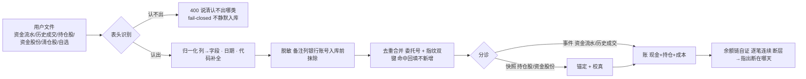
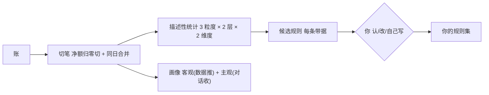
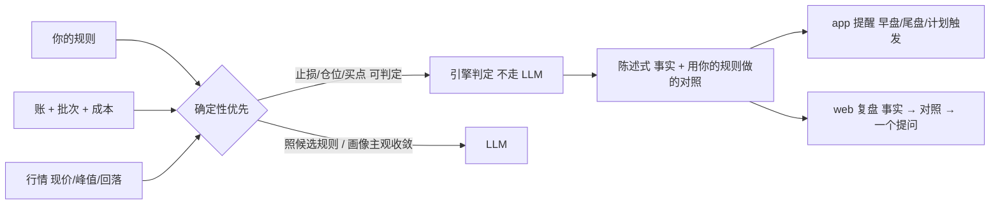

# trading-plugin-redesign 设计文档 v2

**轮次**：v2 · 2026-10-06 · **编写**：设计文档编写者（subagent）
**上游**：`./requirement.md`（2026-10-06 人拍板定稿，硬约束）· 上一轮 `./review-v1-20261006.md`
**人拍板输入**：`./decisions.md`（**人的介入点②**：S1/S2 + U1–U6，结论「全部按建议执行」）
**素材**：`trading-plugin-design-input.md`（D1–D9）· `trading-plugin-overview.md`（既有能力 / 端点盘点）

> 本稿写「**怎么做**」。需求里「不做」的四项（`X-01` 下单 · `X-02` 用户端行情入口 · `N-01` 规则分享 · `N-02` 周期层）**不进设计**。

## 本轮回应

> 逐条对应 `review-v1` 编号。**战略级 2 条 + U1–U6 已由人拍板**（`design-decisions`），本稿据以落成设计；`P*` 项逐条给落点。**无「未回应」项**。

| 上一轮编号 | 结论 | 本稿怎么改（落点）|
|:--|:--|:--|
| **S1** L6 反哺闭环被砍 | **采纳（人拍板：保留）** | 新增 **§10 L6 反哺闭环承接**：`promote`（复盘 → `os/trading-engine/99-inbox`）与 admin `conflicts` **保留**、受 trading 插件门控；用「**知识（os/）vs 记忆（kernel）**」一句与 §11.4 划清——反哺的是**知识库**，不违反「理解不进 kernel 记忆」 |
| **S2** 定位扩容未进蓝图 | **采纳（人拍板：补 RFC + roadmap）** | 属**方向文档**（`.agents/direction/`）改动 → **不在本分支改**，登记 §13 交主会话；设计侧声明**依赖**（frontmatter 已挂 `product-roadmap.md`）|
| **P1-1** 计划 / 待办跨域二义 | **已改** | §11.4 重写：**两个「计划」分家**——`R-11` 次日计划落 trading `plans/`（随插件）；必要时写入 kernel 待办时打 `source=trading` + `sourceRecordId`，**ContextEngine / 推送对 `source=trading` 做「插件关闭即过滤」闸门**（§8 契约含此闸门）|
| **P1-2** 理解 → Context 注入链路缺席 | **已改** | 新增 **§8「理解 → Context 注入契约」**：注入字段 / 形态 · 触发条件 · 脱敏口径 · 条数体量上限；并列 **三个既有 Contributor 的去留**（删死代码 / 保留 / 保留）|
| **P1-3** 既有能力回归面未列清单 | **已改** | 新增 **§9「既有能力清单 + 去留」**（保留 / 替换 / 删除 + 理由），依据 overview §2 端点总览 + 代码抽查——**作为 U1 的必需输入** |
| **P2-1** 术语未统一 | **已改** | 新增 **§7 术语表**（笔 = round · 批次 = lot · 做 T · 放飞 / 减仓 / 清仓），与 RFC `20260825`（lot = 批次）· `20260909` 对齐，全稿统一用词 |
| **P2-2** 唯一输入入口口径 | **已改** | §5 分流：**批量文件导入**走 trading 域端点（成批、需表头识别）· **随手记一笔 / 截图入账**走 `POST /api/v1/records` + 意图分流 |
| **P2-3** 不留痕 vs 可追溯 | **已改** | §4.3 新增：**用户面不留痕**（就地改、无版本），**系统侧保留不可见修改日志**（时间 / 字段 / 前后值 / 来源），供「每个数字点得进去」（验收 4）复算审计 |
| **P2-4** admin 行情导入会误读 | **已改** | §6 / §10 澄清：**行情抓取仍归 L5 / infrastructure 自动**（tdx → 腾讯 → 新浪兜底）；admin 只导**公共数据**（行情包 / 活跃市值），不是行情来源 |
| **P2-5** 品种口径分裂 | **已改** | §11.2 + §4：**限制只在「账」**——`cases` / `watchlist` **不依赖 `ledger`**；图表「有行情即可画」，**买卖点标记仅当该标的有账时出现** |
| **P3-1** frontmatter `depends-on` 不全 | **已改** | 补 `product-roadmap.md` / `ARCHITECTURE.md` / `boundaries.md` / `ai-context-engineering.md` / `REVIEW.md` |
| **P3-2** 追溯矩阵不全 | **已改** | §12 矩阵补 **§5 三条契约**；「不做」四项**分列**；U 项落点在 §9 / §13 |
| **P3-3** 台账卫生 | **已改（登记交接）** | `P2-交易81`（将被验收 1 覆盖）· `P2-交易66`（无解 → 待实施）→ §13 登记**由主会话回写 REVIEW**（本分支不改，守 batch1 纪律）|
| **P29–P33** 流程检查点 | **方向采纳** | P30 / P33 已在 §8 / §4.3 落实；P29 → §9 + §13；P31「域 → Context 必须显式契约」→ §8；P32 → §10。规则文本改动属 `.agents/rules` → §13 登记待交接 |

**未采纳 / 保留**：无。v1 的 T1–T10 取舍**全部维持**（审核未对 T 项提出异议）。

---

## 设计

### 1. 归属与分层

| 问题 | 答案 |
|:--|:--|
| 产品层 | **L6 交易反哺**（含闭环终点：复盘 → `promote` → 知识库，见 §10）|
| 代码域 | `domain/trading`（**插件**，随 `Account.plugins` 生灭）|
| 依赖方向 | `interfaces → application → domain/trading`；行情 / 推送 / LLM 归 `infrastructure`（依赖倒置）；**跨域只经 `application` 编排**（B6）|
| 与 kernel 的关系 | kernel 只提供**插件门控**（`PluginRegistry` / `PluginService`）与通用待办 / 推送 / 存储；**交易「理解」一律不进 kernel 记忆**（§11.4）|

| 层 | 本设计承担 |
|:--|:--|
| `interfaces` | `TradingController`（web / app 共用 API）· `TradingCaseController` · `TradingEvidenceController` · `TradingPlanController` · `TradingRoundController` · admin 侧公共数据导入 / `conflicts` |
| `application` | `TradingAppService`（**唯一编排点**）：导入 · 对账 · 分析 · 规则 · 三环 · 计划 |
| `domain/trading` | 六个子模块（§2）+ 端口（`TradingRuleSettingsPort` / `TradingMarketStagePort` / `TradingRoundPort` / `KlineSource` / `MarketDataSource`）|
| `infrastructure` | 行情源（tdx → 腾讯 → 新浪）· 通达信文本解析 · 文件存储 · 推送 · `infrastructure/ai`（仅候选规则与画像主观收敛）|
| `kernel` | 插件门控 + **通用待办链**（交易来源打 `source=trading`，受关插件闸门，§8）|

### 2. 模块切分（六个子模块 + 横切）

| # | 子模块 | 职责（一句话）| 关键产物 | 对应需求 |
|:--:|:--|:--|:--|:--|
| 1 | `ingest` 入库 | 把一份导出**认出来 · 洗干净 · 去重 · 排好序**再交给账 | 归一事件 / 快照 + 原始文件 | `R-01` `R-12` |
| 2 | `ledger` 账 | **单一真源**：成交 · 持仓 · 现金 · 成本 · 派生的唯一计算地；对账只在它内部做 | 账 + 对账结论 | `R-02` `G-01` `G-02` |
| 3 | `rounds` 一笔 | 按口径切「笔」+「批次」，边界是**一等对象** | 笔 / 批次 / 边界 | `R-03` |
| 4 | `analytics` 理解 | 三粒度 × 两层 × 两维度的**描述**；候选规则原料；画像 | 统计 / 候选 / 画像 | `R-05` `R-13` `G-07` |
| 5 | `rules` 规则 | 三来源（自建 / 导入 / 从数据长）· 三态（候选 / 已认 / 自定义）· 只存**文本 + 参数** | 规则集 | `R-06` |
| 6 | `advisory` 三环 | 买 / 持 / 卖三环的**对照**与**陈述式**输出 | 对照结论 / 提醒 | `R-07` `R-11` |

横切三个：`cases` 案例库（`R-10`）· `watchlist` 自选留历史（`R-09`）· `plan` 计划（`R-11`）——共用 `charts` 通用画图能力（K 线 + B/S/T 标记 + 止损线 / 峰值浮盈线，`R-04`）。

**依赖约束**：`ingest → ledger` · `rounds → ledger` · `analytics → rounds + ledger` · `rules → analytics`（候选来源）· `advisory → rules + ledger + 行情`。**反向无依赖**（`ledger` 不感知规则、`analytics` 不感知推送）→ 可单独重算。**`cases` / `watchlist` 只依赖行情，不依赖 `ledger`**（P2-5）。

### 3. 数据流（四条主链）

**① 入库链**（`R-01` `R-02` `R-12` · 验收 1 / 5 / 6 / 8）

要点：① **内部排序**（事件在前、快照最后）——用户**不用记顺序**（`R-12`）；② **两源不重复入账**（流水先建账，成交按编号 / 指纹合并回填）；③ **资金流水是资金侧主源**；④ 识别失败与品种不支持一律**如实拒绝**（§11.2）。

**② 理解链**（`G-03` `G-05` `R-03` `R-05` `R-06` `R-13` · 验收 2 / 3）

切笔细则与需求「业务规则」逐字对齐：**净额归零即一笔结束** · **同日「卖光 → 买回」合回同一笔**（做 T 不切新笔）· **建仓完毕 = 首次卖出前的最后一次买入** · **不做底仓特例**（识别不出 → 如实说判不了）· **切笔只发生在跨日清仓之后**。人工边界 `{symbol, 锚定日, 锚定那笔买入, source: auto|manual, 备注}`，**人工 > 自动**（§7 术语）。

**描述与对照分开产出**：无规则的人只出「描述」，如实说「我还没有你的规则，判不了守没守」——**不拿别人的规则替他判**。

**③ 对照链**（`R-07` `R-11` · 验收 7 / 10）

**说话前四要素闸门**——成本 / 批次 · 我的线（止损价 / 放飞线）· 行情（现价 / 峰值 / 回落）· 持有时间（从建仓完毕算）；**缺一样就别开口**。提醒只用**你定的线**、只**陈述**，**不说「该止损了」**。**止损 / 清仓分开说**。**卖点尺子闭环**：你的清仓股分析 → 候选卖点规则 → 你认 → 下次用它评你（验收 7）。

**④ 纠错链**（`R-08` · 验收 8）

| 错在 | 怎么修 | 派生怎么跟 |
|:--|:--|:--|
| 快照（持仓股 / 资金股份）| 重导一次即覆盖 | 重算 |
| 事件（成交 / 资金流水）| 就地改 / 删（确认后直接改，**用户面不留痕**）| 重算 |
| 派生（持仓 / 成本 / 盈亏 / 笔）| 不手修 | 改源后**自动重算** |
| 切笔边界 | 人工切 / 合 | 重算 |
| 规则 / 止损价 | 改规则 | 重算对照 |

发现机制：**简单校验**（余额链断层 / 对账 drift / 丢行提示）→ 指出「哪里不对」。**后路**：原始导入文件留存 `imports/save/`（U6：长期留 + 银行账号脱敏）。**系统侧修改日志**见 §4.3。

### 4. 落盘与数据模型（`File First`）

**4.1 目录**——`data/{userId}/trading/`（隐私 · gitignore 保护 · 单账户期 `userId` 即账户，模型**预留 `accountId` 一层**）：

| 路径 | 装什么 | 性质 |
|:--|:--|:--|
| `imports/save/` | 原始导入文件（后路，不改）| 原始 · **长期留**（U6）|
| `ledger/` | 逐笔流水 · 转账 / 出入金 · 现金调整 | 事件（真相）|
| `positions/` `account.json` | 持仓 / 成本 / 现金 / 本金 | 派生 + 少量手填 |
| `snapshots/` | 持仓股 / 资金股份快照 + 锚定日 | 快照（锚）|
| `rounds/` | 笔 + 批次 + **人工边界** | 派生（可人工覆盖）|
| `watchlist/` | 自选股**按日快照**（最早 / 最后出现）| 快照 |
| `plans/` | 次日计划 / 日状态 | 事件 |
| `cases/` | 案例库 | 事件 |
| `rules.yaml` `profile/` `knowledge.md` | 规则集 · 画像（客观 + 主观）· 用户私有交易知识 | 配置 |
| `market/`（全局）| 行情包 · 活跃市值（**admin 导入 · 公共数据**）| 公共资产 |

**4.2 派生量恒等式**：`系统现金 = 上次快照值 + Σ 已计入流水与转账 + Σ 调整`；本金**不靠手填**——`净投入 = 转存 − 转取`由事件推出（`G-06` · `P2-交易66` 残余）。

**4.3 修改日志（P2-3）**——满足「用户面不留痕」与「可追溯复算」两个看似冲突的要求：

| 面 | 落法 |
|:--|:--|
| 用户面 | 就地改 / 删，**无版本、无痕迹**（需求「诚实口径」）|
| 系统侧 | `ledger/.audit/`（或等价）保留**不可见修改日志**：`{时间, 记录 id, 字段, 前值, 后值, 来源}`——**仅供复算审计**，不进任何用户可见面、不进 AI 上下文 |
| 用途 | 支撑验收 4「每个数字点得进去（哪几天、哪几笔算的）」· 支撑 U1 迁移期**逐笔对拍**（U2）|

### 5. 接口

**输入分流（P2-2）**——两条入口，不混：

| 输入 | 走哪 | 为什么 |
|:--|:--|:--|
| **批量文件导入**（资金流水 / 历史成交 / 持仓股 / 资金股份 / 清仓股 / 自选）| **trading 域端点** `POST /trading/import` | 成批、需表头识别与归一化，属域内 `ingest` |
| **随手记一笔 / 截图入账** | **`POST /api/v1/records`**（+ 意图分流）| 属**通用记录**（ARCHITECTURE「唯一输入入口」）；域侧只被动消费 Record |

**端点（按需求分组，全部 `X-User-Id` + trading 插件门控）**：

| 组 | 端点（示意）| 对应 | 面 |
|:--|:--|:--|:--|
| 导入 | `POST /trading/import`（`kind` 分派 + `dryRun` 预检 + **一次全收**）| `R-01` `R-12` `R-02` | web |
| 账 / 对账 | `GET /trading/account` · `GET /trading/integrity` · `POST /trading/reconcile` | `G-01` `G-02` | web（app 只读结论）|
| 一笔 | `GET /trading/rounds` · `PUT /trading/rounds/{id}` · `POST /trading/rounds/boundaries` | `R-03` | web |
| 图表 | `GET /trading/kline?symbol=&window=`（B/S/T 标记 · 止损线 · 峰值浮盈线）| `R-04` | web |
| 分析 | `GET /trading/analysis/{global\|symbol\|round}` | `R-05` | web（结论进 app）|
| 规则 | `GET/PUT /trading/rules` · `POST /trading/rules/candidates` · `POST /trading/rules/{id}/accept` | `R-06` | web |
| 三环 | `GET /trading/advisory/{buy\|hold\|sell}`（陈述 + 四要素依据）| `R-07` | app + web |
| 纠错 | `PUT/DELETE /trading/trades/{id}` · 重导快照 | `R-08` | web |
| 自选 / 案例 | `GET/POST /trading/watchlist` · `/trading/cases` | `R-09` `R-10` | web |
| 计划 / 提醒 | `GET/PUT /trading/plans` | `R-11` | app 收 / web 看 |
| 画像 | `GET /trading/profile` | `R-13` | web |
| 反哺（S1）| `POST /trading/reviews/{date}/promote` | §10 | web |
| admin | `POST /admin/market/import`（行情包 / 活跃市值）· `GET /admin/trading/knowledge/conflicts` | 约束 · 分系统 · §10 | admin |

**接口契约三条**：① 「缺数据」一律出 `null` + `reason`，**不出 0**（验收 5）；② 分析类响应**每个数字带可回溯引用**（哪几天 / 哪几笔算的，验收 4）；③ 三环响应**只带 `statement` + `basis[]` + `ruleRef`**，**契约层不含建议字段**（验收 10）。

### 6. 三端呈现

| 功能 | web（坐下来）| app（随身）| admin |
|:--|:--|:--|:--|
| `R-01` 记录 | 导入（一次全收）· 逐笔编辑 | **手动记一笔 / 截图入账** | — |
| `R-02` 对账 | 差额可见 + 断点定位 | — | — |
| `R-03` 一笔 | 图上 / 列表上人工切笔 | — | — |
| `R-04` 图表 | K 线 + 指标 + 买卖点 | — | — |
| `R-05` 分析 | 三粒度明细 | **只给结论入口** | — |
| `R-06` 规则 | 自建 / 导入 / 认候选 | — | — |
| `R-07` 三环 | 看依据 | **收提醒** | — |
| `R-08` 纠错 | 就地改 | — | — |
| `R-09` `R-10` 自选 / 案例 | 全功能 | — | — |
| `R-11` 提醒 | — | **收提醒** | — |
| `R-12` 一次交文件 | 是 | （不能导入）| — |
| `R-13` 画像 | 页面（客观 + 主观）| — | — |
| 行情 / 活跃市值 | — | — | **只导公共数据**（`X-02`）；**行情抓取归 L5 自动**（P2-4）|

**持仓**是「同一功能两端不同摆法」的样板：web = 表格 + 逐行编辑；app = 一行行的卡 + 点开看结论。**不许出现"某功能只在一端、且未声明"**——上表即声明。

### 7. 术语表（P2-1）

| 术语 | 定义 | 口径来源 |
|:--|:--|:--|
| **笔（round）** | 建仓 → 清仓的完整过程；复盘与规则的**单位**；一笔 = 多个批次 | 需求「业务规则」· RFC `20261003`（`TradingRoundService`）|
| **批次（lot）** | **每一次买入**；持仓与操作的粒度；同标的 + 同方向 + 同日合并为一批 | RFC `20260825`（lot = 批次）|
| **做 T** | 同一天「先卖后买」（含清仓后买回）= 同一笔的过程，**不切新笔** | 需求「业务规则」|
| **建仓完毕** | 首次卖出之前的**最后一次买入** | 需求 |
| **边界** | 笔的切分点；**一等对象**，人工可覆盖自动 | D3 |
| **放飞** | 部分减仓（保留底仓）；**与清仓分开说** | 需求「提醒口径」|
| **减仓 / 清仓** | 减仓 = 卖部分；清仓 = 全卖（持仓归零，触发复盘）| 需求 |
| **锚定** | 券商快照 = 账的真值基准（锚点）| RFC `20260912` |
| **drift** | 派生持仓 ≠ 最近锚点 + 锚点后净变化 | RFC `20260912` |
| **余额链** | 资金流水逐笔余额连续性；断层 = 漏导 | D1 |
| **有据 / 无据** | 锚定日依据显式化（EXPLICIT / FILE_DATE / CLOSED_DAY = 有据 · CLOCK = 无据）| `P2-交易84` |

> 术语表**只存本设计稿内**，不动全局 glossary（REVIEW 已有「glossary 术语重复 6 处」；收敛到全局属主会话动作，§13）。

### 8. 理解 → Context 注入契约（P1-2 · P31）

**唯一注入点在 kernel 的 `ContextContributor` / `KnowledgeSource`**（roadmap §3.2：`ContextContributor` 是插件的上下文接入点）。**不另建注入通道**——自建通道会多一个「关不掉」的注入面（违反 §11.3）。

**8.1 既有贡献者去留**：

| 贡献者 / 通道 | 现状 | 去留 | 注入什么 |
|:--|:--|:--|:--|
| `MarketContextContributor` | 生效（`scene=trading`）| **保留 · 改造** | 大盘指数（始终）+ 持仓行情（短版）——「现在怎样」|
| `TradingContextContributor` | **死代码**（`supports()` 恒 false、`enrich()` 恒空）| **删除** | —（避免 U1 静默留着或静默删掉无据）|
| `TradingProfileContributor` | 生效（`scene=trading\|decision`）| **保留** | 画像文本（客观统计 + 主观签名）——「你是谁」|
| `TradingKnowledgeSource`（既有）| 生效 | **保留** | 规则 / 知识：**用户私有 `data/{userId}/trading/knowledge.md` 优先**，owner 回落 `os/`，**其他用户不注入**（防跨用户泄漏）|

**8.2 字段 · 触发 · 脱敏 · 上限**：

| 维度 | 契约 |
|:--|:--|
| **触发** | 详情仅在 `scene=trading\|decision` 注入；其他场景只出一句「存在画像」（沿用 `TradingProfileContributor.globalContext` 的宁缺毋滥，防幻觉）|
| **脱敏** | 与 §11.1 同一口径：**能出结构不出规模**——代码 · 比例 · 价格 · 规则文本 · 形态可出；**数量 / 金额 / 成本价不出** |
| **体量上限** | 单贡献者默认：行情 ≤ 持仓数行 · 画像 ≤ 12 行 · 规则摘要 ≤ 8 行；**超限截断并标注**（默认值可调，见自评风险 2）|
| **关插件闸门** | 插件关 → 贡献者全部返回空；**kernel 待办中 `source=trading` 的条目**在 ContextEngine「## 待行动事项」与推送侧**按插件开关过滤**（P1-1）|

### 9. 既有能力清单 + 去留（P1-3 · U1 的必需输入）

> 依据：`trading-plugin-overview.md` §2 端点总览 + 代码抽查（粒度到「组」，未逐端点核 94 个交易域文件——见自评风险 1）。

| 既有能力 | 现状（端点 / 机制）| 去留 | 理由 |
|:--|:--|:--|:--|
| 三源账本 + 锚定 + drift 对账 | `/integrity` `/anchor` `/sync`（RFC `20260912` / `20261003`）| **保留** | 真钱账、生产事故验证过；U1 渐进重构不许推倒 |
| 导入（历史成交 / 持仓股 / 资金股份 / 清仓股 / 自选）| `/trades/import` `/positions/import` `/imports/cash` `/sold/import` `/watchlist/import` | **保留 · 改造** | 改造为 §3① 一次全收 + 表头识别 fail-closed（`R-12`）|
| 资金流水主源 + 备注脱敏 + 余额哨兵 | `/imports/save` + D1 | **保留 · 改造** | D1；脱敏移到入库前 |
| 切笔（一笔）| `TradingRoundService` `/rounds` | **保留 · 改造** | 对齐 §7 口径；加人工边界一等对象 |
| 批次推导 + 批次止损 | `/lots`（RFC `20260825`）| **保留** | 与「批次 = lot」术语对齐 |
| 规则引擎（止损 R66 / 仓位 R81）| `DefaultTradingRuleEngine`（三分共用）| **保留** | T4 确定性优先 |
| 四要素铁证 + evidence 底座 | `/evidence/*`（RFC `20260922`）| **保留** | 支撑验收 4 / 7；「缺证据不发」|
| 建议引擎 | `/advice` `TradingDecisionNarrator`（现输出 buy/hold/reduce/clear）| **替换 · 收窄** | 现状方向词**违反验收 10 / B1** → 收窄为「陈述 + 你的规则对照」，契约层去建议字段 |
| 定时推送（09:15 / 12:00 / 14:50 / 15:05 / 15:15 / 15:30）| `TradingSessionPushService` | **保留 · 改造** | 文案去建议；加一天上限（★ V1）|
| 行情异动推送 | `MarketAlertService`（`type=push` 入 Feed）| **保留** | L5 能力；与 `R-11` 合并去重 |
| 行情链路 | tdx → 腾讯 → 新浪 + `/market-data/health` | **保留** | 归 L5 / infrastructure；**admin 不导行情**（P2-4）|
| 自选股 + 买点扫描 | `/watchlist` `/buy-points` | **保留 · 改造** | 落 §4（按日快照 + 最早出现）；不上 app |
| 案例库 + 相似度 | `/cases*`（RFC `20260830`）| **保留** | `R-10`；**不依赖 `ledger`**（P2-5）|
| 认知 / 画像 5 端点 | `/profile` 等（RFC `20260905`），前端零入口 | **保留 · 补入口** | `R-13` 画像页（验收 11）|
| 复盘 + promote 反哺 | `/reviews/{date}/promote` → `99-inbox` | **保留**（S1）| L6 闭环终点（§10）|
| admin conflicts（持仓 vs 规则）| `/admin/trading/knowledge/conflicts` | **保留**（S1）| L6 闭环，admin 面 |
| 87 课知识链 | `TradingKnowledgeSource` | **保留** | §10；其他用户不注入（防泄漏）|
| 次日计划 + 日状态 | `TradingPlanService` `/plans*` | **保留 · 改造** | §11.4 分家；接 `P2-交易87` |
| 纠错（就地改）| `PUT/DELETE /trades/{id}` | **保留 · 改造** | §4.3 加系统侧修改日志 |
| `TradingContextContributor` | 死代码 | **删除** | §8.1 |
| `GET /trading/has-activity` | 唯一**无插件门控**端点 | **补门控**（或登记为只读例外）| §11.3 边界一致性 |

### 10. L6 反哺闭环承接（S1 · P32）

**保留现状闭环**：复盘 → `POST /trading/reviews/{date}/promote` → 写 `os/trading-engine/99-inbox/YYYY-MM-DD_主题.md` → 人工在 `os/trading-engine` 工作流审核融合 → 重建 `knowledge/context` → 经 `TradingKnowledgeSource` 注入。

- **门控**：`promote` 与 `conflicts` 受 trading 插件门控（RFC `20260814`）——**关插件即不可 promote**，与 §11.3 一致。
- **与「理解不进 kernel」的边界**：**知识（`os/` 文件，人审后入库）≠ 记忆（kernel `Memory`，跨会话自动）**。反哺的是**知识库**，不是 kernel 记忆 → 不违反 §11.4。
- **脱敏**：既有代码已对 promote 内容脱敏（`TradingController` 约 :1776）；本设计正式纳入 §11.1 口径（分享 / 导出一律无金额）。
- **只写不融**：`promote` 只写 `99-inbox/`、**不自动入库**（`#178`）——与 File First 一致。

### 11. 边界（红线落地）

**11.1 隐私**（约束 · 验收 9）——打码与脱敏都做在「**出**」的边界（DTO 序列化层 + `ContextContributor` 层），存储层保真值以支撑对账：

| 面 | 落法 |
|:--|:--|
| 端上打码（统一口径）| **数量与成本打码，现价与止损保留**——三端共用同一 DTO 字段策略 |
| 分享 / 导出 / promote | 默认剥离金额字段（服务端出参即不含）|
| AI 上下文 | **能不出就不出；必须出时出"结构"不出"规模"**（§8.2）——配：能不走 LLM 的判定不走 · 脱敏在出边界 · 透明可解释 |
| 多账号 | **隔离**（家人各用自己的账号）|

**11.2 品种与拒绝**——限制**只在「账」**：`600/601/603/605` · `000/001/002/003` 才入账；其他（科创 / 创业 / 北交所 / ETF / 可转债 / 港美股）**如实拒绝、不静默**（表头识别同理 fail-closed）。**`cases` / `watchlist` / 行情不受主板限制**；图表「有行情即可画」，**买卖点标记仅当该标的有账时才出现**（P2-5）。

**11.3 可配置（插件生灭）**——交易的一切随插件：关 → 受控端点 403 + **账与理解都不注入**（§8.2 闸门）+ 不推送；**数据保留不删**，重开即有。

**11.4 记忆归属与「两个计划」分家**（P1-1 · D9）：

| 概念 | 落哪 | 随插件开关 |
|:--|:--|:--|
| 交易的**账**与**理解**（画像 / 规则）| **trading 域**（`data/{userId}/trading/`）| ✅ 随 |
| `R-11` **次日计划** | **trading `plans/`** | ✅ 随（**不回 kernel**）|
| 对话里的「**动作**」→ kernel **通用待办** | kernel `todos/`（builtin）| ❌ 关不掉 → **打 `source=trading` + `sourceRecordId`，ContextEngine / 推送按插件开关过滤** |

**11.5 不编 / 降级**——行情取不到就明说（不用旧值冒充 · 降级要标出）；没交数据就只说事实、明说缺什么；派生量缺字段 → `—`，**绝不渲染成 0**。

**11.6 第一原则（B1）**——所有用户可见输出（含推送 / 复盘 / 分析总结）不得出现系统视角标签（问：/ 答：/ 建议 / 该买 / 该卖）。

### 12. 需求追溯矩阵（P3-2）

| 需求 | 设计落点 | 需求 | 设计落点 |
|:--|:--|:--|:--|
| `G-01`–`G-07` | §2 六模块 · §3 四链 | 验收 1 | §3① + §6（web 导入 + app 记录）|
| `R-01` | §3① §5（分流）| 验收 2 | §3② 候选规则 |
| `R-02` | §3① 余额链 · §4.2 | 验收 3 | §3② + §3④ 重算 |
| `R-03` | §2.3 §3② §7 | 验收 4 | §5 契约② + §4.3 修改日志 |
| `R-04` | §2 横切 charts | 验收 5 | §5 契约① |
| `R-05` | §3② | 验收 6 | §3① §4.2 |
| `R-06` | §2.5 §3② | 验收 7 | §3③ 卖点尺子闭环 |
| `R-07` | §2.6 §3③ | 验收 8 | §3④ |
| `R-08` | §3④ §4.3 | 验收 9 | §11.1 |
| `R-09` `R-10` | §2 横切 · §9 | 验收 10 | §5 契约③ + §9（建议引擎收窄）|
| `R-11` | §3③ §6 §11.4 | 验收 11 | §2.4 画像 + §9（补入口）|
| `R-12` | §3① 内部排序 · §5 | 验收（注入）| §8 |
| `R-13` | §2.4 §9 | 验收（反哺）| §10（S1）|
| **不做** `X-01` | 不进设计（§9 收窄建议引擎）| **不做** `X-02` | 不进设计（§6 admin 只导公共数据）|
| **不做** `N-01` | 不进设计（规则分享）| **不做** `N-02` | 不进设计（周期层）|
| **U 项** | §9 去留表 · §13 路线 | **§5 契约** | 契约①②③（上表两列）|

### 13. 落地路线与交接

**U1 = 渐进重构**（人拍板）：分批替换 `ingest → ledger → rounds → analytics → rules → advisory`，**每批保持插件可用**（不停机）；**§9 去留表为验收基线**。**U2 = 迁移 + 逐笔对拍**（借 §4.3 修改日志做对拍）。**U3 / U4 / U5 / U6** 已定（引擎 + 模板为主 · 提醒加天上限 · 显式全量回放 · 原始文件长期留）。

**交接主会话（非本分支改，守 batch1 纪律）**：

| 动作 | 落点 |
|:--|:--|
| S2：补「定位扩容」RFC + roadmap 增 / 改 Trading 条目 | `.agents/direction/rfc/` · `product-roadmap.md` |
| P3-3：`P2-交易81`（将被验收 1 覆盖）· `P2-交易66`（无解 → 待实施）回写 | `.agents/records/REVIEW.md` |
| P29–P32 + `process-issues-20261006.md` 6 条 | `.agents/rules/process/review-driven.md` · `.agents/toolkit/roles/` |

**登记待排（非阻断，人点头才动手）**：`P2-交易88`（动作 → 待办 → 记忆粒度）· `P2-交易66` 残余（历史出入金补录入口）· `P2-交易87`（`dayStatus` 接入复盘 / 提醒）· **交易是否落 kernel `Record` 流水线**（与 §11.4 边界需人确认）。

---

## 取舍

> v1 的 T1–T10 **全部维持**；下表为 v2 新增（由本轮审核结论驱动）。

| # | 选择 | 为什么不选另一条 |
|:--:|:--|:--|
| T11 | S1 承接方式选 **B（保留 `promote` / `conflicts` 于域内，受插件门控）** | 选 A（随重写一并砍）会**静默丢已上线能力**；选 C（另立 kernel 知识链）与 File First + 插件门控冲突 |
| T12 | 注入走**既有** `ContextContributor` / `KnowledgeSource`，不自建注入通道 | 自建通道 = 多一个**关不掉**的注入面（违反 §11.3）|
| T13 | **用户面不留痕 + 系统侧留修改日志**（P2-3）| 纯不留痕与验收 4「点得进去」冲突；纯留痕违反需求「不留痕」|
| T14 | 建议引擎**收窄**而非新增 | 现状 `/advice` 已产出方向词；收窄比重写省，且**立刻**满足验收 10 / B1 |
| T15 | 术语表**只存本稿内**，不动全局 glossary | 全局 glossary 已有「重复 6 处」（REVIEW）；再插一处会让治理更乱——收敛到全局属主会话动作 |

## ★ 未决（需人拍板 · 介入点②）

> **以下 3 项均为「两个方案都行、选哪个」的取值**——按主链**不自行拍板**。**未定不阻断本稿其余部分**（可带着走），但定前对应的实现细节不落地。**请拍板**：

- **★ V1 提醒一天上限的具体条数**（人已定「加一天上限」，数未定）
  - **建议**：定时类 ≤4（早盘 / 午间 / 尾盘 / 收盘）+ 异动类同票同类当日去重，**全局 ≤8 / 日**；超限**合并**（多触发合成一条「今日 3 个提醒」），不丢弃。
  - 依据：现状定时 6 类 + 每 30 分钟异动轮询，无全局上限（防刷屏「沉默是默认」）。
- **★ V2 打码的「临时显形」**（§11.1）
  - A **不提供**（最稳；代价：批次 / 仓位页可读性差）；B **端上「点一下显形」**（本地解开，服务端出保真值）；C **服务端出打码值、显形需再请求一次**（带审计，多一次调用）。
- **★ V3 「比例可出」的防反推档位**（§11.1 · 对抗视角：出比例 + 公开行情可反推金额）
  - A 直接出比例（需求允许）；B **只出区间**（如「≤20%」）；C **出比例同时脱敏分母**。**取值 · 隐私 × 可用性**。

## 自评风险

我认为**最可能被打回**的四处（主动暴露）：

1. **§9 去留表未逐端点核对**——依据 overview §2 + 代码抽查（94 个交易域文件只抽查未穷举），**可能漏项 / 误标去留**。倾向：v3 交 `code-backend-reviewer` 对拍代码；本稿已在表头**如实标注依据与粒度**。
2. **§8 的默认体量上限是我自定的默认值**（画像 ≤12 行等）——可能被判「越权取值」。**回应**：默认值可在实现期调；真正的「两个方案都行」取值（V1–V3）已进 ★ 未决，未自定。
3. **S1 承接后「知识反哺（`os/`）」与「理解不进 kernel 记忆」**仍可能被认为边界含糊——已用「知识 vs 记忆」一句分开，但数据官 / 产品官可再挑。
4. **U1-B 渐进重构下「新旧口径长期并存」**——§13 给了分批顺序，但**未给「并存期如何防两套数」的机制**（如同一端点两口径如何切换），可能被数据官判 P1 / P2。倾向：v3 补「并存期开关 + 对拍口径」。

**其余自评**：`R-01`–`R-13` 与验收 1–11 追溯（§12）已逐条核过；「不做」四项（`N-01` `N-02` `X-01` `X-02`）**分列**且确认未混入设计；审核 v1 的 **13 条编号逐条有回应**（无遗漏）。

---

**给审核者**：本稿已把 v1 的 13 条 + 人拍板的 S1/S2/U1–U6 全部落成设计；**收敛阻塞项只剩 ★ V1–V3**。若你判定其中某项**不需要人拍板**（我可自行决定），请写明依据并指路，我在 v3 收进设计。
