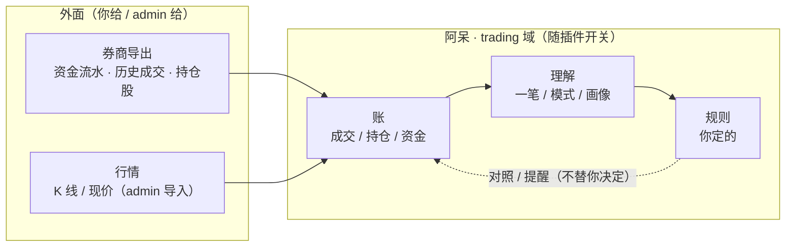
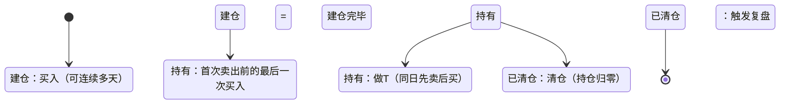

# trading-plugin-redesign 需求文稿

**状态**：✅ **已定稿**（**2026-10-06 · adai 拍板**）

> **口径**：**只看需求、不看现状**——现有代码 / 界面不作依据（免得把"现在就是这么做的"写成"需求"）；但**外部现实**（能拿到什么数据）不脱离。
> **「怎么做」在哪**：[`./input.md`](./input.md)——**它不当需求、不参与验收**，是下一阶段（**设计**）的**输入素材**。

## 问题 / 动机

**这个插件现在是从"你有一套交易系统"长出来的**——它默认用户有规则，甚至（现状里）拿你的 R1–R120 去判别人。

要把它变成 **人人可用**：

- **没有交易系统的人也能用**——先如实记录，再从数据里照见自己；
- **人人可制定规则**（自建 / 导入 / 从数据里长出来）；
- **规则可互相分享**（本期先不做，见「范围」）。

**不这么做的代价**：插件只能你自己用；别人一开箱，要么一条规则都没有，要么拿到的是"别人的系统"（越界 + 失真）。

## 一图看懂（边界）

## 谁会用它 · 在什么时刻

**两种人**

| 谁 | 特征 | 他要什么 |
|:--|:--|:--|
| ① 有自己交易系统的人（如你） | 有明确规则，要的是执行纪律 | 「守约」+「照见」 |
| ② 还没系统、但愿意如实记录的人 | 没有规则 | 先「看见自己」，规则从数据里长出来 |

**一天的几个时刻**

| 时刻 | 他想干什么 |
|:--|:--|
| 收盘后（盘后） | 把今天的成交与资金导进来 · 对账 |
| 前晚 | 写明天怎么做（一句话） |
| 早盘 09:15 | 今天该不该动、动哪只 |
| 盘中 | 随手把成交记下来；**该提醒时被提醒**（不止损、不放飞是散户最大的问题） |
| 尾盘 14:50 | 今天该不该卖 |
| 收盘后 | 今天到底发生了什么 |
| 不定期 | 我是什么样的人；调规则 |

## 要达成什么

**目标**

| ID | 目标 |
|:--|:--|
| `G-01` | 我能看到我的账（持仓 / 资金 / 盈亏） |
| `G-02` | 我能确认**账和券商对得上**（差在哪、差多少） |
| `G-03` | 我能**看见我自己怎么交易的**——一笔一笔地看 |
| `G-04` | 我能被按**我自己的规则**提醒（不是别人的规则） |
| `G-05` | 我还没有规则时，它能**从我的数据里长出一份**给我认 |
| `G-06` | **我知道我到底投进去多少钱**——本金从数据里推得出来（不靠我手填、也不靠我回忆） |
| `G-07` | **我能在「交易层 + 资金层」两个面看自己**——不只买卖点，还有资金纪律 / 出入金 / 费用 / 分红 |

**不目标**

- 不替我做任何买卖决定；
- 不预测、不荐股；
- 不因为"能算"就替我算（算不出就如实说）。

## 用户必须付出什么

这是这个插件的**前置条件**——**你把数据如实交出去，它才照得出来**：

1. **交出你的真实数据**——**导「资金流水 + 历史成交」**（两类导出）· 或随手记一笔 / 截图入账——**唯一不可替代的输入**；
2. **（建议）定期对一次账**（不必每天）——导持仓股 / 资金股份 做交叉校验；
3. 可选（决定它能帮多深）：**定规则 · 写次日计划 · 认下它的提问**。

## 业务规则

### 一笔怎么算（`R-03` 的定义）

| 阶段 | 定义 |
|:--|:--|
| **开始** | 从**买入**开始，可能**连续买多天**——**首次卖出之前的最后一次买入 = 建仓完毕** |
| **结束** | 陆续卖出，**直到清仓**（持仓归零） |
| **做T** | 某天**先卖后买**（哪怕先清仓再买回）= **同一笔的过程**，不切新笔 |

> **切笔只发生在「跨日的清仓之后」**——日内任何买卖都不切笔。

两条细则：**建仓完毕**是独立概念（记在每一笔上）· **不做底仓特例**（识别不出就如实说判不了）。

**两个维度**：**笔**（建仓 → 清仓，复盘与规则的单位）· **批次**（**每一次买入**，持仓与操作的粒度）——**一笔 = 多个批次**，**一笔不是一个成本价**。

**边界我自己能切**——系统给默认，我可以指定「从这里算新的一笔」。

### 买卖三环的行为

| 环 | 它怎么知道（**被动**） | 事前对照 | 事后复盘 |
|:--|:--|:--|:--|
| **买入** | **我写「明日计划」告诉它** | 按我的**买点规则**照 | **买点回顾**（那一笔的买点长什么样） |
| **持仓** | 从数据推 + 行情 | **要不要止损 / 要不要放飞**（用我的线） | — |
| **卖出** | 我写了计划 · 或我的线触发 | 按我的**卖点规则**照 | **卖飞了没**（陈述）+ 按没按规则卖 |

**提醒口径**：只说「**你定的 −5% 到了，要动吗**」——**用你的线 + 只陈述**；**不说「该止损了」**（那是替我判断）。

**止损 / 清仓**：**止损价我自己填**（持仓级 + **按批次**）· **清仓 = 全卖**（与"减仓 / 放飞一部分"**分开说**）。

**先说清情况再开口**：说话前要凑齐——**成本 / 批次** · **我的线**（止损价 / 放飞线）· **行情**（现价 / 峰值 / 回落）· **持有时间**（从建仓完毕算）；**缺一样就别开口**（说"我缺 X，说不了"）。

**两个典型场景**

| 场景 | 说之前要凑齐 | 它说什么 |
|:--|:--|:--|
| **买入不涨，到止损价了** | 现价 vs **我填的止损价** · 持有几天 · 浮亏多少 · 批次 | 「**你定的 XX 到了**（现价 Y、持 N 天），要动吗？」+ 依据 |
| **买入就涨，放飞还是清仓** | 涨幅 · **峰值、距峰值回落** · 持几天 · 我的**放飞规则** | 「**涨到 +X%**（峰值 +Y%，回落 Z%）；按你自己定的『两根中阳减半』，要减吗？」+ 依据；**分清减仓 vs 清仓** |

### 诚实口径（不编、不假装知道）

| 情形 | 口径 |
|:--|:--|
| **自选股** | 导出**没有日期** → 只说「**最早出现**」（我最早看到它的那天），**不说"进入时间"**；精度随导入频率 |
| **纠错** | **就地改**、确认后直接改，**不留痕**；**原始导入文件留存**作后路 |
| **卖飞了没** | **只陈述**（清仓后涨了多少），**不评价**（不然是马后炮） |

## 约束

### 隐私

| 面 | 决定 |
|:--|:--|
| **默认打码** | **统一口径**（所有端 / 所有页面）：**数量与成本打码，现价与止损保留** |
| **分享 / 导出** | **默认不带金额** |
| **AI 上下文** | **能不出就不出；必须要出时，出"结构"不出"规模"**——**数量 / 金额 / 成本价都不出**；代码 · 比例 · 价格 · 规则文本 · 形态可以出。配套：能不用 LLM 的判定不用 LLM · 脱敏做在"出"的边界上 · 透明 |

（多账号是**隔离**的——家人用自己账号，看不到你的。）

### 范围边界

- **品种**：**只做 A 股主板**（沪 `600/601/603/605` · 深 `000/001/002/003`）；其他（科创 / 创业 / 北交所 / ETF / 可转债 / 港美股）**暂不支持**——"做了再说"，且**如实拒绝、不静默**；
- **限制的是「账」不是「看」**：自选 / 案例 / 行情**不受主板限制**；
- **账户**：**先按单账户**（将来要加，数据模型给"账户"留一层）。

### 可配置

**交易插件是可配置的（能关）**——所以**交易的一切随插件生灭**：

- 关了插件 → 阿呆**不再提**你的交易，**账与理解都不注入**；
- 因此交易的"理解"放 **trading 域（画像 / 规则）**，**不进 kernel 记忆**（记忆是 kernel 级、关不掉）。

### 分系统（**谁处理 / 谁呈现**）

**三个面，职责不同、不许混**：

| 系统 | 谁用 | 干什么 |
|:--|:--|:--|
| **admin（管理后台）** | 你 / 运维 | **公共数据**（行情包 · 活跃市值）· 账号与插件开关 · 数据治理 —— **用户端永不出现这些入口** |
| **web（桌面）** | 你 | **导入 · 编辑 · 分析 · 图 · 规则 · 案例 · 计划** —— 坐下来的活 |
| **app（手机）** | 你 | **记录（手动 / 截图）· 看持仓 · 看结论 · 收提醒** —— 随身那一半 |

**同一个功能，两端呈现方式不同**（不是"有没有"，是"**怎么摆**"）：比如**持仓**——web 是表格 + 逐行编辑；app 是一行行的卡 + 点开看结论。

**要求**：需求里**每条功能都要说清它归哪个系统、哪些端呈现、怎么呈现**——不许留下"某功能只在一端出现"这种意外。

## 范围（做 / 不做）

### 做（每条标「归谁」）

| ID | 做什么 | 归谁（见「分系统」） |
|:--|:--|:--|
| `R-01` | **记录**：手动记一笔 · 截图入账 · 导**资金流水 + 历史成交** | **app**（手动 / 截图）· **web**（导入） |
| `R-02` | **对账**：快照导入 + 差额可见；**现金能从数据自证**（余额链不连续时指出断在哪天） | **web** |
| `R-03` | **一笔**：按定义切分 + **我能人工改**（**笔 + 批次**两个维度） | **web**（在图上 / 列表上改） |
| `R-04` | **图表**：K 线 + 指标 + **标出我的买卖点** + 止损线 / 峰值浮盈线 | **web** |
| `R-05` | **分析总结**：三个粒度 × 两个层（交易 / 资金）× 两个维度（笔 / 批次）；描述与对照分开、总结三段；**含"按资金量 / 仓位分时期看"** | **web**（app 只给结论） |
| `R-06` | **规则**：自建 / 导入 / 从数据里长出来；**没有规则时不套默认值、只说事实** | **web** |
| `R-07` | **买卖三环**：买入对照 / 持仓提醒 / 卖点评价——都用**我自己的规则**，只陈述、不替我决定 | **app + web**（app 收提醒，web 看依据） |
| `R-08` | **纠错**：就地改、确认后直接改；派生量跟着重算 | **web** |
| `R-09` | **自选股留历史**（选股那一环） | **web** |
| `R-10` | **案例库**：成功 / 失败 · 买点 / 卖点 · 也是规则出口 | **web** |
| `R-11` | **提醒**：早盘买点 / 尾盘卖点 / 计划触发 | **app** |
| `R-12` | **一次把导出的文件交给它就行**——我不需要记顺序、不需要分次 | **web** |
| `R-13` | **画像**：一个可以看的页面（客观 + 主观），主观在对话里收；**如实标"可能不准"** | **web** |

### 先不做（以后再说）

| ID | 什么 |
|:--|:--|
| `N-01` | **规则的分享** |
| `N-02` | "**周期**"层（周 / 月总结） |

### 不做

| ID | 什么 |
|:--|:--|
| `X-01` | 下单 / 执行 / 预测 / 荐股 |
| `X-02` | 用户端出现行情 / 活跃市值的导入入口（归 **admin**） |

## 验收标准

| # | 验收（可判定） | 对应 |
|:--:|:--|:--|
| 1 | **空账号的新用户**：只导两类导出、**不填任何规则**，能走到"看见第一笔分析"——**全程不需要看文档** | `R-01` `R-05` `R-12` |
| 2 | 他能在**没有任何规则**的情况下拿到**候选规则**（每条**带据**），并认下 / 改 / 自己写 | `R-06` |
| 3 | **一笔的切分**符合定义（跨日清仓切、日内不切），**我能人工改**，且改完后续分析与统计**跟着重算** | `R-03` |
| 4 | 图上能看到**我的买卖点**；且**每个数字点得进去**（哪几天、哪几笔算的） | `R-04` `R-05` |
| 5 | **缺数据时不编**：取不到的字段显示「—」，**绝不渲染成 0**；判不了的（没有规则）**明说判不了** | `R-02` `R-05` |
| 6 | **现金能从数据自证**：余额链**逐笔连续**；不连续时**当场指出断在哪天** | `R-02` |
| 7 | **卖出有评价**（按我的尺子打分 + 说事实），尺子能**从我的清仓股分析里长出来** | `R-07` |
| 8 | **导错了能就地改**：改一笔 → 确认 → 派生量**重算 + 重新对账** | `R-08` |
| 9 | **分享 / 导出 / 发给模型**的东西**不含数量与金额** | 约束 · 隐私 |
| 10 | 全程**没有一句"该买 / 该卖 / 建议"**——只有**事实 + 用我的规则做的对照** | `R-07` |
| 11 | **画像能看到**（客观 + 主观），且**如实标"这是我从你数据里看到的、可能不准"** | `R-13` |

## 边界与异常（默认行为）

| 情形 | 行为 |
|:--|:--|
| **行情取不到** | **明说取不到**——不用旧数据冒充、不编数（降级要标出来） |
| **插件关掉** | 交易数据**保留**（不删），但**不再注入、不再处理、不再推送**；重开即有 |
| **换设备 / 换手机** | 数据在服务器上，**登录即有**；本地不留敏感数据 |
| **数据丢了** | 服务器**每日有快照备份**（运维恢复）——**这是现状能力，不是本插件新建** |
| **我没有交数据** | 只说事实、不给结论；**明说缺什么**（不猜） |
| **新用户** | 空账号、**零规则**也要能走通第一步（见验收 1） |

## 未决问题

> **已清空**——规则分享「先不做」· 没有规则「只说事实」· 分析入口「web 为主」· 移动端「不能导入」。**等你定稿。**

## 定稿记录

- **2026-10-06 · adai 拍板定稿**（人的介入点①）——本需求文稿作为「**交易插件重做**」的**设计输入**。
-- **前置**：自审**三轮收敛**——[第一轮](./requirement-review-20261006.md)（P1×2 / P2×3 / P3×2）→ [第二轮](./requirement-review-20261006-r2.md)（收敛）→ [第三轮 · 归位后](./requirement-review-20261006-r3.md)（12 条判据全过，无 P0 / P1 / P2）。
- **归档**：⏳ **留给合并后**——由主会话搬进 `.agents/direction/rfc/`（或 `knowledge/features/`）**并删本分支目录**；**分支上不搬**。
- **下一步**：进**设计阶段**——同目录 `design-v1-*.md` / `review-v1-*.md`，**双角色真对打**（编写者 / 审核者独立），≤3 轮收敛。
