# 交易插件 Web 端 UI/UX 与原型比对审核

> **本文档所属阶段**：**Web 端体验走查**（UX Audit）——链条位置＝…实施 → **走查** → 发布；覆盖三层＝**信息架构**（逐屏对照 · 列预算）· **交互设计**（打码 · 抽屉 · 冻结列）· **视觉设计**（标记 · 图例）。术语口径见 [`.agents/rules/assets/design-lexicon.md`](../../rules/assets/design-lexicon.md)。

> **范围**：web 端交易插件（`apps/adai-web/lib/pages/trading_page.dart`，HEAD `179617e8`）与原型 `mockups/trading-web-full.html` 的**形态与交互一致性**。
> **纪律**：**只报告不改**（AGENTS.md 规则 6）。每条附实测证据；无证据的推测已剔除。
> **v2 修订（2026-10-07）**：adai 复核指出 web-1「明显不一样」——逐图重核后证实：web-1 由「结构一致」改判「**部分一致**」（新增 P2-9 表列预算 · P3-10 信息层），并补录 web-2 / web-3 / web-4 / web-7 四处原漏项（并入各屏正文）。

## 一、怎么审的（可复现）

| 项 | 做法 |
|:--|:--|
| 原型基准 | `mockups/trading-web-full.html`（8 屏可点稿）+ `mockups/png/web-1..8.png` |
| 实现基准 | 工作区源码 + **真机渲染**（不是读代码猜） |
| 起环境 | `bash .agents/mechanism/scripts/trading-local-up.sh`（本地后端 :8080 读 data 快照 + web :8082，用当前代码构建） |
| 截图 | 无头 Chrome 1600×1000，CDP 驱动（点击/横滚/打码），真实账号 `adai` 数据 —— 8 张存 **`audit-shots-20261007/`**（**金额列已脱敏**） |
| 口径对照 | `uiux-discovery-20261007.md` §三护栏 + §五圈选（**web = 方向 A 专业终端**） |
| 客观证据 | `flutter test test/trading_page_test.dart test/trading_kline_test.dart test/trading_bundle_analysis_test.dart test/case_kline_chart_test.dart` → **209 条全绿** |
| v2 复核（2026-10-07） | adai 指出 web-1 与原型肉眼差异大 → **8 组图逐张人工复核 + 源码核对**（DataColumn 计数 / 打码与颜色逻辑 / K 线行入口），web-1 改判与四处补录见 §二 · §四 |

## 二、逐屏比对（左＝原型 · 右＝本机实拍）

> 左列 = 原型可点稿 `mockups/png/`；右列 = 本机实拍 `audit-shots-20261007/`（1600×1000，真实账号数据，**金额列已脱敏**）。

### 1. web-1 持仓主屏 —— ⚠️ 部分一致（列与信息层超原型，见 P2-9 / P3-10）

| 原型 | 实现 |
|:--|:--|
| 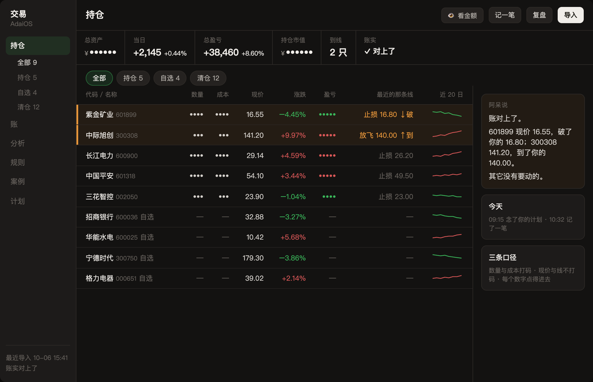 | 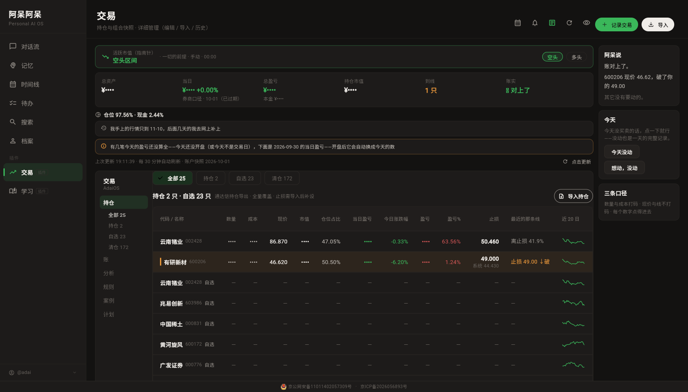 |

相同的：左导航 6 区 + 子项计数、6 格状态条（总资产·当日·总盈亏·持仓市值·到线·账实）、筛选 chips（全部/持仓/自选/清仓）、右栏三卡、「近 20 日」迷你走势、到线行标。

不同的：实拍表列 **16 vs 原型 8**（P2-9，1600px 下最右 3 列需横滚）；页面多 **5 条信息带** + 标题层级差异 + 「今天」卡形态不同（P3-10）；顶栏动作退化为图标（P3-5）。

### 2. web-2 账 —— ⚠️ 部分一致（摆法与口径不同，见 P2-3）

| 原型 | 实现 |
|:--|:--|
| 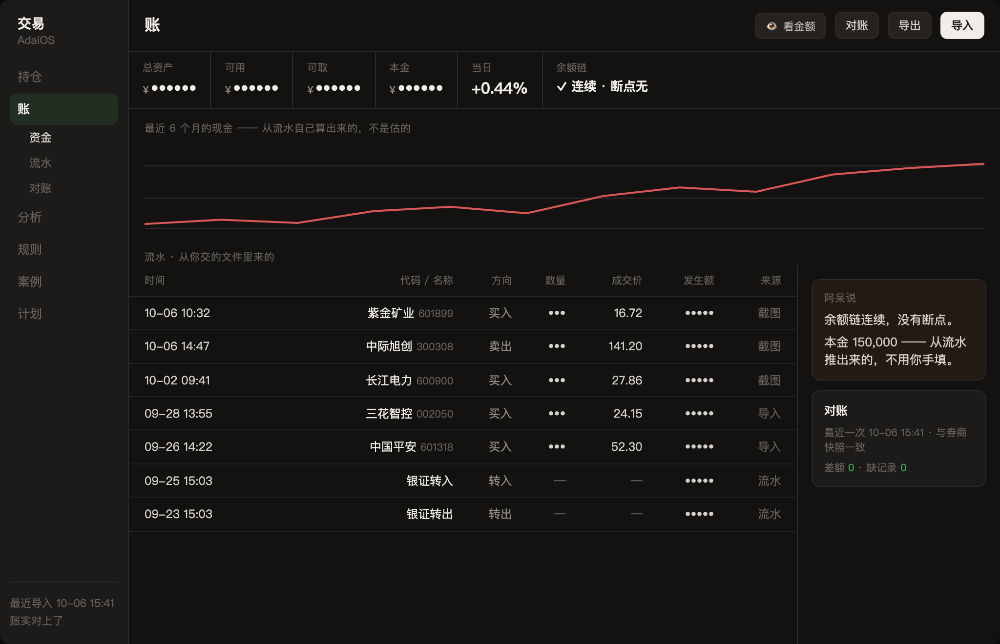 | 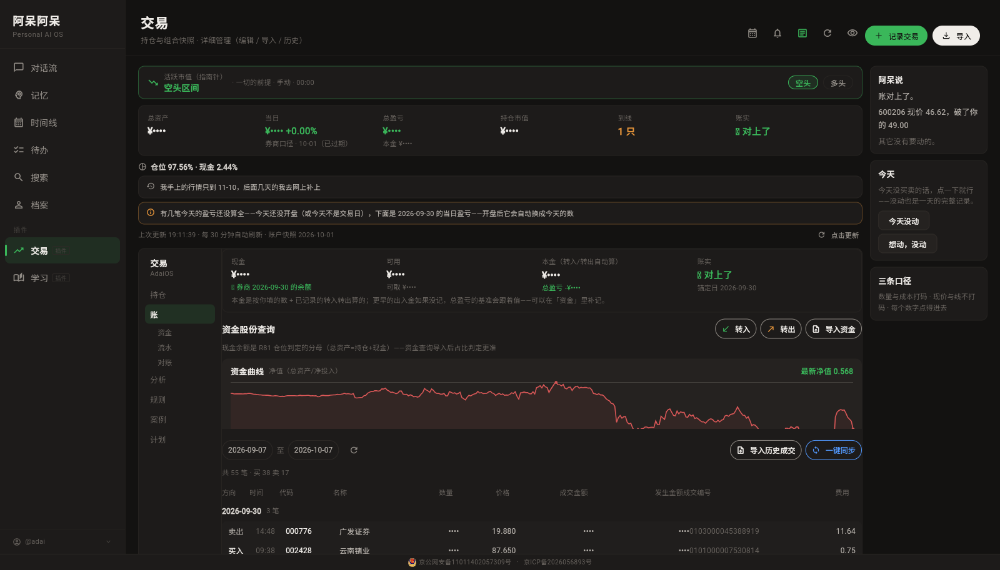 |

相同的：现金曲线 + 流水同屏、本金从流水推、账实结论。不同的：原型状态条 6 格含「可取」「余额链」，实现沿用持仓那 6 格 + 内容区另起四格（P2-3）；实拍另多原型没有的「资金股份查询」块（转入 / 转出 / 导入资金按钮）、净值口径资金曲线、日期段筛选与「一键同步」；原型顶栏「对账」「导出」在实拍未见对应文字入口（P3-5 同类）。

### 3. web-3 分析 —— ❌ 形态不同（见 P2-1）

| 原型 | 实现 |
|:--|:--|
| 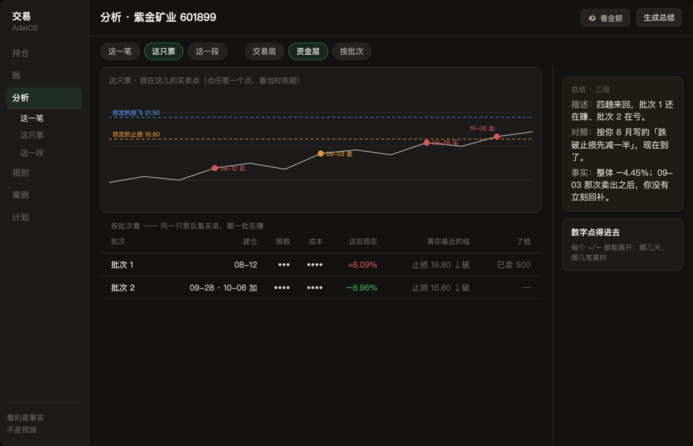 | 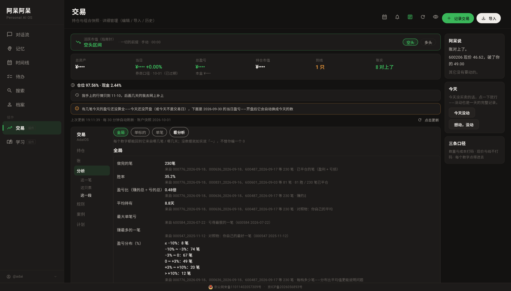 |

原型主体是「这只票的买卖点图 + 按批次表 + 三段总结」；实现默认落在**全局统计列表**（做完的笔 230 / 胜率 35.2% / 盈亏比 0.48 倍…）。左导航子项「这一笔 / 这只票 / 这一段」在，但默认粒度不是原型那个。

### 4. web-4 清仓（持续整理） —— ⚠️ 部分一致（表列超预算，见 P2-2）

| 原型 | 实现 |
|:--|:--|
| 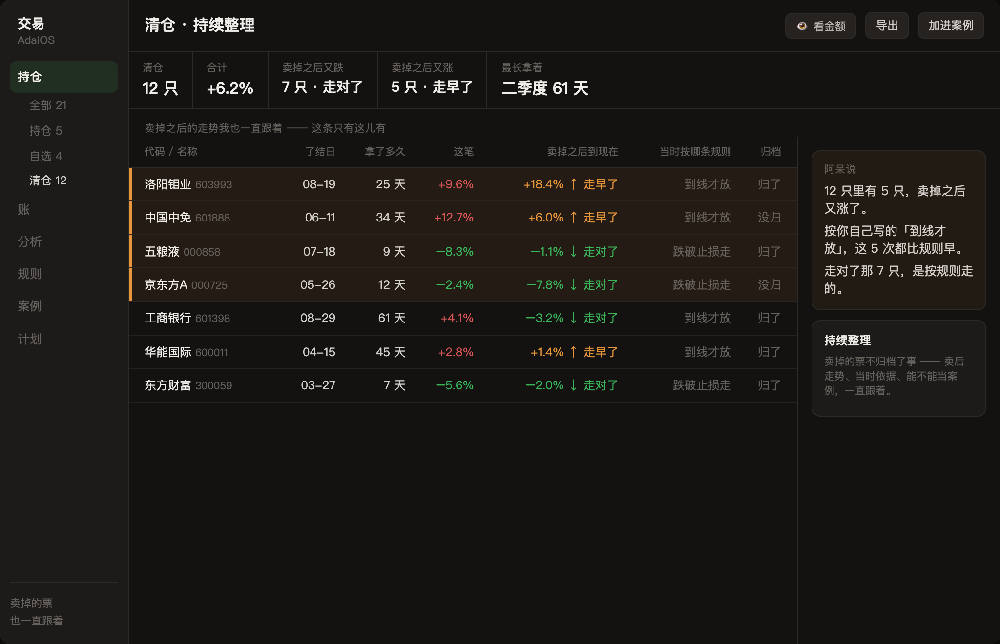 | 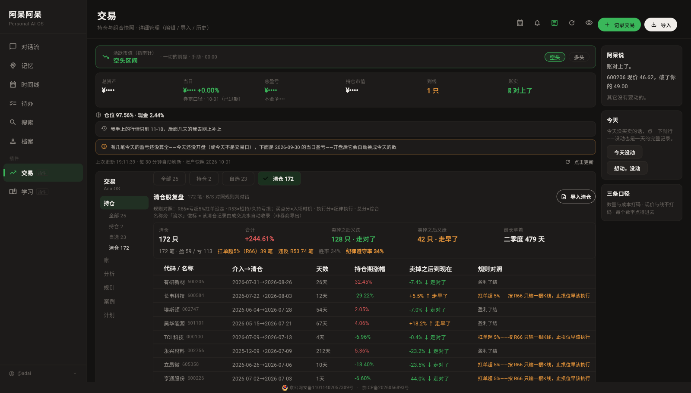 |

5 格（清仓数 · 合计 · 卖掉之后又跌 · 又涨 · 最长拿着）与「卖掉之后到现在」列 ✓；实现表列 11 列（多出买点分/执行分/总分/心理标注），1600px 宽下最右「图」入口需横滚；另多出原型没有的「规则对照」图例行、纪律统计行（盈 59 / 亏 113 · 扛单超 5% 39 笔 · 纪律遵守率 34%）与「导入清仓」按钮。

### 5. web-5 案例 —— ⚠️ 候选卡一致，缺顶部状态条（P3-4）

| 原型 | 实现 |
|:--|:--|
| 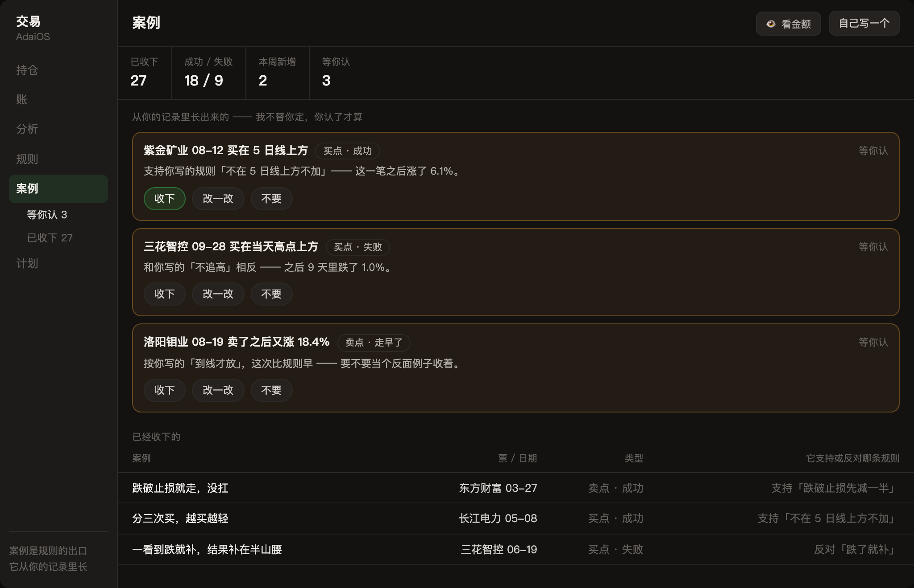 | 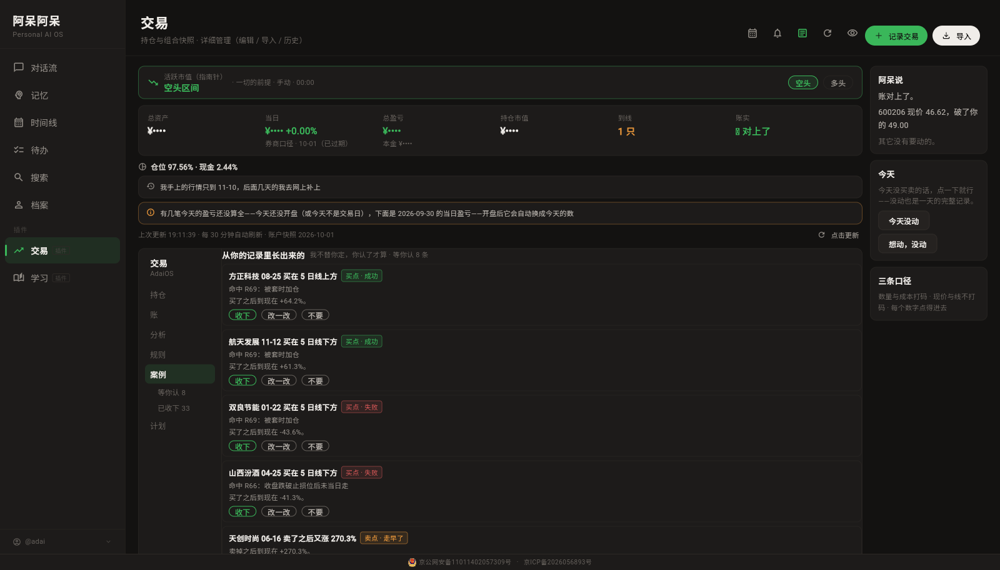 |

候选卡形态高度一致（标题 + 命中规则 + 买了之后到现在 + 收下/改一改/不要）；原型顶部 4 格状态条在实现里改由左导航子项计数承载。

### 6. web-6 K 线 —— ✅ 内容一致（形态是弹窗）

| 原型 | 实现 |
|:--|:--|
| 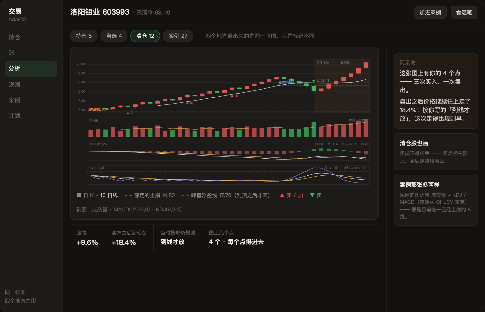 | 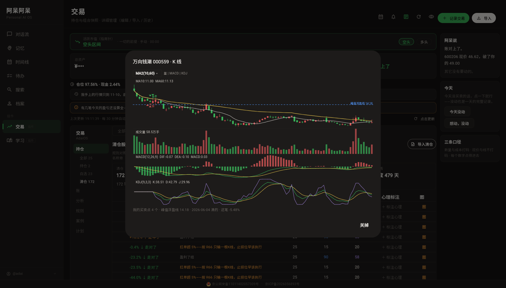 |

四区图（主图 + 量 + MACD(12,26,9) + KDJ(9,3,3)）、我的买卖点、峰值浮盈线、图下一句话 —— 都在。原型是整屏，实现是**从表格「图」入口弹出的同一张图**（原型「四个地方共用同一张图」的落地）。

### 7. web-7 导入抽屉 —— ✅ 一致（本次只见空态）

| 原型 | 实现 |
|:--|:--|
| 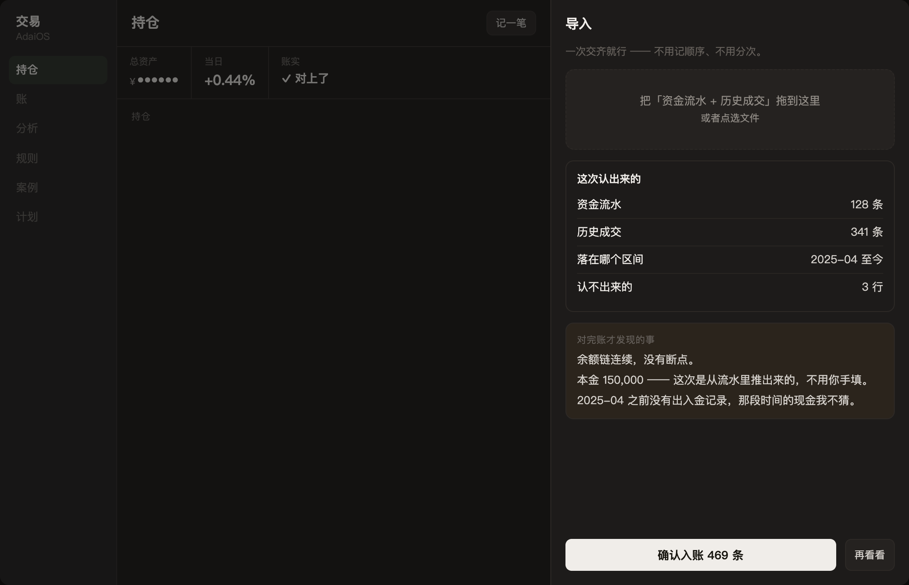 | 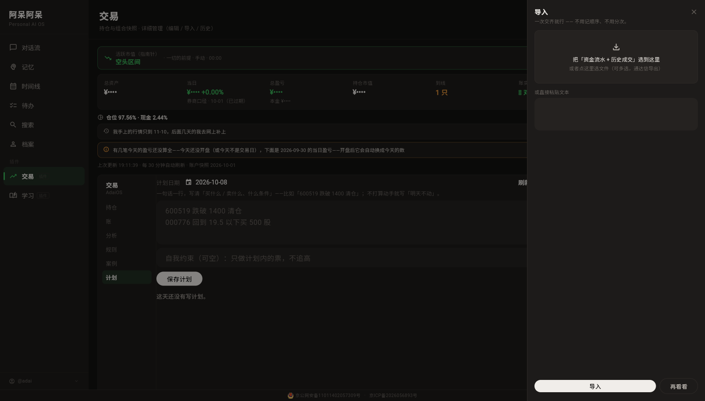 |

右侧抽屉、不跳页、「一次交齐就行」都一致。原型展示的是**选完文件后的预检态**（认出来 N 条 / 认不出来 M 行 / 确认入账 N 条），本次无真实文件，只截到空态；实拍空态比原型多一个「或直接粘贴文本」入口。

### 8. web-8 全量地图（设计说明） —— 9→6 收编达标

| 原型（设计说明页） |
|:--|
| 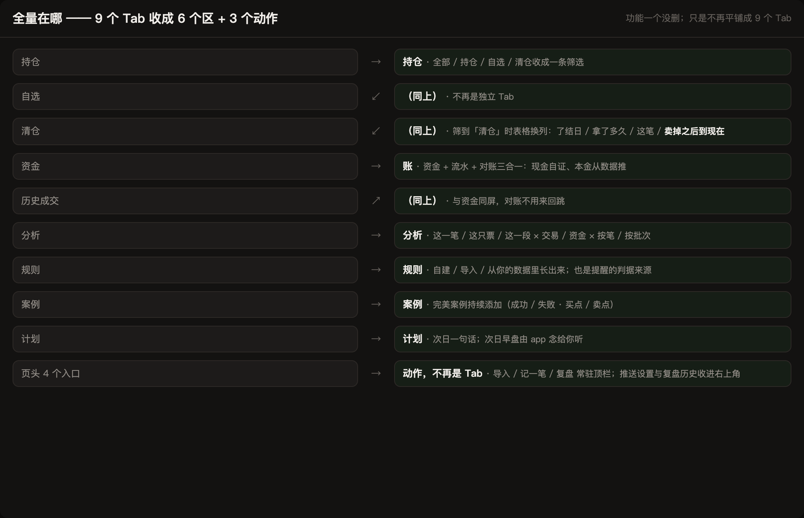 |

对照实现：持仓/自选/清仓 → 一条筛选 ✓；资金/流水/对账 → 「账」✓；导入·记录交易常驻顶栏、推送设置与复盘历史收进右上角 ✓。另附计划屏实拍（原型无专屏，见 §十一 定义）：`audit-shots-20261007/16-plan.png`。

## 三、与「已定护栏」的核对（实测证据）

| 口径 | 实测 | 结论 |
|:--|:--|:--|
| 涨红跌绿（A 股） | 像素采样：`-0.33%`→绿 `(58,183,90)`、`+63.56%`→红 `(217,87,87)`、状态条 `-2,580.00`→绿 | ✅ |
| 打码两层（数量与成本打码 · 现价与线不打码） | 持仓表：数量/成本 `••••`，现价 `86.870`、止损 `50.460` 明文；点 👁 后状态条与表内**同时**显形（实测确认；该状态截图含真实金额，未入库） | ✅ |
| 无第三视角 | 全屏未见「问：/答：/图片记录：」类标签；右栏是「阿呆说」第一人称 | ✅ |
| 缺数据不编 | 自选行数量/成本/盈亏显示 `—`（非 0）；行情不全时明说「我手上的行情只到 11-10」 | ✅ |
| 数字点得进去 | 分析屏每个指标下标注来源（哪几笔、哪几天） | ✅ |
| 不动 Feed/Launcher/底部导航 | 全局侧栏与「对话流」未变 | ✅ |

## 四、偏差清单

### P2-1 分析屏：原型是「这一笔/这只票/这一段」，实现主视图是全局统计

- 原型 web-3 主体是**一只票的买卖点图 + 按批次表 + 右栏三段总结**（描述/对照/事实）。
- 实现（`trading_page.dart` 分析区）顶部 chips 为 `全局 / 单标的 / 单笔 / 看分析`，默认落在**全局指标列表**（做完的笔 230、胜率 35.2%、盈亏比 0.48 倍…）。
- 左导航子项 `这一笔 / 这只票 / 这一段` 与原型 chips 对应，但**默认落地粒度与原型不一致**；且 chips 词汇表本身不同（实现 `全局 / 单标的 / 单笔 / 看分析` vs 原型 `这一笔 / 这只票 / 这一段 / 交易层 / 资金层 / 按批次`）（`13-analysis.png`）。

### P2-2 清仓表：列比原型多，1600px 宽下需横向滚动才能看到「图」入口

- 原型 7 列：代码/名称 · 了结日 · 拿了多久 · 这笔 · 卖掉之后到现在 · 当时按哪条规则 · 归档。
- 实现 11 列：代码/名称 · 介入→清仓 · 天数 · 持仓期涨幅 · 卖掉之后到现在 · 规则对照 · **买点分 · 执行分 · 总分 · 心理标注** · 图。
- 实测 1600×1000 下最右「图」列在视口外（需横滚），与「专业终端一眼看全」的方向 A 意图有摩擦；列名亦与原型不同（`11-cleared.png`）。

### P2-3 账屏：状态条仍用持仓口径，原型要求的「可取」「余额链」无对应格

- 原型 web-2 状态条 6 格：总资产 · 可用 · 可取 · 本金 · 当日 · **余额链**（✓ 连续 · 断点无）。
- 实现：顶部仍是持仓那 6 格（总资产·当日·总盈亏·持仓市值·到线·账实），内容区另起「现金 / 可用 / 本金 / 账实」四格 + 资金曲线 + 流水。
- **「可取」未出现**；「余额链/断点」以「账实 ✓ 对上了」表达，原型要求的「断点当场指出」未在账屏单列（`12-account.png`）。

### P2-9 持仓主屏表列：16 列 vs 原型 8 列，1600px 下最右「买点 / 角色 / 操作」在视口外

- 原型 web-1 表格 8 列：代码/名称 · 数量 · 成本 · 现价 · 涨跌 · 盈亏 · 最近的那条线 · 近 20 日。
- 实现 16 列（源码 16 个 `DataColumn`，`trading_page.dart` L1117-L1137）：多出市值 · 仓位占比 · 当日盈亏 · 今日涨跌幅 · 盈亏% · 止损 · 买点 · 角色 · 操作（图 / 批次 / 编辑）。
- 1600×1000 实测最右 3 列在视口外（需横滚）——与 P2-2（清仓表 11 列）同类且更重，「专业终端一眼看全」的意图受同样摩擦（`10-holding.png`）。
- 注：按 `uiux-discovery-20261007.md` §十末「全部展示，只分层」口径，基础数据「全部在场」成立——问题不在数据是否在场，而在 **16 列的平铺组合**；**收口口径已定（2026-10-07）：adai 补「可删」**（见 `decisions.md` 第五轮）——以「删 / 按设计对齐」为主，「保留」需有明确理由。

### P3-4 案例屏缺顶部 4 格状态条

- 原型 web-5：已收下 27 · 成功/失败 18/9 · 本周新增 2 · 等你认 3。
- 实现以左导航子项计数替代（实测「等你认 8 / 已收下 33」），页内无状态条（`15-cases.png`）。

### P3-5 顶栏动作退化为纯图标

- 原型：`👁 看金额` `记一笔` `复盘` `导入`（文字按钮，一眼可读）。
- 实现：5 个纯图标（复盘历史 / 推送设置 / 复盘 / 刷新 / 看金额）+ `记录交易` + `导入`。功能都在，但前三项无文字标签。

### P3-6 窄窗行为：`maxWidth < 1080` 整栏消失，原型未定义

- `trading_page.dart:903` `final hasRail = cons.maxWidth >= 1080;` —— 右栏（阿呆说/今天/三条口径）在窄窗**整体隐藏**；845px 视口实测确认。
- 笔记本分屏/小屏用户会失去「阿呆说」这一核心出口，需产品拍板。

### P3-7 规则屏未见「导入 / 从你的数据里长出来」入口

- 原型全量地图对规则区的定义：`自建 / 导入 / 从你的数据里长出来；也是提醒的判据来源`。
- 实测规则屏只有 25 项参数表 + 「编辑规则」按钮。

### P3-8 分析屏的金额未纳入打码

- 实测：**打码态**下分析屏仍明文显示金额 —— 「赚的总 66788.45 元 ÷ 亏的总 137826.91 元」「最大单笔亏 −10646.06 元」「赚最多的一笔 5180.95 元」（本报告用图已遮盖这几处）。
- 对照护栏「打码两层：**数量与成本（金额类）默认 `••••`**，点 👁 显形」——分析屏的盈亏汇总同属金额类，但当前不受 👁 控制。
- 注：本报告的脱敏是**审核侧手工**处理；产品侧是否纳入打码需拍板（涉及「递手机时给朋友看分析屏」这一场景）。

### P3-10 web-1 页面信息层：5 条信息带 + 标题层级，原型均未画

- 实拍比原型多 5 条信息带：活跃市值区间切换条（「空头区间」）· 「仓位 97.56% · 现金 2.44%」· 「行情只到 11-10」· 「盈亏还没算全」· 「上次更新 / 账户快照」（`10-holding.png`）。
- 主区标题：原型「持仓」（当前区名）→ 实现「交易」+ 副标题，区名下沉到左导航；另多一行「持仓 N 只 · 自选 M 只 + 导入持仓」（原型无）。
- 「今天」卡：原型为轨迹文字（「09:15 念了你的计划 · 10:32 记了一笔」）→ 实现为「今天没动 / 想动，没动」回填按钮。
- 归属说明：信息带为原型未画、实现已有的信息（诚实口径 / 刷新状态 / 当日口径类），非本次重构新增；但主屏首屏信息密度显著高于原型——**处置口径已定（2026-10-07）：可删 / 按设计收敛**（见 `decisions.md` 第五轮）。

## 五、未覆盖 / 建议人工确认

1. **导入抽屉预检态**（认出来 N 条 / 认不出来 M 行 / 确认入账 N 条）需真实通达信导出文件，本次只看到空态；建议用真实文件走一遍。
2. **空账号/新用户态**（原型有「新用户·空账号」开关）本次未验。
3. **K 线入口覆盖** —— v2 已收口：清仓行实测可用；持仓行「图 / 批次 / 编辑」与自选行「图 / 删」经源码核对确认（`trading_page.dart` L1223-L1252 · L1298-L1317）。
4. **窄屏（<1080）** 是否接受「右栏消失」需产品拍板（见 P3-6）。

## 六、v3 复核：差异决算批回验（2026-10-07）

> **背景**：`91035896`（web 差异决算 5 批 + 补批）逐条处置本报告 P2/P3。本轮用**同一管道复跑**确认落地：本地起后端 + 当前代码构建 web + 无头 Chrome 1600×1000 + 真实账号数据。
> **客观证据**：`flutter test` **461 全绿** · `flutter analyze` **0 error / 0 warning**（11 条 info 为既有风格提示）。**新证据**：`audit-shots-20261007-v3/`（11 张）。

### 6.1 已落地（实拍确认）

| 原编号 | 处置结果 | 实拍证据 |
|:--|:--|:--|
| P2-9 持仓 16 列 | ✅ 收成 **9 列**（= 原型 8 列 + 操作列）：盈亏%并入盈亏（金额 `••••` + 比例明文）· 止损并入「最近的那条线」（值 + 离线多远 + ↓破）· 删市值/仓位占比/当日盈亏/角色 · 涨跌列名对齐 | `01-holding.png` |
| P2-2 清仓 11 列 | ✅ 收成 **6 列 + 图**，列名回人话（了结日 / 拿了多久 / 这笔 / 当时按哪条规则）；「买点分 / 执行分 / 总分 / 心理标注」已删；纪律统计并入五格副注 | `02-cleared.png` |
| P2-3 账屏 | ✅ 自证条扩为 现金 · 可用 · **可取** · 本金 · 账实（断点无 · 锚定 2026-09-30）；资金曲线默认回**现金**（净值保留为切换） | `03-account.png` |
| P3-10 信息层 5 条 | ✅ 收成 1 条：仓位/现金并入状态条副注，「上次更新」移左导航脚注（现为「最近导入 09-30 · 账实对上了」）；主区标题回区名 | `01-holding.png` |
| P3-5 顶栏图标 | ✅ 「看金额」「复盘」恢复文字；复盘历史 / 推送设置 / 刷新保持图标 | `01-holding.png` |
| P3-6 窄窗右栏 | ✅ 窄窗顶栏出现「阿呆说」入口 → 点开右侧抽屉（阿呆说 / 今天 / 三条口径 + ✕ 收合） | `09-narrow.png` · `10-narrow-drawer.png` |
| P3-7 规则区 | ✅ 接入「自建 / 从你的数据里长」三态（「照一照我的数据」+「写一条」+ 空态人话）；「导入」后端未实现，未造壳 | `05-rules.png` |
| P3-8 分析屏金额 | ✅ 已纳入 👁：累计盈亏 / 累计投入 / 逐笔金额 `¥••••` 打码，笔 / 天 / % / 倍 明文 | `08-analysis-filled.png` |
| A1-6 买点换列 | ✅ 筛「自选」时表头换成 板块 / 买点计数 / 图，并给出「B1=… B2=… 案例=…（判定是提示不是指令）」说明行 | `14-watchlist.png` |
| B1-5 流水 10 列 | ✅ 收成 7 列（方向·时间·代码·名称·数量·价格·发生金额），成交金额 / 费用 / 编号收进行展开 | `03-account.png` |
| C1-1 分析词表 | ✅ chips 改为「这一笔 / 这只票 / 这一段」+ 代码框 + 看分析 | `04-analysis.png` |

**收口后的实拍（与原型对照）**：

| 持仓主屏（9 列 · 信息带 1 条 · 顶栏文字） | 清仓（6 列 + 列名回人话） |
|:--|:--|
| 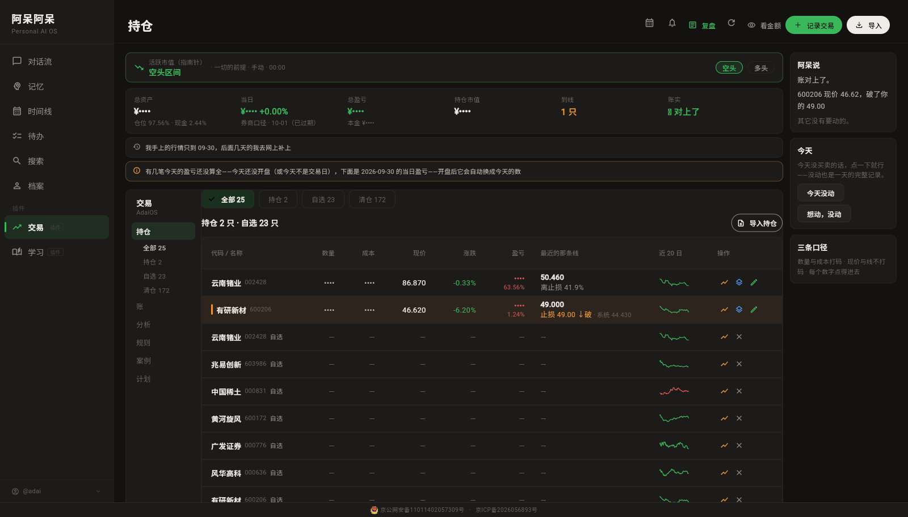 | 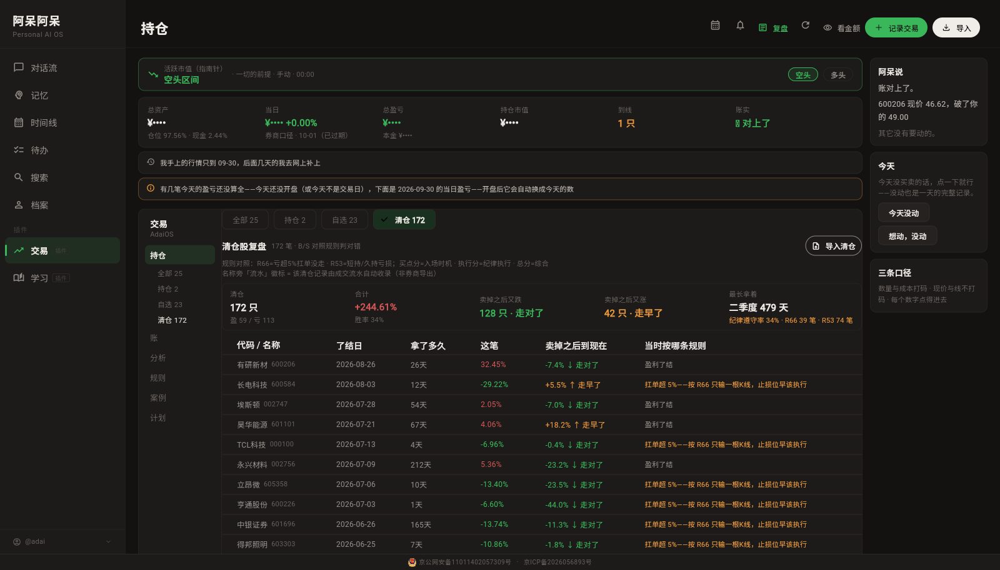 |

| 账屏（可取 / 余额链 · 现金曲线） | 分析屏「这只票」（金额已打码 · R1 默认空态） |
|:--|:--|
| 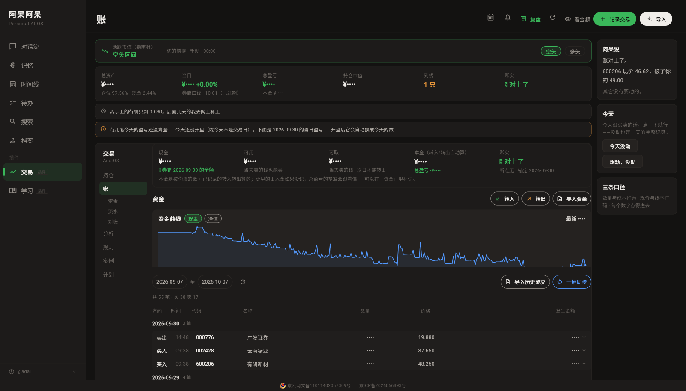 | 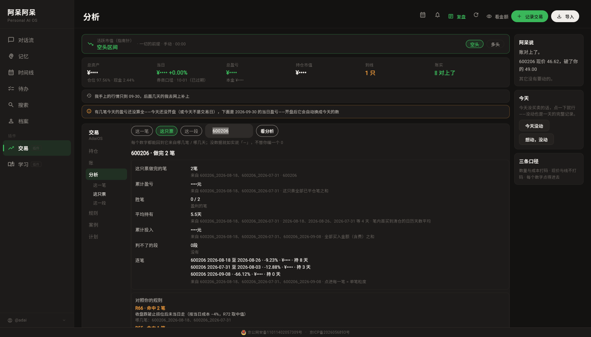 |

| 窄窗「阿呆说」抽屉（P3-6） | 自选换列（买点信号） |
|:--|:--|
| 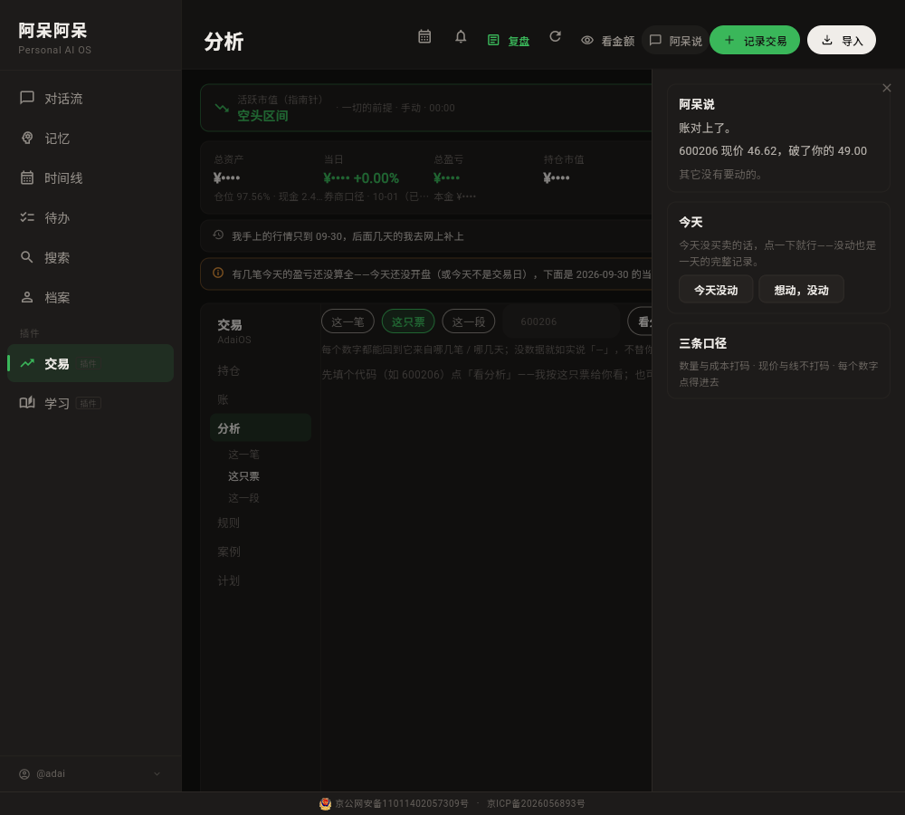 | 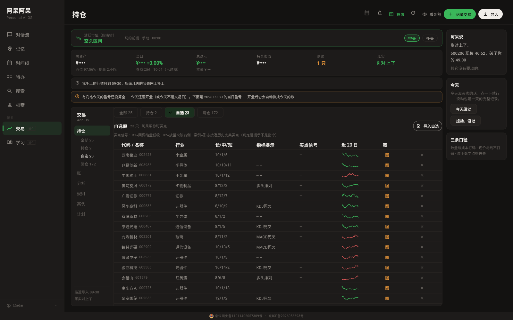 |

### 6.2 仍未达 / 新观察

#### R1 分析屏默认是**空态**（P2-1 未真正收口）

- 进分析屏（未输代码）内容区为空，提示「先填个代码（如 600206）点「看分析」」；填 600206 后才出「这只票」视图（`04-analysis.png` → `08-analysis-filled.png`）。
- 原型 web-3 是**带着一只票**的完整视图（标题「分析 · 紫金矿业 601899」）。实现从「默认全局统计」变成「默认空白 + 手输代码」，用户动作反而多了一步。

#### R2 分析屏缺原型那张「买卖点图」

- 原型 web-3 的视觉主体是「我在这儿的买卖点（点任意一个点，看当时依据）」；实现的「这只票」视图是统计卡 + 逐笔列表 + 「对照你的规则」，**没有图**（`08-analysis-filled.png`）。
- K 线四区图存在于表格「图」入口的弹窗，但分析屏未内嵌同一张。

#### R3 案例屏 4 格状态条仍未见（与决算声明不符）

- `diff-decisions-20261007.md` §H 记「P3-4 复核已达标（案例屏 4 格 m3b 已落）无需改」；本轮回验在**候选视图**未见页内 4 格（只有「等你认 8 条」一个数），另两个数由左导航子项承载（`06-cases.png`）。
- 请确认「m3b 已落」所指位置；若指页内 4 格，则实拍不符。

#### R4（次要）清仓表「图」列在 1600px 下仍需横滚

- 语义树确认「图」入口存在（`x≈1361`），但 1600×1000 视口内不可见（前 6 列占到 `x≈1030`）（`02-cleared.png`）。

#### R5（次要）账屏顶栏仍缺「对账 / 导出」

- 原型 web-2 顶栏有 `对账` `导出`；实现顶栏为 看金额 / 记录交易 / 导入 + 图标（`03-account.png`）。决策清单未涵盖此项，如实提出。

## 七、v4 复核：实施清单 7 批验收（2026-10-08）

> **背景**：`fbfed3bd → c9a6f329`（批 1–7，+ `7a9bb4c0` gitignore）按 `impl-plan-20261007.md` 实施。本轮逐批**真机验收**：本地起后端 + 当前代码构建 web + 无头 Chrome 1600×1000 与 1280×900 + 真实账号数据。
> **客观证据**：`flutter test` **471 全绿**（上批 461，+10）· `flutter analyze` **0 error / 0 warning**（10 条 info 为既有风格提示）。**证据图**：`audit-shots-20261008/`（11 张）。

| 批 | 范围 | 实拍结论 |
|:--:|:--|:--|
| 1 | 导航重做（一级 8 区横 Tab + 去二级） | ✅ **达成**：8 区顺序＝持仓·自选·清仓·资金·规则·分析·案例·计划；逐区点击标题一致；badge 计数在位（持仓 2 / 自选 23 / 清仓 172）；交易内左导航整体退役（`01-holding.png` … `08-plan.png`） |
| 2 | 宽度预算（断点 1080→1200） | ✅ **达成**：1280×900 下右栏收起、顶栏出现「阿呆说」入口（`10-narrow-holding.png`） |
| 3 | 表格自适应（窄窗降列 + 操作列冻结） | ✅ **达成**：同图上「近 20 日」自动收列，操作列（图/批次/编辑）冻结在右且可点 |
| 4 | 统一 K 线组件（B/S/T + 图例 + 放宽） | ✅ **达成**：弹窗放宽至约 1320；标记为字母 **B / T / S**；图例行齐全（`■ 日K+均线 · 你定的止损 · 峰值浮盈线 · B 买 · T 加仓 · S 卖 · 副图口径`）；自选行入口实测打开（`09-kline.png`） |
| 5 | 分析屏（默认带票 + 嵌图） | ✅ **达成**：进「分析」默认带持仓第一只 `002428`，页内直接是「这只票 · 我在这儿的买卖点」四区图 + 统计（`06-analysis.png`） |
| 6 | 小尾巴（活跃市值条移规则区 + 案例 4 格） | ⚠️ **半达成**：活跃市值条已移入规则区 ✅（`05-rules.png`）；**案例屏 4 格仍未出现** ❌（`07-cases.png` / `12-cases-bottom.png`，含滚到底部） |
| 7 | 文档与状态同步 | ✅ 文档层面核对（`uiux-discovery` §十一 已改、`decisions` 第八轮入账） |

**验收实拍（6 张关键证据）**：

| 一级 8 区横 Tab + badge（批 1） | 1280 窄窗：右栏走抽屉 + 操作列冻结 + 降列（批 2/3） |
|:--|:--|
| 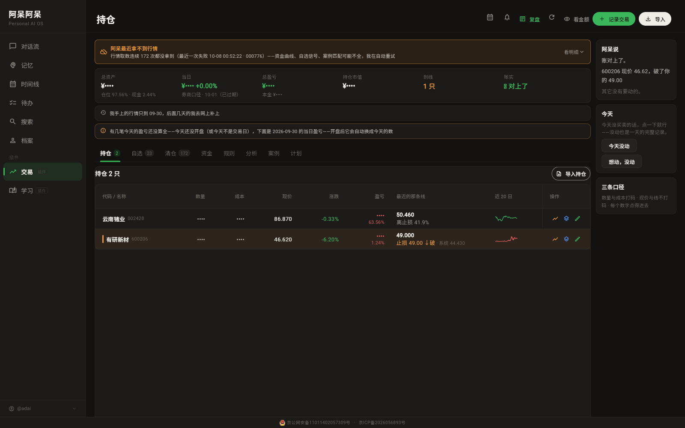 | 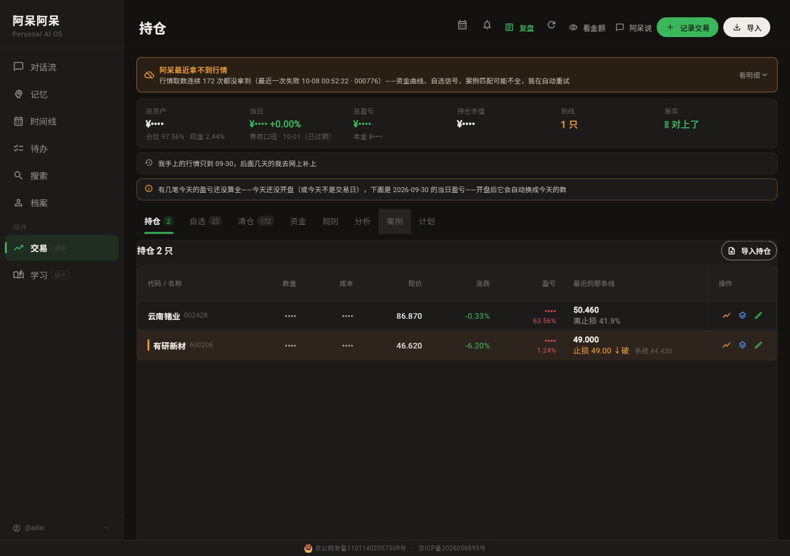 |

| K 线统一组件：B/T/S + 图例行 + 放宽（批 4） | 分析屏：默认带票 + 内嵌买卖点图（批 5） |
|:--|:--|
| 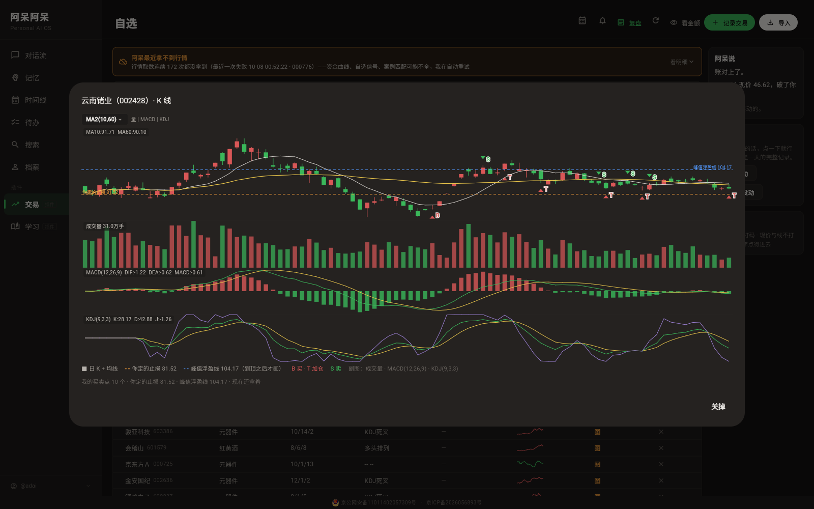 | 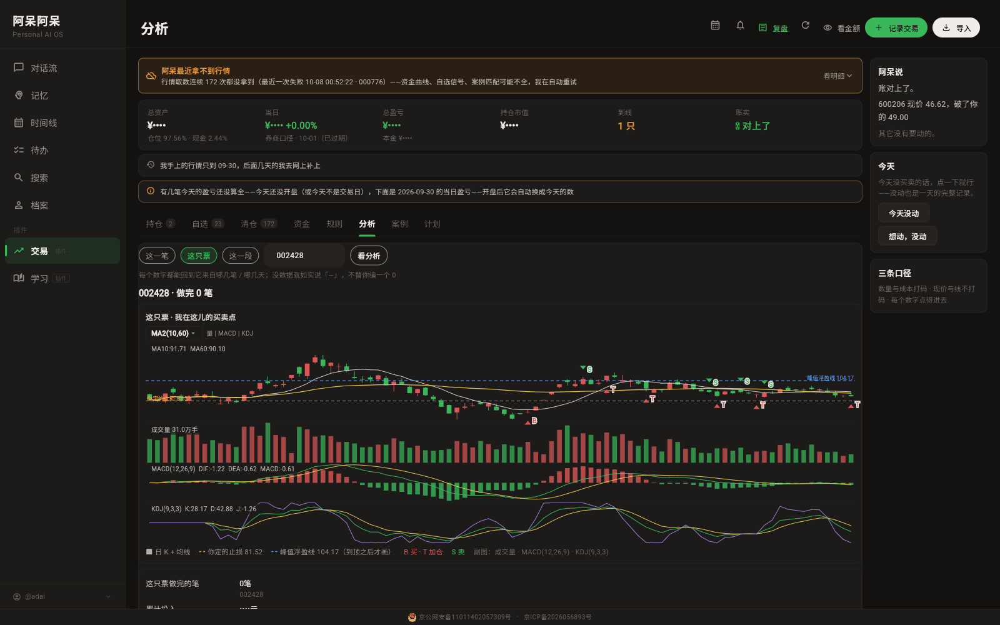 |

| 资金区一页三段（批 1） | 案例屏：4 格仍未见（批 6 未达成 · R6） |
|:--|:--|
| 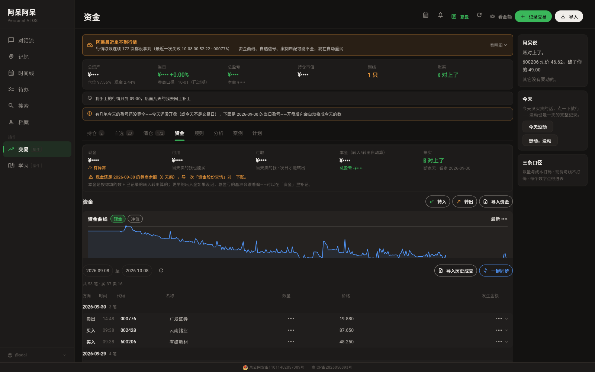 | 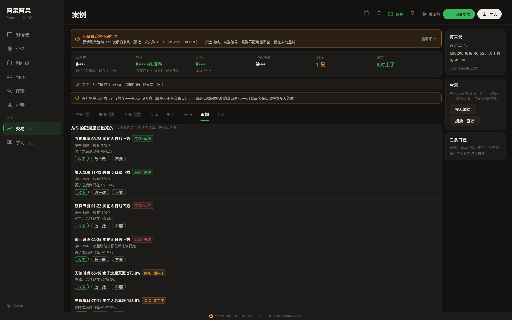 |

### 7.1 新发现（3 条）

**R6｜案例屏 4 格未补 + 「已收下」计数/入口随二级退役消失**（较重要）

- 批 6 的「案例 4 格」实拍仍未见（页内只有「等你认 8 条」一行）；滚到底部确认「已收下」**列表**在（表格形式），但**计数与入口没了**——原先它挂在左导航二级（`已收下 33`），二级退役后没有迁移到页内。
- 对照：分析与资金的二级内容都有页内等价物（粒度 chips / 三段），**只有案例缺这一处**。
- 建议：案例屏补一行 4 格（已收下 · 成功/失败 · 本周新增 · 等你认）+ 页内分段（等你认 / 已收下），与 D2b 的「页内分段」口径一致。

**R7｜分析屏标题显示代码而非名称**（轻）

- 实拍为 `002428 · 做完 0 笔`；原型是 `分析 · 紫金矿业 601899`（名称 + 代码）。建议标题用 `名称 代码`，与 K 线弹窗标题（`云南锗业（002428）· K 线`）保持一致。

**R8｜行情源连续失败**（环境/运行观察，非本批引入）

- 实拍各屏顶部常驻橙色横幅：「行情取数连续 172 次都没拿到（最近一次失败 10-08 00:52:22 · 000776）」。
- 本地属实（本机网络受限下后端抓不到行情），**生产是否同样连续失败需另查**；提示本身符合「诚实口径」，但连续 172 次的规模值得单独看一眼（是否熔断/退避生效）。

### 7.2 未覆盖

- 导入抽屉**预检态**（仍需真实通达信文件）
- 空账号/新用户态
- K 线**同簇标记合并**（D4 已定后排）

## 八、v5 走查：批 8 交付验收（2026-10-08）

> **背景**：批 8 = `R-10`（案例 4 格）+ `R7`（分析标题）一次性交付；同轮**更正 v4 的一条误报**（8.1）。

### 8.1 更正：v4 的 `R6` 是**误报**

- v4 写「案例屏 4 格未出现」——**错**。本轮核实：**4 格代码存在且在渲染**（`_buildCaseStatStrip`，`trading_page.dart`），只是位置在「完美买点案例」标题**下方**（语义树实测 **y≈1242**），首屏与我当时的滚动范围都没覆盖到。
- **误判原因**：v4 只截首屏 + 用 CDP `mouseWheel` 滚动（每次实际位移远小于 400px，未滚到 1242）。**教训**：断言"不存在"之前必须用**可数事实**确认（语义树坐标 / 全文 dump），否则会把「位置不对」说成「没做」——这正是 v2 那次（16 列 vs 8 列）教训的另一面。
- 但**真实问题成立**（且正是 adai/A2 指出的）：**「已收下」计数首屏看不见** → 批 8 把它提到最前。

### 8.2 批 8 交付与验收

| 项 | 改动 | 验收（实拍） | 证据 |
|:--|:--|:--|:--|
| `R-10` | `_buildCaseStatStrip()` 从「完美买点案例」标题上方 → **案例区最前**（页头之下、两个半区之上） | 首屏可见：已收下 **33** · 成功/失败 **33 / 0** · 本周新增 **0** · 等你认 **8**；语义树 y 由 1242 → **390** | `audit-shots-20261008/p8-cases.png` |
| `R7` | 新增 `_analysisLabel()`：单标的标题的代码前缀换成本地名称（查不到则原样） | 实拍：**`云南锗业 002428 · 做完 0 笔`**（原 `002428 · 做完 0 笔`） | `audit-shots-20261008/p8-analysis.png` |

**客观证据**：`flutter test` **471 全绿**（批 8 同步了 2 处断言）· `flutter analyze` 0 error / 0 warning。

### 8.3 批 8 过程中逮住的一个缺陷（已修）

- `_analysisLabel` 首版写成 `'$name ${label.substring(...)}'`——**漏了 `$sym`**，会把标题渲染成 `立昂微  · 做完 0 笔`（**代码被吃掉**）。
- **是测试逮住的**（断言期望「名称 代码 …」）；修正后为 `'$name $sym${label.substring(...)}'`。**价值**：这条若无断言会直接上线——与 8.1 的教训互补（该断言的地方要断言）。

### 8.4 状态

- `scope-uiux` 的 `R-10` 由「未交付」→「已交付」⇒ **本批计划 7 条全部闭合**；
- 剩余：~~`R8`~~（已由 §8.5 结案：生产正常 · 本地属环境受限）· `U-4`（K 线同簇标记合并）· `U-5`（导入预检态 / 空账号态）· **`design-uiux` 的独立设计审核（仍待派）**。

### 8.5 `R8` 结案：生产正常，本地属环境受限（2026-10-08）

**本地侧（证据：后端日志）**：

| 现象 | 日志实证 |
|:--|:--|
| 主源失败形态 | `腾讯 K线范围查询失败 … request timed out`（= **超时**，不是被拒） |
| 熔断是否生效 | `腾讯 K线范围连续失败 3 次，熔断 5 分钟，直接走新浪兜底` ✅ **生效** |
| 兜底是否可用 | `新浪兜底同样拿不到数据` ❌ 本机出网受限，两个源都不通 |
| 计数为何这么大 | `consecutiveAllFailures` 只在**成功时归零**（`KlineService:524/530`）——本机长时间全源失败 ⇒ 累加至 172 |
| 连带影响 | `资金曲线：部分标的当日盈亏未计入（缺行情/昨收）`（**如实降级，不编**） |

**生产侧（证据：`ai-guard-prod.sh` 2026-10-08 日报）**：

- 五个服务全 `active` · **ERROR 0** · WARN 56；
- 告警段里 **「K线服务告警（多为上游取数失败的连带）」只有 1 条** —— 没有出现本机那种"连续失败"形态；
- 结论：**生产行情正常**（偶发 1 条属上游抖动）。

**判定与处置**：

1. **R8 不是本轮引入的缺陷，生产也没有此问题** → **不改代码**；它在本地复现纯属本 worktree 出网受限（这也是本地截图里那条橙色横幅一直挂着的原因）；
2. **熔断 / 退避 / 降级三条机制都按设计工作**（日志逐条证实）——本轮反而给它们补了一次真实环境下的观测证据；
3. **可选优化（待定，不擅自改）**：横幅主句目前是 `行情取数连续 N 次都没拿到（最近一次失败 …）——…`，N 会无限增长，对用户的信息量低于"最近一次失败时间"。按设计口径（`A3-3/A3-4`：**仅异常时**出现 · 降小字），可考虑收敛为 **主句「行情暂时拿不到，我在自动重试」+ 「连续 N 次 / 最近失败 …」收进「看明细」**。要不要做由 adai 定。

## 九、v6 修复批：独立审核建议落地（2026-10-08）

> **来源**：adai 2026-10-08「1」= 采纳独立审核的**小补丁批**建议。改动三处（一次交付，含测试）。

| 来源 | 问题 | 修法 | 验收 |
|:--|:--|:--|:--|
| 交互官 `P2-2` | 案例行备注列**直接插值原始 double** → 实拍出现 15~18 位小数 | 新增顶层 `_fmtFeat()`（null → `—`，num → **1 位小数**），替换原插值 | 真机：`回撤 14.7% · 量比 0.9 · J -4.3`（原 `14.737310774710608% · 0.94 · -4.319124970794519`）· `p9-cases-bottom.png` |
| 视觉官 `P2-3` | 状态条「当日 **+0.00%**」着**涨色红**（0 值不该着色） | 着色条件由 `todayPnl >= 0` 改三段：`>0` 红 / `<0` 绿 / `=0` **中性灰** | 真机当日恰为 −2.77%（非 0）**未覆盖到** ⇒ **改用断言**：`m5 状态条`用例新增一条「`stripToday` 的 color == `darkGrey3`」(`trading_page_test.dart`) |
| 交互官 `P3-2` | 案例页 **B1/B2 与「命中 Rxx」零解释**（自选页有同款口径） | 案例区 4 格下方补一行「类型说明：B1=… · B2=…；命中 Rxx = …（判定是提示不是指令）」 | 真机：`p9-cases.png` 首屏可见 |

**客观证据**：`flutter test` **471 全绿**（含新增的 0 值着色断言）· `flutter analyze` 0 error / 0 warning · 真机 3 张证据图（`p9-holding` / `p9-cases` / `p9-cases-bottom`，均打码态）。

**未随本批做**（如实声明）：交互官 `P2-1`（设计稿 §七 滞后）已单独回填 ✅ · `P2-3` 四组验收证据缺 → 留下一轮走查 · `P3-1`（历史成交导入走 Dialog）· 视觉官 `P2-1`（横幅视觉强度）· `P3-4`（副注小字对比度 2.8:1）· `P3-5`（资金曲线默认蓝）· `P3-6`（K 线弹窗关闭入口 / 操作图标无标签）——**均属待定或需产品拍板**，未擅自改。

## 十、v7 修复批（二）：独立审核剩余建议落地（2026-10-08）

> **来源**：adai 2026-10-08「继续」——把两份独立审核里**可局部、低风险**的剩余条目做完。改动四处 + 一处文档注明。

| 来源 | 问题 | 修法 | 验收 |
|:--|:--|:--|:--|
| 视觉官 `P3-5` | 资金曲线/峰值浮盈线用**图表库默认蓝** `Color(0xFF5299FF)` 硬编码 | 全部改引项目常量 `AppColors.darkBlue`（`case_kline_chart.dart` 两处） | 代码级（视觉等价、去硬编码） |
| 视觉官 `P2-1` | 异常横幅视觉强度 **≥ 主数据**（橙色实底通栏） | 底色 alpha `0.10 → 0.06`、边框 `0.55 → 0.28`；**文案与展开明细一个不减**（诚实口径不让步） | ⚠️ **本轮未验到**——真机时行情已恢复、横幅不渲染（只在 `ok=false` 出现）；改动为纯样式、无逻辑分支 |
| 交互官 `P3-3` | 活跃市值条上「展示」与「切换」**同形**，点它会改整页判定基准却无提示 | `_stageButton` 加 `Tooltip`：当前项「点了不会变」/ 可选项「点了就换成「X」前提——整页的判定基准会跟着变」 | 代码级 + 悬停可见（本轮未截图） |
| 视觉官 `P3-6`(a) | K 线弹窗唯一关闭入口是**右下角小字「关掉」** | `KlinePanel` 标题行补**右上角 ✕**（保留原「关掉」） | 真机：`p10-kline.png` 右上角 ✕ 在位 |
| 交互官 `P3-1` | 历史成交导入两处走 `Dialog`，与其余五处抽屉口径不一 | **设计侧注明例外**（不再改代码）：`design-uiux` §三 I-5 补注「历史成交导入为独立迁移流程，保留 Dialog」 | 文档（`design-uiux` §三） |

**未做（需你拍板）**：视觉官 `P3-4` 副注小字对比度 ≈2.8:1（`darkGrey5 #66615C` on `#1D1B1A`）——**这是色阶体系级改动**（`darkGrey5` 全仓 252 处引用），而 checklist `V5-2` 本来就写着「小字号元信息不用 darkGrey5」。选项见下批：① 提亮 `darkGrey5` 到 AA 达标（≈`#8A857F`，与 `darkGrey4 #908B85` 视觉几乎重合，5 级灰阶实际塌成 4 级）；② 只在**小字号**处换 `darkGrey4`（精准但需逐处甄别 252 处）；③ 维持现状 + 记 REVIEW（承认深色小字三级灰不达 AA 是取舍）。

**客观证据**：`flutter test` **471 全绿** · `flutter analyze` 0 error / 0 warning · 真机 2 张（`p10-holding` / `p10-kline`）。

## 十一、v8 修复批（三）：色阶达标（视觉官 `P3-4`）

> **来源**：adai 2026-10-08「1」= 采纳**选项 1**（提亮常量、全站生效、接受"塌级"代价）。

| 项 | 改动 | 计算与验证 |
|:--|:--|:--|
| `darkGrey5` tertiary | `#66615C` → **`#8D8882`**（`lib/theme/app_colors.dart`，全站唯一硬编码点，其余 252 处均为常量引用 ⇒ 一处改全站生效） | 现状 `#66615C` 在 darkSurface 上 **2.80:1**、darkSurface2 上 **2.58:1**（低于 WCAG AA 4.5:1）；提亮后 **4.88:1 / 4.50:1**，两种表面均达标。取值刻意贴"刚好过线"——下探一档 `#8A857F` 会在 surface2 上掉回 4.32 |

**已知代价（已写进常量注释）**：与 `darkGrey4`（`#908B85`，5.08:1 / 4.68:1）的视觉差被压到约 **4%**，5 级灰阶实际趋近 4 级。若观感上需要恢复三级层次 → 走「**整体重排**」（同时提亮 `darkGrey4`），**不要**回退此值（那会把 AA 达标又还回去）。

**验证**：`flutter test` **471 全绿** · `flutter analyze` 0 error / 0 warning · 真机 2 张（`p11-holding` / `p11-cases`）——小字（仓位/现金副注、表头、行内注释）明显更可读，整体仍是暗色调、无突兀。

> 至此，两份独立审核提出的 **14 条（P2×6 + P3×8）** 已处理：**11 条落地**（含 2 条文档口径 / 1 条经核不算缺陷）、**1 条本轮未验到**（横幅，行情恢复后不渲染）、**1 条= 本条色阶**、剩余 **`P2-3` 四组验收证据**留给下一轮走查（其中「导入预检态」需真实通达信文件）。

## 十二、结论

web 端重构**主体达标**：9→6 收编、6 格状态条、筛选式持仓、清仓「卖掉之后到现在」、案例候选、K 线四区图、导入抽屉均已落地；三条硬口径（涨红跌绿、打码两层、缺数据不编）有像素级实测证据。**「达标」不等于「同构」**——主屏（web-1）的列与信息层明显重于原型（P2-9 · P3-10），本报告 v1 原判其「结构一致」，v2 已改判「部分一致」。

需收口的是**四处形态偏差**（P2-1~P2-3 · P2-9）与**六处细节**（P3-4~P3-8 · P3-10）：核心是**分析屏的默认落地粒度**与**两张主表的列预算**（持仓 16 列 · 清仓 11 列，1600px 下均需横滚）——前者偏离原型最主要的交互屏，后者在宽屏下不能「一眼看全」。

**v3 状态（2026-10-07 · 差异决算批回验后）**：上段十项**基本收口** —— 两张主表列预算（持仓 16→9 · 清仓 11→6+图）· 信息层 5→1 · 账屏可取/余额链 · 顶栏文字 · 窄窗抽屉 · 分析屏金额打码 · 规则区三态 · 买点换列，均有实拍确认（§六 6.1）。**仍在案三条**：分析屏「默认空态 + 缺买卖点图」（R1 · R2，属原型最主要交互屏）· 案例屏 4 格未见（R3，与决算声明不符需确认）；另有两条次要项（R4 清仓「图」列横滚 · R5 账屏缺「对账 / 导出」）。

> 归口：本报告为分支在制品；合并前如需进 `docs/records/audits/` + `.agents/records/REVIEW.md`，留给合并后的主会话（`.agents/workspace/_directory.md` 约束）。
