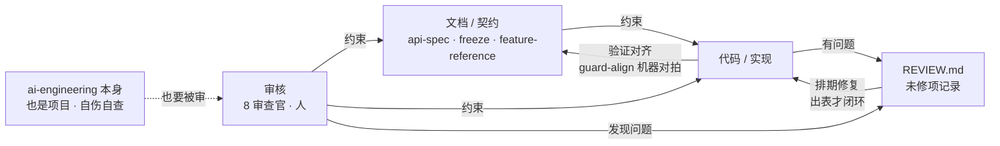
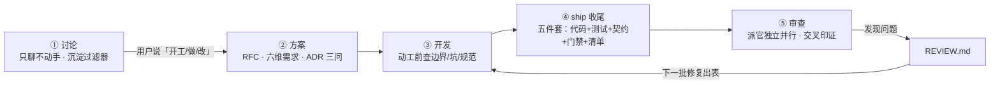
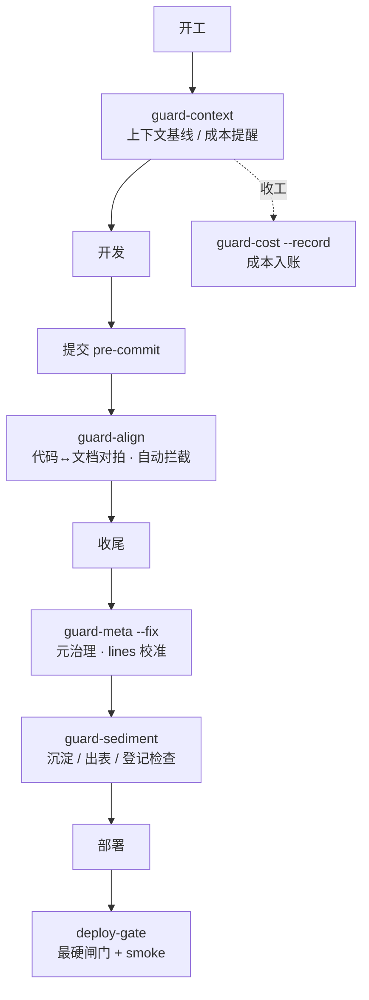

# 工作流总览

> 一张图看懂 AdaiOS 的 AI 协作工作流：**主心骨（约束模型）→ 五段闭环（过程）→ guard 挂点（自动化）**。新会话/新 AI 工具读此文件即可定位自己在流程中的位置。

## 一、主心骨：文档约束代码，审核约束两者

## 二、五段闭环

## 三、guard 挂点（自动化）

## 四、日常四问（人只需记这些）

1. **做之前**：契约文档写了吗？（先文档后代码）
2. **做之后**：测试 + guard-align 对拍过了吗？（验证对齐）
3. **发现问题**：记 REVIEW 了吗？（记录）
4. **该审了**：派官审了吗？（审核约束）

其余全是自动化——guard 脚本不是额外步骤，是第 ④⑤ 步的机器化。
