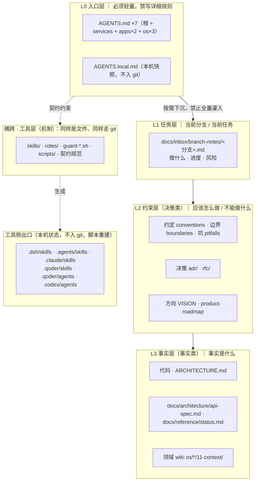
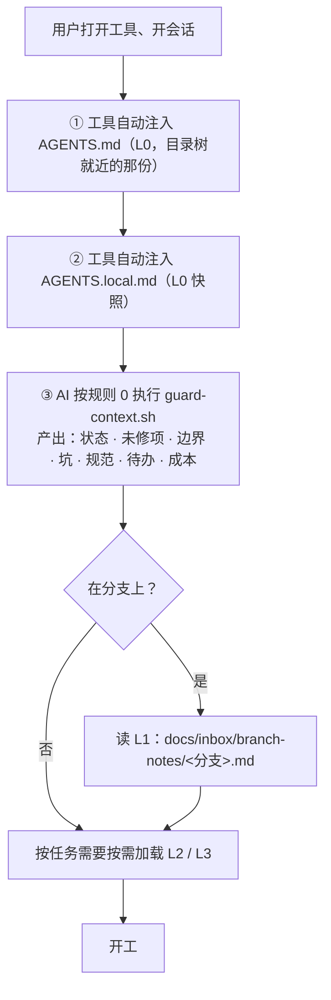
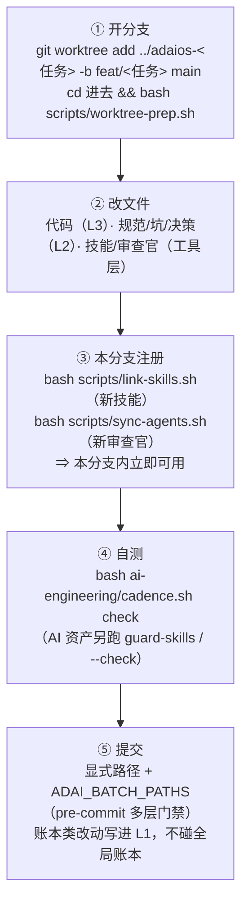
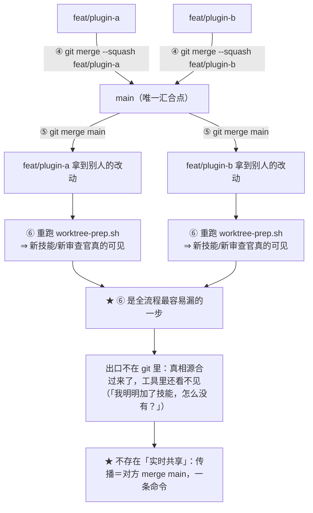
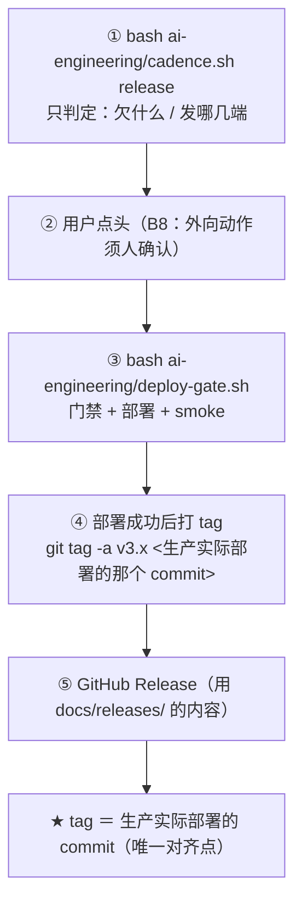
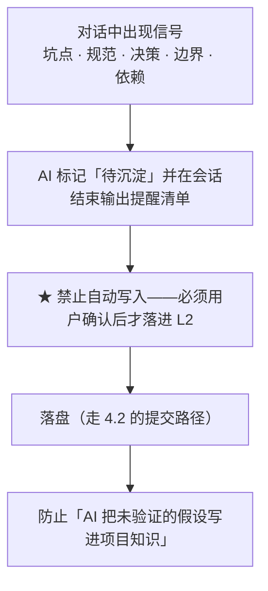

# AdaiOS AI 上下文工程体系（方案稿）

> **状态**：方案稿（`status: draft`），待拍板。
> **与另三份的分工**：**本文是总览**（体系全貌、目录定位、流程与工作流）· `ai-engineering/assets/ai-context-layer-spec.md` 是**机制细节**（出口、契约、反模式）· `docs/guides/git-workflow.md` 是**版本控制操作**（分支/提交/合并/推送/发布）· `docs/guides/branch-development.md` 是**分支上的操作流程**（怎么改、怎么传给别人、合并后做什么）。

## 一、体系全景

**为什么这么切**（来自早期方法论的核心洞察）：

- **决策**会变、有立场、记「为什么」；**事实**相对稳定、可验证、随代码同步。混在一起是**文档腐烂的根源**——AI 分不清「这是约束还是现状」，要么盲从过时事实，要么无视有效约束。
- 二者**不是静态二分**，而是**同一知识的两态**：决策被接受后成为约束/事实；事实会因新决策而失效。所以每份文档都带 `status`（`draft` → `active` → `superseded`），靠生命周期管理，而非靠目录分区。

## 二、目录与文件定位（全量）

| 路径 | 层 | 职责 | 随分支 | 谁写 / 怎么保真 |
|:--|:--:|:--|:--:|:--|
| `AGENTS.md` + 6 个子目录版本（共 **7** 个）| **L0** | 任何工具的统一入口：项目一句话 · 协作规则 0–11 · 审查体系导航 | ✅ | 人/AI；`guard-meta`（lines/断链）|
| `AGENTS.local.md` | **L0** | 本机开工快照（状态/未修项/边界/坑/规范/待办/成本）| ❌ | `guard-context.sh --write-local`；**恒 link 主仓库** |
| `docs/inbox/branch-notes/<分支>.md` | **L1** | 分支本地账本：做什么 · 进度 · 风险 · **待归档的账本条目**（合并时搬进 change-log / REVIEW / `_index`，然后删除本文件）| ✅ | 分支内 AI/人（**待建**）|
| `ai-engineering/assets/conventions.md` | **L2** | 代码与工程约定（C1–C8…）| ✅ | `guard-meta` |
| `ai-engineering/assets/boundaries.md` | **L2** | 原则级边界 B1–B9 | ✅ | 同上 |
| `ai-engineering/assets/pitfalls.md` | **L2** | 已知坑 + **复发信号**（现 23 章）| ✅ | 同上 |
| `ai-engineering/assets/adr/*.md` | **L2** | 架构决策记录（**append-only**：改动写新记录 + superseded 链，不回头改已接受的）| ✅ | `guard-meta`（图谱）|
| `docs/rfc/*.md` | **L2** | 方案决策（含未采纳的备选与理由）| ✅ | `guard-feature`（status 枚举）|
| `docs/VISION.md` · `docs/architecture/product-roadmap.md` | **L2** | 业务方向（**唯一蓝图**）| ✅ | `guard-roadmap` |
| `ARCHITECTURE.md` | **L3** | 技术栈 · 五层架构 · 分层依赖 · 红线 | ✅ | `guard-meta` |
| **`docs/architecture/api-spec.md`** | **L3** | 接口事实（端点表）| ✅ | **`guard-align` A1 与源码 `@Mapping` 逐一对拍** |
| `docs/reference/status.md` | **L3** | 测试数 · 端点数 · 运行环境 · 发布态 | ✅ | **`guard-align` A2 与实测对拍** |
| `os/*/11-context/*.md`（现 `life-os` / `project-os`）| **L3** | 领域知识 wiki | ✅ | 人/AI |
| `services/` · `apps/` · `os/` | **L3** | 代码本体 | ✅ | 编译器 + 测试 |
| **`ai-engineering/skills/<name>/SKILL.md`** | 工具 | 技能（把流程封装成「加载即执行」）| ✅ | `guard-skills`（S3/S4/S5/S7）|
| **`ai-engineering/roles/<name>.md`** | 工具 | 审查官（**扁平**，即 subagent 的真相源）| ✅ | `guard-skills` + `sync-agents` |
| `ai-engineering/*.sh`（**16 个**：11 守卫 + `cadence` / `deploy-gate` / `noon-task` / `weekly-audit` 等执行器）| 工具 | 守卫与执行器 | ✅ | shell-lint + 自检 |
| `ai-engineering/process/*.md`（**4** 份：audit / review / ship / cadence）| 工具 | 流程定义 | ✅ | `guard-meta` |
| `ai-engineering/checklists/*.md`（**14** 份）| 工具 | 逐条可执行清单（人也用）| ✅ | `guard-meta` |
| `ai-engineering/frontmatter-spec.md`（**顶层**）| 工具 | **元数据契约**（图谱/治理/归档）| ✅ | `guard-meta` |
| `ai-engineering/assets/skills-spec.md` | 工具 | **技能包契约**（五段 + 偏离在案）| ✅ | `guard-skills` |
| `ai-engineering/assets/ai-context-layer-spec.md` | 工具 | **中间层契约**（出口 / 布局 / 反模式 / 证据）| ✅ | `guard-meta` |
| `ai-engineering/lib/*.sh` · `scripts/*.sh` | 工具 | 注册与环境（`link-skills` · `sync-agents` · `worktree-prep`…）| ✅ | shell-lint |
| `.githooks/pre-commit` | 工具 | **多层门禁**（范围守卫 → 隐私 → 密钥 → 对齐 → 结构 → 功能索引 → 技能包 → 防复发 → shell）| ✅ | 自身即守卫 |
| `docs/reference/change-log.md` · `docs/review/REVIEW.md` · 各 `_index.md` | 账本 | 批次历史 · 未修项 · 目录索引 | ✅ | `guard-sediment` · `guard-unfixed` · `guard-meta` |
| `ai-engineering/state/*`（游标 / 成本账 / 日志）| **本机** | 协作节奏的账本 | ❌ | **恒 link 主仓库**（全局唯一一本）|
| 6 个出口目录 | **出口** | 让各家工具「看得见」技能与子代理 | ❌ | `worktree-prep.sh` = `link-skills` + `sync-agents` |

## 三、关系：谁依赖谁

**三条关系铁律**：

1. **单一权威来源**——同一知识**只在一处详述**，别处**只引用**。重复即腐烂起点，靠**机器检测**（`guard-meta` 断链/孤儿；`guard-align` 事实对拍）维持，**不靠纪律**。
2. **引用单向、不设环**——`depends-on` / `related` 构成有向图；跨域交叉用「软引用」（提名字、不建强依赖），避免互相锁死。
3. **下沉单向**——L0 → L1 → L2 → L3 只能**按需下沉**，**不许反向**把细节塞进入口（入口一膨胀，每次会话都替所有任务付税）。

## 四、流程图

### 4.1 一次开工（会话启动，零人工）

### 4.2 一次改动（含「加一个 skill」）

### 4.3 一次合并与传播（关键）

**冲突高发文件**（合并时人工处理）：`change-log` · `REVIEW` · `status` · 各 `_index` · 两个脚本的 `REGISTER` 数组（**取并集**，不二选一）。

### 4.4 一次发布

### 4.5 一次知识回流（对话 → L2）

## 五、工作流：触发词 → 动作

| 触发 | 动作 | 现状 |
|:--|:--|:--:|
| **开工**（自动，无需交代）| 注入 L0 + `guard-context.sh` + 读 L1 | ✅ |
| **每日巡检** | `cadence.sh daily`（从上次覆盖日补看到今天）→ 只讲「用户之声 / 新异常 / 心跳趋势」| ✅ |
| **收工** | `cadence.sh ship`（diff + 快照 + 成本入账）→ **显式路径提交** → `cadence.sh mark ship` | ✅ |
| **发布 / 发版** | `cadence.sh release`（**只判定，不部署**）| ✅ |
| **每周** | `cadence.sh weekly`（W1–W6 + 到期红线）| ✅ |
| **待办** | `cadence.sh todo`（REVIEW 未修项一眼看全）| ✅ |
| （无参数）**状态总览** | `cadence.sh`（上次巡检 / 收工 / 周审 / 发版 + 欠账 + 到期红线）| ✅ |
| **加一个 skill / 审查官** | 走 §4.2 分支流程 | ✅ 机制已备 |
| **接一个新工具** | `ai-context-layer-spec.md` §五 四步 | ✅ |
| **沉淀** | AI 主动提示「待沉淀清单」→ 人确认 → 写 L2（§4.5）| ❌ **待建** |

## 六、个人 vs 团队：同一结构，两种配置

**结构完全一样**（L0–L3 + 工具层 + 单一权威来源）。差别只在**强制程度**与**责任归属**：

| 维度 | **个人**（当前）| **团队**（扩展配置）|
|:--|:--|:--|
| 分支 | `main` + 短命分支（worktree 并行）| + **保护分支** + PR + **required review** |
| 共享 | 各自注册出口 + `merge main` | 同 + **CODEOWNERS**（哪块归谁）|
| 知识回流 | AI 提示 + 你确认 | 同 + **PR review** 再一道 |
| **强制层** | `pre-commit` 门禁（本机，**可绕过**）| + CI + **managed settings / 组织级指令**（**管理员不可绕过**）|
| 责任 | 你自己 | **owner 制**（每块有负责团队）|
| 加载 | L0–L3 按需 | 同 + **路由表按模块分发** |
| 防膨胀 | 行数红线 + 定期裁 | 同 + 定期审计出报告 |

> 早期方法论里被标「过时」的分支纪律（feature/develop/master + 硬卡点），**就是「团队」那一栏**——单人过时，团队仍成立。

## 七、保障体系不腐的机制

| # | 机制 | 现状 | 覆盖 |
|:--:|:--|:--:|:--|
| 1 | **范围守卫**（显式路径 + `ADAI_BATCH_PATHS`）| ✅ | 防并发会话互卷 |
| 2 | **多层 pre-commit 门禁**（隐私/密钥/对齐/结构/功能索引/技能包/防复发/shell）| ✅ | 提交即拦 |
| 3 | **元数据图谱自检**（`guard-meta`：断链 / lines / 孤儿 / 正文路径）| ✅ | L2/L3 + 工具层 |
| 4 | **事实对拍**（`guard-align`：端点↔api-spec · 测试数↔status）| ✅ | L3 |
| 5 | **技能包合规**（`guard-skills` S3/S4/S5/S7）| ✅ | 工具层 |
| 6 | **工具接入自检**（`guard-tools` T1–T7，含出口真身）| ✅ | 出口 |
| 7 | **反例回归**（`ai-engineering/tests/`：守卫必须能被反例触发）| ✅ | 守卫自身 |
| 8 | **知识回流需人确认**（AI 提示，禁自动写入 L2）| ❌ **待建** | L2 |
| 9 | **防膨胀红线**（单文件 >300 行提示拆 / >500 必拆；同知识点 ≥2 次合并；「已废弃」超 3 月归档）| ❌ **待建** | 全体 |
| 10 | **按需加载路由**（模块↔关键词表 + 惰性加载）| ❌ **待建** | L2/L3 |
| 11 | **上下文成本度量**（每个 skill 的 context 成本 × 调用频率；从未调用的撤出 catalog）| ❌ **待建** | 工具层 |

## 八、判断依据（为什么这么定）

| 依据 | 来源 | 影响了体系的哪一条 |
|:--|:--|:--|
| **决策/事实分离**；L1 每次必读；单一权威来源；知识回流需人确认；防膨胀四维检查 | 本项目早期方法论（公司项目实践，2026-08 稿）| §一 分层 · §三 铁律 · §七 8/9 |
| **一切是文件、都走 git**（含工具层）| 用户 2026-10-03 的主张 | §4.2 / 4.3 · 工具层定位 |
| **上下文文件不提升正确率，但 +20% 成本**；「删掉 .md 后反而 +2.7%」；失败在 implementation skill | [ETH Zurich arXiv 2602.11988](https://ar5iv.labs.arxiv.org/html/2602.11988) · [arXiv 2607.27250](https://ar5iv.labs.arxiv.org/html/2607.27250v1) | **§七 9/10/11** |
| **skill listing 预算 ≈ context window 的 1%**，溢出丢弃 description ⇒ 越多越不准 | [Agent Skills 规范](https://agentskills.io/specification) | §七 11 · 出口只注册直触发 |
| **按路径/目录作用域化**（四家工具独立收敛）| AGENTS.md / Claude Code / Copilot / Cursor 官方文档 | §一 入口分层 · §七 10 |
| **上下文不是硬约束**——强制要走 hook / managed settings / sandbox | Anthropic · Cursor · DORA | §六 团队态 · §七 2 |
| **AI 直连内部数据是放大器**；更高采纳＝吞吐↑ + 不稳定↑ | [DORA 2025](https://dora.dev/insights/balancing-ai-tensions/) | §三 单一来源（便于被 AI 直读）|
| **知识资产像代码管理**（版本 + 评审 + owner + 追加式变更）| DDC 论文 §5.4 · docs-as-code · ADR · Changesets | §4.2 / 4.3 · §六 |
| **「提升 X%」类宣称要看测量设计** | METR（自我宣布 RCT 失效）| 本文不写「提升多少」的承诺 |

## 九、落地缺口（现状 → 目标）

| 缺口 | 目标 | 代价 |
|:--|:--|:--|
| **L1 任务层缺失** | 建 `docs/inbox/branch-notes/` 模板 + 合并时归档到 change-log / REVIEW / `_index` | 小（模板 + 规范条款 + `guard-sediment` 查残留）|
| **知识回流无确认机制** | AI 输出「待沉淀清单」→ 人确认才写 | 小（写进 AGENTS.md 规则）|
| **防膨胀无红线** | `guard-meta` 加「行数 / 重复 / 过时」提示 | 小（守卫加一维）|
| **无按需加载路由** | 模块↔关键词表（从 `docs/features/_index.md` 与 AGENTS.md 分层自然长出）| 中 |
| **上下文成本无度量** | 统计每个 skill / 审查官的调用频率与 context 开销 | 中（需埋点或日志分析）|
| **出口一致性靠「记得重跑」** | `guard-tools` T4 已能查真身；再加一条「出口过期」提示 | 小 |
| **AI 上下文资产已偏重**（179 docs / 64 ai-eng md / 规范 ~190 行）| 按 §七 9 的红线做一轮**裁**（不是再加）| 中 |

---

## 一句话总览

> **分层按需加载（L0→L3）+ 工具层横跨；一切是文件、都走 git；单一权威来源靠机器检测；知识回流必须人确认；默认不加、按需加载、量不出来就撤。**
