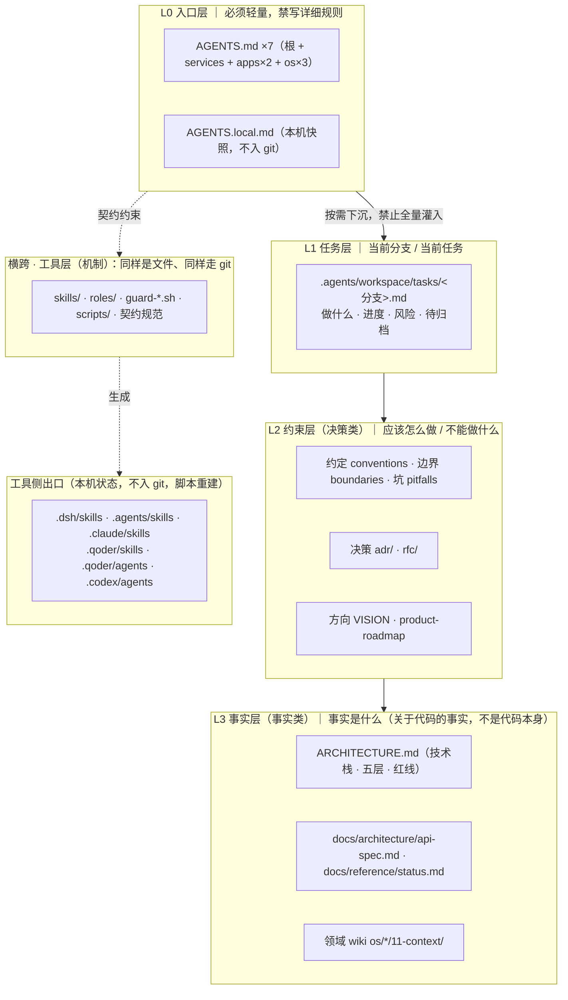
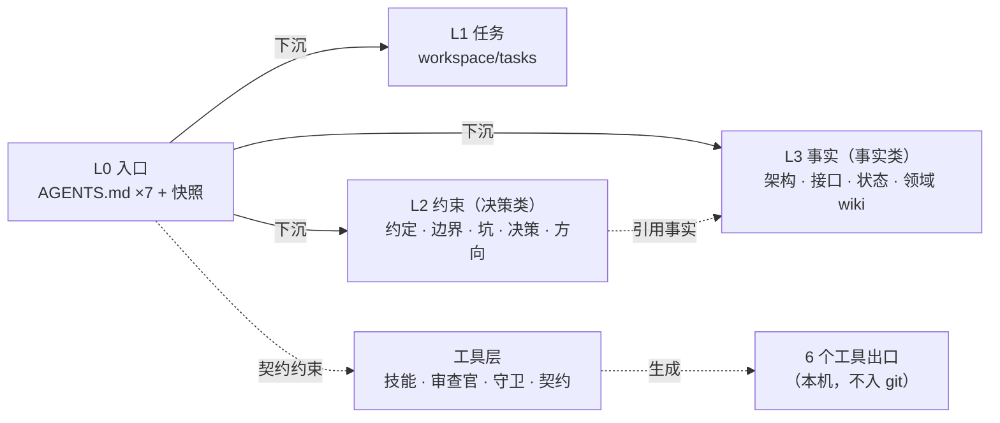
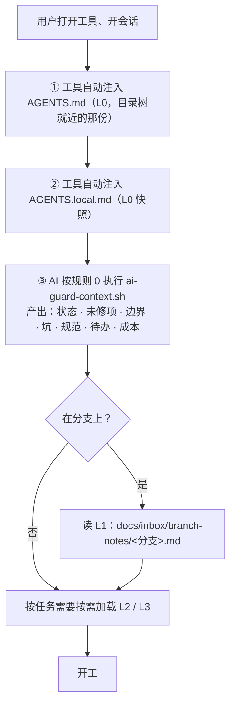
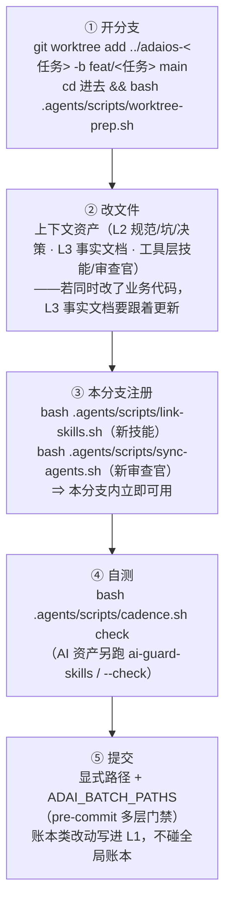
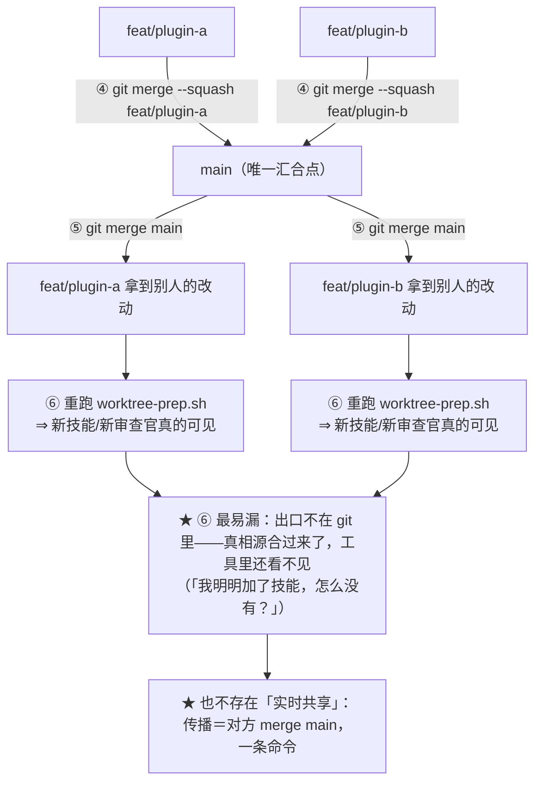
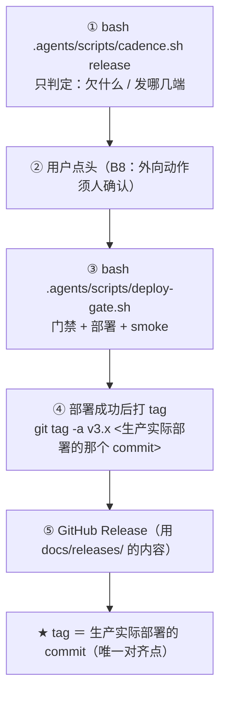
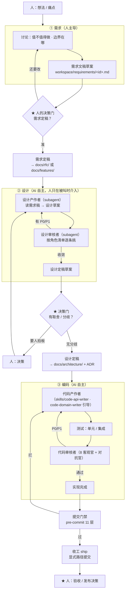
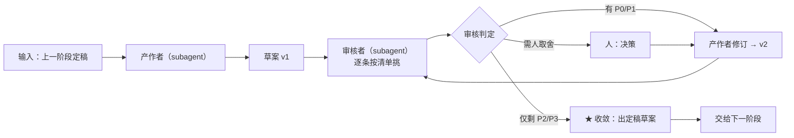
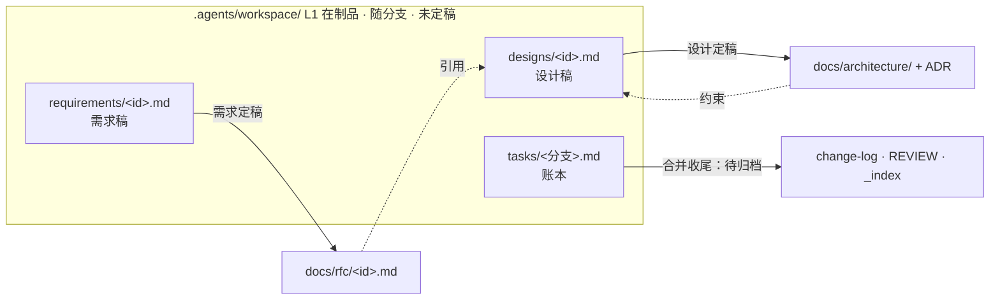

# AdaiOS AI 上下文工程体系

> **状态**：方案稿（`status: active`），待拍板。
> **与另三份的分工**：**本文是总览**（体系全貌、目录定位、流程与工作流）· `.agents/assets/ai-context-layer-spec.md` 是**机制细节**（出口、契约、反模式）· `docs/guides/git-workflow.md` 是**版本控制操作**（分支/提交/合并/推送/发布）· `docs/guides/branch-development.md` 是**分支上的操作流程**（怎么改、怎么传给别人、合并后做什么）。

## 一、体系全景

**`.agents/` 与分层的关系**：容器**不等于某一层**——它装 L2 约束（`assets/`）＋ L3 的事实文档（`frontmatter-spec` 等契约）＋ **工具层全部**（`guards/` `scripts/` `roles/` `skills/` `process/` `checklists/`）；而 L0 的 `AGENTS.md` 与 L3 的产品文档（`docs/`）在容器外。**为什么这么切**：**决策**会变、有立场、记「为什么」；**事实**稳定、可验证、随代码同步——混在一起是**文档腐烂的根源**（AI 分不清「这是约束还是现状」，要么盲从过时事实，要么无视有效约束）。二者又**不是静态二分**，而是**同一知识的两态**（决策被接受即成为约束/事实；事实会因新决策失效），所以每份文档都带 `status`（`draft` → `active` → `superseded`）靠生命周期管理，而非靠目录分区。

## 二、资产清单（按层组织）

> **位置说明**（2026-10-03 更新）：AI 协作资产**已收进单一容器 `.agents/`**（根 + 12 子目录，每个都有 `_index.md` + `_directory.md`）——此前散在 9 个一级位置的局面已结束。留在容器外的只有三类：**`docs/`**（人也常读的产品文档）· **`.githooks/`**（git 约定）· **工具出口目录**（`.dsh/` `.claude/` `.qoder/` `.codex/`，本机状态、不入库）。

### L0 入口（轻量，禁详细规则）

| 资产 | 位置 | 随分支 | 保真 |
|:--|:--|:--:|:--|
| 统一入口（**7 份**：根 + `services/adai-core` + `apps/adai-{app,web}` + `os/{life-os,project-os,trading-engine}`）| `AGENTS.md` ×7 | ✅ | `ai-guard-meta`（lines / 断链）|
| 本机开工快照 | `AGENTS.local.md` | ❌ | `ai-guard-context.sh --write-local`（**恒 link 主仓库**）|

### L1 任务层（当前分支 / 任务）

**分支本地账本**：`.agents/workspace/tasks/<分支>.md`（随分支 ✅）——做什么 · 进度 · 风险 · **待归档的账本条目**；合并时搬进 change-log / REVIEW / `_index`，然后删除本文件。目录契约见 `.agents/workspace/tasks/_directory.md`。

### L2 约束层（决策类：应该怎么做 / 不能做什么）

| 资产 | 位置 | 保真 |
|:--|:--|:--|
| 工程约定（C1–C8…）| `.agents/assets/conventions.md` | `ai-guard-meta` |
| 原则边界（B1–B9）| `.agents/assets/boundaries.md` | `ai-guard-meta` |
| 已知坑 + 复发信号（**23 章**）| `.agents/assets/pitfalls.md` | `ai-guard-meta` |
| 架构决策 ADR（**append-only**：改动写新记录 + superseded 链）| `.agents/assets/adr/*.md` | `ai-guard-meta`（图谱）|
| 方案决策 RFC（**70 份**，含未采纳的备选与理由）| `docs/rfc/*.md` | `ai-guard-feature`（status 枚举）|
| 业务方向（**唯一蓝图**）| `docs/VISION.md` · `docs/architecture/product-roadmap.md` | `ai-guard-roadmap` |

> ⚠️ **L2 现在分在两家**（`.agents/assets/` 放"约束"，`docs/rfc/` 放"决策"）——这是**历史形成的**（工程侧 vs 文档侧各自演化）。语义上二者都是"决策类"，但**合并代价 44 处引用**，故暂不动；本表按层呈现，正是为了让这个分家**可见**而不是被目录结构掩盖。

### L3 事实层（事实类：关于代码的事实，**不是代码本身**）

| 资产 | 位置 | 保真 |
|:--|:--|:--|
| 架构事实（技术栈 · 五层 · 红线）| `ARCHITECTURE.md` | `ai-guard-meta` |
| 接口事实（端点表）| `docs/architecture/api-spec.md` | **`ai-guard-align` A1：与源码 `@Mapping` 逐一对拍** |
| 状态事实（测试数 · 端点 · 环境 · 发布态）| `docs/reference/status.md` | **`ai-guard-align` A2：与实测对拍** |
| 设计文档（**19 份**：五层架构 / 插件模型 / 记忆设计 / 交易设计…）| `docs/architecture/*.md` | `ai-guard-meta` |
| 参考手册（**12 份**：功能手册 / 特性参考 / 任务表…）| `docs/reference/*.md` | `ai-guard-meta` |
| 领域 wiki | `os/*/11-context/*.md`（现 life-os / project-os）| 人/AI |

### 工具层（机制：横跨以上各层）

| 资产 | 位置 | 规模 / 保真 |
|:--|:--|:--|
| 技能（目录布局 `<name>/SKILL.md`）| `.agents/skills/` | `ai-guard-skills` S3/S4/S5/S7 |
| 审查官（**扁平** `<name>.md`＝ subagent 真相源）| `.agents/roles/` | `ai-guard-skills` + `sync-agents` |
| 守卫与执行器 | `.agents/guards/*.sh`（11）· `.agents/scripts/*.sh` | shell-lint + 自检 |
| 流程定义 | `.agents/process/*.md` | **4 份**（audit / review / ship / cadence）|
| 检查清单 | `.agents/checklists/*.md` | **14 份** |
| 契约 | `.agents/frontmatter-spec.md`（**顶层**）· `assets/skills-spec.md` · `assets/ai-context-layer-spec.md` | `ai-guard-meta` / `ai-guard-skills` |
| 注册与环境脚本 | `scripts/*.sh` · `.agents/lib/*.sh` | shell-lint |
| 提交门禁 | `.githooks/pre-commit` | 自身即守卫（多层）|

### 目录元数据：两件套（2026-10-03 新增）

**每个目录**（含 `.agents/` 根）维护两个文件，与**文件级 frontmatter** 构成三级规范：

| 层级 | 文件 | 回答什么 |
|:--|:--|:--|
| **目录清单** | `_index.md` | **有什么**——清单从实际文件生成 ⇒ 与事实天然一致 |
| **目录契约** | `_directory.md` | **规则是什么**——职责边界 / 依赖 / 触发 / 约束 / 守卫 / 维护 |
| **文件元数据** | 各文件 frontmatter | **这一个的约束与边**——10 字段 + `depends-on` / `related` |

⇒ 三级都**可机器校验**（`ai-guard-structure` + `ai-guard-meta`；**检查项清单以守卫脚本为准**，此处不复制——防漂移）。

### 账本

| 资产 | 位置 | 保真 |
|:--|:--|:--|
| 批次历史 | `docs/reference/change-log.md` | `ai-guard-sediment` |
| 未修项 | `docs/review/REVIEW.md` | `ai-guard-unfixed` |
| 目录索引 | 各 `_index.md` | `ai-guard-meta`（孤儿检查）|

### 本机状态（**不入 git**，脚本重建）

| 项 | 位置 | 重建方式 |
|:--|:--|:--|
| 协作游标 · 成本账 · 心跳缓存 | `.agents/state/*` | `worktree-prep.sh` **恒 link 主仓库**（全局唯一一本）|
| 开工快照 | `AGENTS.local.md` | 同上 |
| **6 个工具出口** | `.dsh/skills` · `.agents/skills` · `.claude/skills` · `.qoder/skills` · `.qoder/agents/*` · `.codex/agents/*` | `worktree-prep.sh` = `link-skills` + `sync-agents` |

> **代码本体不在本清单内**——`services/` · `apps/` · `os/` 的实现文件是**被上下文描述、被 AI 读取的对象**，不是上下文本身。两者的关系靠「**事实对拍**」维持（上表 L3 的 `api-spec` / `status`）——**文档与代码不一致时，是文档错还是代码错，由门禁逼你回答**。

## 三、关系：谁依赖谁

**三条关系铁律**：

1. **单一权威来源**——同一知识**只在一处详述**、别处**只引用**；靠**机器检测**维持（`ai-guard-meta` 断链/孤儿 · `ai-guard-align` 事实对拍），**不靠纪律**。
2. **引用单向不设环**（`depends-on`/`related` 成有向图，跨域用软引用）· **下沉单向**（L0→L3 只按需下沉、不许反向——入口一膨胀，每次会话都替所有任务付税）。

## 四、流程图

### 4.1 一次开工（会话启动，零人工）

### 4.2 一次改动（含「加一个 skill」）

### 4.3 一次合并与传播（关键）

**冲突高发文件**（合并时人工处理）：`change-log` · `REVIEW` · `status` · 各 `_index` · 两个脚本的 `REGISTER` 数组（**取并集**，不二选一）。

### 4.4 一次发布

### 4.5 一次知识回流（对话 → L2）—— **待建**

**信号**（坑点 / 规范 / 决策 / 边界 / 依赖）→ AI 标记「待沉淀」并在会话结束输出清单 → **★ 禁止自动写入，必须用户确认** → 落盘（走 §4.2 的提交路径）。**尚未实现**（见 §七 8）——它防的是「AI 把未验证的假设写进项目知识」。

### 4.6 一次「审核驱动开发」主链（需求 → 设计 → 编码）★ 2026-10-03 新增

**模式**：**文档先行 + 双角色交叉**。定了需求文稿之后，**人基本不参与**——全程只在 **4 个点**被叫回来。

**人的介入点（仅 4 个，其余全自动）**：① **需求定稿**（必须，整链的入口契约）· ② **设计阶段的取舍 / 分歧**（AI 判断「这不是我能定的」时被叫）· ③ **验收**（必须）· ④ **发布**（必须，B8）。

**单个阶段如何收敛**（「人基本不参与」能否成立，全靠这条判据）：

> **收敛判据**：审核者报「**无 P0/P1**」＝ 本轮收敛——带着剩余 P2/P3 往下走（记进 `docs/review/REVIEW.md`），**不无限对打**。
> **升级判据**：凡「**取值取舍**」类问题（两个方案都行、选哪个）→ **强制升级给人**——那是 AI 不该自己决定的。

**产物往哪去**（在制品 → 定稿）：

| 环节 | 现状（2026-10-03）|
|:--|:--|
| **审核者** | ✅ 现成——12 个审查官（8 客观 + 对抗 + 3 外部视角）就在 `.agents/roles/` |
| **产作者（编码）** | ✅ 现成——`skills/code-api-writer` / `code-domain-writer` 已是建设技能 |
| **产作者（设计）** | ❌ **缺**——没有「设计作者」角色（待定：主 agent 兼任，还是建 subagent）|
| **多轮交叉的流程** | ❌ 缺——本节即其定义，待落成 `.agents/process/review-driven.md` |
| **门禁 / 收工 / 归档** | ✅ 全部现成（`pre-commit` 11 层 + `cadence ship`）|
| **在制品目录** | ✅ `workspace/` 三目录齐备——`tasks/`（分支账本）· `requirements/`（需求稿）· `designs/`（设计与审核的多轮记录，**一需求一目录**、轮次命名带日期，含两个模板）|

## 五、工作流：触发词 → 动作

| 触发 | 动作 | 现状 |
|:--|:--|:--:|
| **开工**（自动，无需交代）| 注入 L0 + `ai-guard-context.sh` + 读 L1 | ✅ |
| **每日巡检** | `cadence.sh daily`（从上次覆盖日补看到今天）→ 只讲「用户之声 / 新异常 / 心跳趋势」| ✅ |
| **收工** | `cadence.sh ship`（diff + 快照 + 成本入账）→ **显式路径提交** → `cadence.sh mark ship` | ✅ |
| **发布 / 发版** | `cadence.sh release`（**只判定，不部署**）| ✅ |
| **每周** / **待办** /（无参数）**总览** | `cadence.sh weekly`（W1–W6 + 到期红线）· `todo`（REVIEW 未修项）· 无参数=状态总览（节奏 + 欠账 + 红线）| ✅ |
| **加一个 skill / 审查官** | 走 §4.2 分支流程 | ✅ 机制已备 |
| **接一个新工具** | `ai-context-layer-spec.md` §五 四步 | ✅ |
| **沉淀** | AI 主动提示「待沉淀清单」→ 人确认 → 写 L2（§4.5）| ❌ **待建** |

## 六、个人 vs 团队：同一结构，两种配置

**结构完全一样**（L0–L3 + 工具层 + 单一权威来源）。差别只在**强制程度**与**责任归属**：

| 维度 | **个人**（当前）| **团队**（扩展配置）|
|:--|:--|:--|
| 分支 | `main` + 短命分支（worktree 并行）| + **保护分支** + PR + **required review** |
| 共享 / 知识回流 | 各自注册出口 + `merge main`；AI 提示 → 你确认后才写 | 同 + **CODEOWNERS**（哪块归谁）+ **PR review** 再一道 |
| **强制层** | `pre-commit` 门禁（本机，**可绕过**）| + CI + **managed settings / 组织级指令**（**管理员不可绕过**）|
| 责任 | 你自己 | **owner 制**（每块有负责团队）|
| 加载 | L0–L3 按需 | 同 + **路由表按模块分发** |
| 防膨胀 | 行数红线 + 定期裁 | 同 + 定期审计出报告 |

> 早期方法论里被标「过时」的分支纪律（feature/develop/master + 硬卡点），**就是「团队」那一栏**——单人过时，团队仍成立。

## 七、保障体系不腐的机制

| # | 机制 | 现状 | 覆盖 |
|:--:|:--|:--:|:--|
| 1 | **范围守卫 + 多层 pre-commit 门禁**（显式路径 `ADAI_BATCH_PATHS`；隐私/密钥/对齐/结构/功能索引/技能包/目录自洽/防复发/shell）| ✅ | 防并发互卷 · 提交即拦 |
| 3 | **元数据图谱自检**（`ai-guard-meta`：断链 / lines / 孤儿 / 正文路径）| ✅ | L2/L3 + 工具层 |
| 4 | **事实对拍**（`ai-guard-align`：端点↔api-spec · 测试数↔status）| ✅ | L3 |
| 5 | **技能包合规**（`ai-guard-skills` S3/S4/S5/S7）| ✅ | 工具层 |
| 6 | **工具接入自检**（`ai-guard-tools` T1–T7，含出口真身）| ✅ | 出口 |
| 7 | **反例回归**（`.agents/tests/`：守卫必须能被反例触发）| ✅ | 守卫自身 |
| 8 | **知识回流需人确认**（AI 提示，禁自动写入 L2）| ❌ **待建** | L2 |
| 9 | **防膨胀红线**（单文件 >300 行提示拆 / >500 必拆；同知识点 ≥2 次合并；「已废弃」超 3 月归档）| ❌ **待建** | 全体 |
| 10 | **按需加载路由**（模块↔关键词表 + 惰性加载）| ❌ **待建** | L2/L3 |
| 11 | **上下文成本度量**（每个 skill 的 context 成本 × 调用频率；从未调用的撤出 catalog）| ❌ **待建** | 工具层 |
| 12 | **目录级自洽**（`ai-guard-structure`：两件套齐备 · 清单⇄实际双向 · 契约依赖存在 · 守卫引用有效 · **两件套不重复**；`--fix` 刷清单）| ✅ | 目录级 |

## 八、判断依据（为什么这么定）

| 依据 | 来源 | 影响了体系的哪一条 |
|:--|:--|:--|
| **决策/事实分离**；L1 每次必读；单一权威来源；知识回流需人确认；防膨胀四维检查 | 本项目早期方法论（公司项目实践，2026-08 稿）| §一 分层 · §三 铁律 · §七 8/9 |
| **一切是文件、都走 git**（含工具层）| 用户 2026-10-03 的主张 | §4.2 / 4.3 · 工具层定位 |
| **上下文文件不提升正确率，但 +20% 成本**；「删掉 .md 后反而 +2.7%」；失败在 implementation skill | [ETH Zurich arXiv 2602.11988](https://ar5iv.labs.arxiv.org/html/2602.11988) · [arXiv 2607.27250](https://ar5iv.labs.arxiv.org/html/2607.27250v1) | **§七 9/10/11** |
| **skill listing 预算 ≈ context window 的 1%**，溢出丢弃 description ⇒ 越多越不准 | [Agent Skills 规范](https://agentskills.io/specification) | §七 11 · 出口只注册直触发 |
| **按路径/目录作用域化**（四家工具独立收敛）· **上下文不是硬约束**（强制须走 hook / managed settings / sandbox）| AGENTS.md / Claude Code / Copilot / Cursor 官方文档 · Anthropic · DORA | §一 入口分层 · §六 团队态 · §七 2/10 |
| **AI 直连内部数据是放大器**；更高采纳＝吞吐↑ + 不稳定↑ | [DORA 2025](https://dora.dev/insights/balancing-ai-tensions/) | §三 单一来源（便于被 AI 直读）|
| **知识资产像代码管理**（版本 + 评审 + owner + 追加式变更）| DDC 论文 §5.4 · docs-as-code · ADR · Changesets | §4.2 / 4.3 · §六 |
| **「提升 X%」类宣称要看测量设计** | METR（自我宣布 RCT 失效）| 本文不写「提升多少」的承诺 |

## 九、落地缺口（现状 → 目标）

**已落地**（2026-10-03）：AI 资产收进 `.agents/` 容器 · **目录两件套**（13 组）+ `ai-guard-structure` · 出口 4→3 · 旧守卫适配修复 · **L1 任务层**（`.agents/workspace/tasks/`）。

| 仍未做 | 目标 | 代价 |
|:--|:--|:--|
| **知识回流无确认** | AI 输出「待沉淀清单」→ 人确认才写 | 小（写进 AGENTS.md）|
| **红线未进守卫 / 无路由 / 无成本度量** | 红线已写入 §七 9 但未实现；`_directory.md` 的「触发关系」是路由雏形；成本度量需统计调用频率 | 中 |
| **资产体量** | 64 个 ai-eng md 已确认**无碎片、无孤岛**（最大 230 行）——**该裁的是"没被读的"，不是"多的"** | 中 |

---

## 一句话总览

> **分层按需加载（L0→L3）+ 工具层横跨；一切是文件、都走 git；单一权威来源靠机器检测；知识回流必须人确认；默认不加、按需加载、量不出来就撤。**
