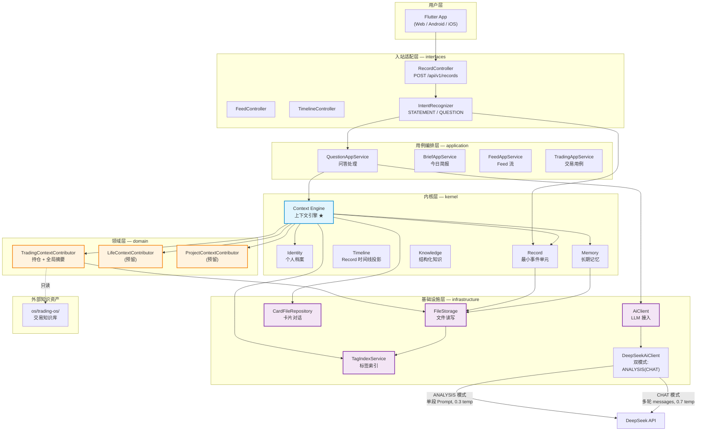
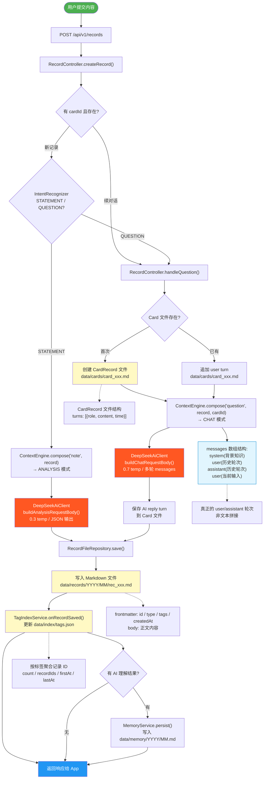
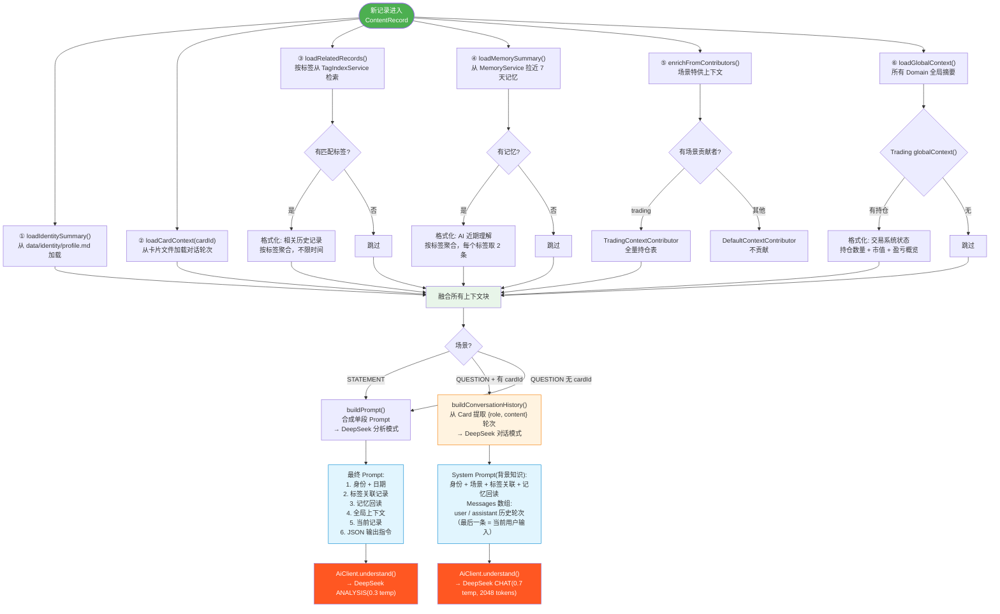
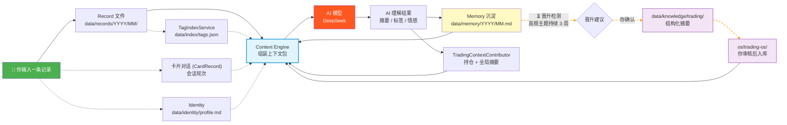

# AdaiOS 系统架构

Version: 0.4

---

## 一、整体架构图



## 二、数据写入流

一条记录提交从 API 到落盘的全路径。两种模式由 ConversationHistory 自动分流：



## 三、Context Engine 组装流

用户提问后，Context Engine 背后拉取的信息源。QUESTION 场景输出多轮 messages，STATEMENT 场景输出 Prompt：



## 四、数据流水线闭环

从记录到理解再到反哺的完整循环：



## 五、核心概念

### 数据原则

```
文件（Source of Truth）
  │
  ├──→ Git 版本管理
  ├──→ AI 直接读取
  ├──→ 人直接查看
  │
  └──→ 数据库（索引/查询/缓存）
         │
         └──→ App 查询
```

### 依赖规则

- `interfaces → application → {kernel, domain} ← infrastructure`
- kernel 内部：Record → Timeline → Context → Memory/Knowledge（流水线方向）
- domain 之间不直接依赖
- infrastructure 通过接口反转依赖

## 六、两类 Domain

### Kernel Domain（系统域）

所有 Domain OS 共享的基础能力：

| Domain | 职责 | 存储 |
|--------|------|------|
| identity | 个人档案（静态偏好、AI 协作规则） | File First |
| record | 最小个人事件单元 | File First |
| timeline | Record 时间序列投影 | 自动生成 |
| context | 上下文引擎（★） | 动态组合 |
| memory | 跨会话长期记忆 | File（沉淀） |
| knowledge | 结构化知识资产 | File（预留） |

### Domain OS（业务域）

挂载在 Kernel 上的领域能力：

| Domain | 职责 |
|--------|------|
| trading | 金融交易（含研究） |
| life | 个人生活管理（预留） |
| project | 项目管理（预留） |

## 七、当前阶段

### 目标

建立 AdaiOS 最小可运行内核。

### 已实现

- Record → Context → AI → Memory 闭环 ✅
- 标签索引（TagIndexService，替代时间窗口切分）✅
- 卡片对话上下文（CardRecord + cardId）✅
- Memory 回读（按标签聚合，喂回 Prompt）✅
- 全局领域上下文（ContextContributor.globalContext()）✅
- Trading OS 持仓贡献（场景 + 全局）✅
- 多轮对话支持（ChatMessage + conversationHistory）✅
- 双模式 AI 调用（ANALYSIS 0.3 temp / CHAT 0.7 temp + 2048 tokens）✅

### 未实现

- 晋升检测（自动发现高频主题 → 建议毕业为 Domain OS）
- `data/knowledge/` 目录
- Life OS / Project OS 的 ContextContributor
- Domain OS 从 `os/*/` 读取知识资产

### 技术约束

- Java 17 + Spring Boot 3 + Modular Monolith
- 不提前微服务化
- 模块边界优先
- 数据资产优先
