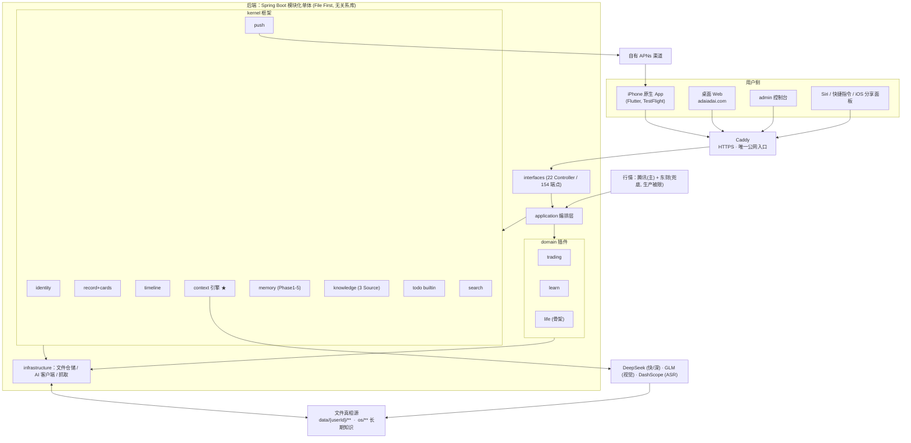
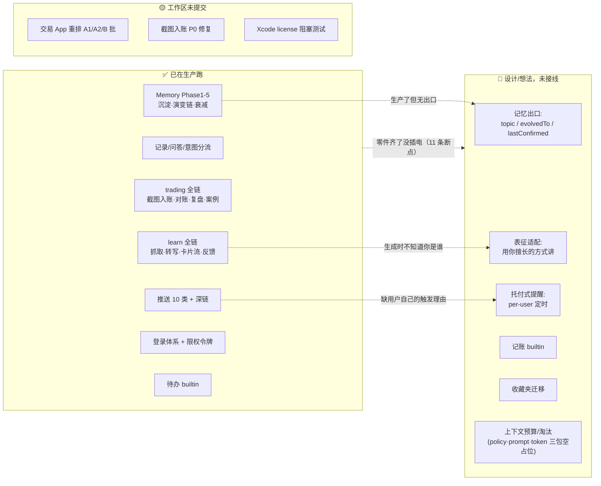

# 阿呆最新状态快照

> **用途**：把阿呆的最新状态交给另一个长期参与过讨论的 AI，让它能快速重新接上——**阿呆现在是什么 → 最近发生了什么变化 → 为什么这样变化 → 当前真正的问题是什么 → 未来可能往哪里走**。**这不是项目介绍**。
>
> **数据截止**：2026-09-19。数字真相源：`status.md`（测试/端点/版本）、`REVIEW.md`（未修项）、`docs/rfc/20260918-trading-app-restructure.md`（进行中的结构改动）、`20260919-external-briefing-for-ai.md`（用户同日自写的外部简报）。文中【事实】= 可在仓库核查；【判断】= 主观倾向，可被反对。

---

## 1. 一句话定义

**阿呆 = 把一个人真实发生的事（交易、学习、日常记录）转成服务器上按用户分目录的 Markdown/JSON 文件资产，再让 AI 只基于这些资产说话的一套闭环。** 形态上是「一个框架（Kernel，装"你是谁"）+ 若干插件（装"你能做什么"）」；LLM 是可替换的内置零件，资产才是主体。

更刻薄一点的定义：**它是一个"以个人数据主权为架构红线、以文件为唯一真相源、单人开发两个月、真实用户恰好只有作者本人"的 Personal AI OS。** 工程完备度与"用户数 = 1"是同一个事实的两面。

---

## 2. 当前状态

| 维度 | 事实 |
|:--|:--|
| 三端 | 桌面 Web `adaiadai.com` · iPhone 原生 App（TestFlight，**未上架**）· admin `adaiadai.com/admin/`；App 与 Web 共用同一份 Flutter 代码，admin 独立 |
| 后端 | Java 17 / Spring Boot 3.3 模块化单体，根包 `com.adaiadai.core`；**没有关系库**——File First 是真的，全部走文件仓储 |
| 规模 | 后端测试 **2033** · App **385** · Web **318** · admin **69**（全绿）｜端点 **154** / Controller **22** |
| 生产 | 腾讯云轻量 2核4G（北京）· 五服务 active · ERROR≈0；四个端口已全部收敛到回环，公网只走 Caddy + HTTPS |
| 版本 | 后端 **v3.72**，**第十次部署 2026-09-17**；`v1.0.0` 正式发布仍未打 tag |
| 用户 | **真实用户 = 1（作者本人）**，无开放注册 |
| 数据资产 | `data/` **337MB / 9992 文件**；`data/adai/`：records 219 条（始于 07-20）、对话卡 9、memory 约 174 条（`08.md` 已 3124 行）、learn 卡片 11、trading（cases 33 / reviews 4 / memory-cards 9 / trade-log / account.json / rules.yaml） |
| 知识资产 | `os/` 543 文件 29MB / 436 个 md：trading-engine 管道完整（01-raw→05-system 各 ~87 文件）· **life-os 仅 6 文件（种子态）** · project-os 7 文件（已退役、保留不再注入） |
| 心跳 | 09-11~09-15 **连续 5 天 0 张卡**；09-16 六张（**四张是产品缺陷反馈**）；09-17 一张；近 7 天 53 条记录 |
| 成本 | 开发侧 AI 单日约 16 元（1171 次调用实测）；转写 0.18 元/37 分钟视频 |
| 合规 | ICP 已备案；**公安联网备案未办，法定截止 2026-09-30** |
| 工作区 | **27 个未提交改动**（09-18~19 交易 App 重排 A1/A2/B 批 + 截图入账 P0 修复批）；HEAD `c22c85b`（09-18 21:02），**未 push**；iOS 构建 9 被 Xcode license 阻塞 |

---

## 3. 最近变化（09-12 → 09-19）——以及这些变化意味着什么

**① 插件模型被自己削平（09-17）**：撤掉整个 `project` 插件（6 个端点 breaking 下线、`domain/project` 整包删除），待办收归 Kernel builtin（`/api/v1/todos` 5 端点、无插件门控）。三层定位落定：core 内核 / builtin 内置（待办·搜索·时间线·简报）/ optional 插件（trading·learn）。
→ *意味着：对"插件"这个形态的信心在下降。project 的死因是"一半通用一半自用"——恰好证明通用需求不该做成插件。*

**② 开始为"递给别人"做准备（09-15~09-17）**：TestFlight 打通（构建 8，VALID 至 2026-12-16）→ 新增 `docs/deployment/testflight-external-testing.md`（内测/外测怎么选、Beta 审核备注、测试账号）→ 新增 `docs/legal/privacy-policy.md`（外测必填的隐私政策）→ 建好 `applereview` 测试账号（`role=user`、只开 learn）。
→ *意味着：项目第一次出现"分发、合规、初次见面"这类非功能工作。*

**③ 冷启动升级为独立议题（09-16 "第一次见面"批）**：新用户插件默认全关 → 第一眼只能看内核；空态改成阿呆先开口 + 3 个可点开场问句；档案页新增"阿呆对你的了解"（长期观察 + 置信度 + 确认回流）；头像只做预设。
→ *意味着：从"功能够不够"转向"第一眼有没有价值"。*

**④ 交易域的主战场从"功能"变成"数据可信度"（09-12~09-18）**：账实一致性对账（锚定/基线/drift/gaps）、当日盈亏改券商口径、丢行丢值可见化、截图入账候选**整行可就地编辑**、确认**逐笔回执**、RFC 明文立下两条铁律——**写账必回执 / 展示必标口径**。
→ *意味着：产品不再假装 AI 正确，而是把"可核对、可修正"做成能力。这是从玩具到工具的必要条件。*

**⑤ learn 从"摘要"改成"重新表达"（09-12~09-17）**：抓取 → 无字幕报价确认 → 转写 → **"一页一单元"卡片流** → 历史卡回填 → 卡片反馈沉淀为 preference 并回流生成 prompt。
→ *意味着：learn 被重新定位成"接管看完之后"，并被内部判定为唯一"内容从外部来"的插件 → 冷启动与增长的双入口。*

**⑥ 记忆保真（09-15）**：conversation 记录正文改为**对话原文**（`我：…` / `你：…`），AI 转述降级进 `summary`。
→ *意味着：承认"AI 复述会失真"，宁可存原始话语。*

**⑦ 被推翻 / 放弃的判断**：PWA 当手机方案（再次否决）· `project` 插件（退役）· 分享入口"靠关键词猜动作"（改"靠动作说"）· "完美图匹配度"（搁置）· 静默推送/角标/小组件（搁置）· B站有字幕链（放弃，一律转写）· **"learn 是存量型插件"的误判**（修正）· 交易页"纵向堆叠卡片"的 UI 范式（09-18 RFC 改数据列表 + 首屏聚焦 + **金额默认打码**）· iOS 分享扩展"用户手点一次签发令牌"（判为设计缺口，未修）。

**⑧ AI 工作方式的变化**：规则固化为「每日巡检」触发词与「讨论与实施分离」；审查官体系扩到 12 角色 + 3 外部视角（陌生人/社会性/支持台）；多会话并发 + worktree；出现跨项目通用产出（`docs/guides/qoder-parallel-workflow.md`，550 行、不含任何项目信息）。

---

## 4. 当前真实架构

```
用户（iPhone 原生 App / 桌面 Web / admin）
   │  Caddy（HTTPS，域名入口；8080/8082/8083/8084 已全部只绑 127.0.0.1）
   ▼
Spring Boot 单体（Modular Monolith）
   interfaces → application → domain/kernel ← infrastructure（依赖倒置）
   ├─ kernel/  account ai auth context identity knowledge memory plugin push record search storage timeline todo
   └─ domain/  learn · life(骨架) · trading          ← project 已删
   ▼
文件仓储（唯一真相源）：data/{userId}/**  +  os/** 长期知识
   ▼
ContextEngine.compose()：串行拼 9 源 → ContextPackage → LLM
   ▼
DeepSeek（flash/pro 按 AiTraceContext.source 路由）· GLM（视觉）· DashScope（ASR）· 腾讯/东财（行情）
   ▼
回写文件 + Feed 卡片 + APNs（10 类推送 + 深链 + 锁屏脱敏）
```

外部还有三个非 HTTP 入口：Siri / 快捷指令（`adai://` scheme）、**iOS 分享面板 Share Extension**（独立 target，主 App 不拉起）、以及 admin 的行情/数据导入。



**架构现实 vs 文档理想的三处偏差（值得单独知道）**：

1. **`kernel/context` 下的 `policy` / `prompt` / `token` 三个子包只有 `package-info`，是空占位**；`estimateTokens()` 只进日志，全仓无 `tokenBudget`、无裁剪、无优先级排序——**"上下文分层与预算"是设计，不是实现**。控制手段只有固定常量（标签关联 ≤20、memory 7 天窗口、每标签 2 条）。prompt 模板硬编码在 `ContextEngine` 的 Java 文本块里，**已与红线 B5「模板归 kernel/context/prompt」不符**。
2. `data/knowledge/` **不存在**（文档里已列为未实现）；`data/adai/project/` 是撤插件后的**孤儿目录**（旧数据留存、不再注入）。
3. `life` 名为 Domain 实为种子（`os/life-os` 仅 6 文件），快捷条 09-16 整条下线；`kernel/knowledge` 现有 Trading / Life / Learn 三个 Source。

**ContextEngine 实测机制**：`compose()` 串行拼 9 源——identity → 卡片对话 → 标签关联（≤20）→ 全文搜索 → memory（7 天窗口，每标签 2 条 + 待行动项）→ knowledgeContext（插件门控）→ domainContext（Contributor 门控）→ globalContext → 当前记录 + 场景 JSON 指令/能力边界。输出 `ContextPackage(prompt / conversationHistory / domainEnum)`；**插件门控真实生效**。

---

## 5. 已实现 / 进行中 / 想法

**✅ 已实现（生产在线）**

- **Kernel**：唯一输入入口 `POST /records` + 后台意图分流 · Timeline · **Context Engine（9 源串行组装）** · Memory（kind 推导 / 事实降噪 / 去重降级升级 / 30 天标签重叠→superseded+evolvedTo+topic / actionable 闭环 / `lastConfirmed` 0.95^天数 衰减 / 过期清理）· Knowledge（Trading/Life/Learn 三 Source）· 待办 builtin · 搜索 · 简报 · 推送（10 类 + 点击深链 + 锁屏脱敏）
- **账号**：登录体系（role admin/user）· 多账号数据分层 · 会话与设备管理 · 外部限权令牌（90 天 / 轮换 / 按 hash 撤销 / 付费动作频控 5 次每分钟）
- **trading**：持仓与批次跟踪 · 当日盈亏（**已对齐券商口径**）· 通达信导入（预检→确认两段式）· **截图入账**（OCR→候选→逐笔确认→整行编辑→逐笔回执）· 复盘 · 买点信号（B1/B2 + KDJ/追高/新鲜度三重校验）· 案例库（33 例，K 线还原 + 相似匹配）· 规则参数 · **账实一致性对账** · 活跃市值区间
- **learn**：链接/图片喂入 · B站/文章服务端抓取 · 无字幕视频报价确认后转写 · **"一页一单元"卡片流** · 复习提醒（7 天节流）· 反馈调教（→preference 回流）· 月度额度闸
- **三端 UI**：Web（Tab 工作区）· App（单页无 tab：Launcher/Feed/交易/学习/待办/档案/时间线）· admin（账号/数据/系统/知识四区 + 插件开关 + 行情导入）
- **工程**：审查官体系 + 部署门禁（GATE-BEFORE/AFTER + smoke 9/9）+ 守护脚本 + 每日巡检 + 成本记账 + 谷时定时任务

**🟡 正在实现（工作区未提交，09-18~19）**

- 交易 App 重排 RFC 四批：**A1 记录与入账链路（完成）** · **A2 首屏聚焦 + 金额默认 `••••` + 持仓改数据列表（第三轮完成）** · **B 数字可信度 B1/B3/B4/B6/B7（完成）** · C 打磨（下拉刷新完成，余项待做）
- 09-18 截图入账 P0 修复（分单吞并 / 锚定误锁 / `normalizeAnchorDate` 盘前归上一交易日）
- **阻塞**：`sudo xcodebuild -license accept` 未执行 → `flutter test` 跑不通 → 本批未提交、未部署；iOS 构建 9 待出

**💭 只是设计 / 想法（未落地）**

- **记忆出口三件**：topic 主题线 · `evolvedTo` 演变链（"阿呆以前认为 X，后来改成 Y"）· `lastConfirmed` 确认日常化——三者后端机制都已存在，**用户侧零/弱出口**
- **记忆保真只做了写侧**：E-B（evidence 摘句）、E-A2（读取侧优先吃原话）、E-C（存量原文化）**均未落地**——"少失真"目前是承诺，回读仍吃提炼文本
- **表征适配**（用"你擅长的方式"重新讲）：只做到"回灌 top5 画像进 prompt"，"从行为推断表征"仍是 0
- **托付式提醒**（"明天下午 3 点提醒我给妈打电话" → 真的响）+ 空态改"一次托付"
- **记账**（已被判定为"通用 → 应做基础能力"，未立项）· 收藏夹迁移（B站/书签）· 个人数据导入总纲（账单/健康/聊天）
- 分享扩展凭据自动签发（RFC 已有，未实施）· 用户自助开插件 · Android 推送（零 FCM）· 静默推送/角标/小组件（主动搁置）
- 条目级 confidence/importance、Temporary/Stable 两级生命周期、Memory Score、语义检索（**Mem0 / Zep / 记忆 MCP 已明确不引入**，只留三条量化触发线）
- 相机运动分析（想法登记）· v1.0.0 正式发布（tag 未打）· **公安联网备案（合规）**

---

## 6. 最近最大的变化（质变判断）

**有一个半质变，和一个尚未跨过的门槛。**

**质变一（已发生）：可信度范式的切换。** 阿呆不再假设"AI/OCR 是对的"，而是把**对账、标注口径、如实回执、承认会出错**做成了产品能力——账实一致性对账、券商口径统一、丢行带行号回显、候选可编辑、两条铁律、记忆存原话。这是从"演示品"到"真工具"的分界线，也是这两个月最实质的进步。

**质变二（转向已发生，跨越未完成）：从"我的工具"转向"要递给别人"。** TestFlight 外部测试手册、隐私政策、审核测试账号、"第一次见面"批、冷启动与托付讨论——都指向对外分发。但**真实用户仍为 1，外部验证为零**，这一步只是转向，不是跨越。

**尚未跨过的门槛：AI 与人的关系没有变。** 目前仍是"我提需求 → 它答/它修"，而不是"它为我工作"。最硬的证据是心跳：09-11~09-15 **连续 5 天 0 张卡**，而 09-16 的六张里有四张是**缺陷反馈**——驱动迭代的是用户的抱怨，不是产品每天带来的价值。推送 10 类全部挂在交易/复习上，**没有一类是"用户自己的事"**（缺 per-user 提醒）。

**与普通 AI App 的边界**：边界在架构上真实存在且清晰（资产在自己磁盘、无第三视角、能力按用户叠加、换模型身份可迁移、Provider 无关）；但它目前只有 1 个人能感受到，因此还**不是产品意义上的边界**，只是"一个人的架构洁癖被执行得很彻底"。

**是否正在变成更大的东西**：产品线还在原地，但**工程方法论那条线确实在往"更大的东西"走**——两个月长出的审查官/门禁/巡检/成本纪律已经能抽成跨项目方法论。风险也在这：这可能是最容易被外部理解的东西，也可能是最精致的逃避。

---

## 7. 当前真实问题

**产品问题**

- **P1 定位未收敛**：同时像第二大脑 / 交易复盘工具 / 学习卡片工具。三个都真做了，都不够"非它不可"。
- **P2 冷启动没有答案**：新用户插件默认全关 + 不能自助开 → 第一眼只能看内核问答；"托付式引导"未拍板。
- **P3 主动价值未成立**：见 §6，这是产品成不成立的总开关。
- **P4 最后一公里**：插件要 admin 开、分享凭据要手签、无支持成本设计、无错误可解释性设计。

**技术问题 —— 但表面技术、实际是产品/架构**

- **行情取数失败静默（REVIEW P1-交易60）**：表面是数据源可靠性，**实际是信任问题**——双源失败距用户操作仅 17 秒，用户那边只看到空值/旧值、没有任何提示。属"静默撒谎"类。
- **文件存储规模化**：表面是"要不要上数据库/向量"，**实际是"要不要给别人用"**——单人几万条够用，多用户立刻变架构问题。**所以现在不该解**。
- **prompt 硬编码在 `ContextEngine.java`**：表面是代码风格，**实际是红线 B5 已漂移**，且它同时是"上下文策略无落点"的症状（三个空包）。
- **交易页 15 区块堆叠 / 三套口径混排**：表面 UI 问题，**实际是"账的真相源在界面没有分层"**，属信息架构。
- **画像统计建在 `sold.json`（首买→末卖纸面区间）**：表面口径 bug，**实际是"交易记忆如何建模"未定**。

**AI 问题**

- **生成时"不知道你是谁"**（接线盘点 B 类）：learn digest 原用 `ContextPackage.simple(...)` + `List.of()` 硬编码空记忆；09-17 只补了 top5 画像回灌，**"表征适配"仍是 0**。
- **记忆有生产、无出口**：topic / evolvedTo / lastConfirmed / sentiment 零或弱消费——**机制在跑，用户感知不到**（衰减在跑，用户不知道记忆在变淡）。
- **AI 只活在"回答那一次"**，不活在"跨时间的观察"里。

**数据问题**

- 交易口径与真实性（锚定、分单、同笔跨来源双落、卖超）——已修三轮，仍在收口。
- **数据密度太低**：records 219 条 / 对话卡 9 / learn 卡片 11 / memory 约 174 条。"越用越懂你"在数据量上还撑不起来。
- 记忆失真存量：09-05 审计实锤（decision 74% 错标、8 月初无卡对话原话从未落盘）——**写侧已修，存量未回填**。

**上下文问题**

- **"零件齐了没插电"是系统性的**（接线盘点 5 类 11 条，不是散落疏漏）：数据生产了不回流生成 · 生成绕过记忆 · 能力齐但触发理由缺失 · 记忆资产无出口 · 方法零消费。
- **无预算、无淘汰、无降级信号**：全量平铺 + 固定窗口；记忆已 3124 行/月，膨胀后只会**静默变差**。
- 插件与 builtin 的边界刚被移动过，口径仍在动（`life` 到底算什么，现在没人说得清）。

**长期方向问题**：单人 + AI 协作的产能上限 · 工程体系是资产还是舒适区 · 给别人用的时间上限与是否商业化。

**⚠️ 表面重要、实际可能不重要的**

- 测试数 2033 / 端点 154 / 三端对齐 → 是工程健康的自证，不是产品价值的证明；且数字已多次漂移（App 381/384/385 三处不一致）。
- v1.0.0 的 tag 发布 → 不改变任何用户可见事实。
- Android 推送、静默推送/角标/小组件、多模态音频、完美图匹配 → 都不是当前瓶颈。
- **三端功能逐批对齐** → 在只有 1 个用户、且他实际只用 iPhone + Web 的情况下，收益可疑、成本持续。

---

## 8. 未决问题（不给答案）

1. 阿呆最终到底是什么——第二大脑？交易工具？学习工具？还是"我的 AI 的操作系统"？
2. **App 是否只是入口**？如果入口是 Siri/分享面板，那 App 的主体性还剩多少？
3. **Domain OS 是否仍然成立**？project 已撤、life 名存实亡、通用需求被判应归 builtin——那"插件"最后只剩 trading 和 learn 两个垂直域。**"一个框架 + 插件"的形态总纲正在被自己的实践削弱**，是改写总纲，还是补插件？
4. Trading 与 learn 是什么关系：并列的两个插件，还是"一个记忆内核的两个投影"（RFC 20260902 的措辞）？谁主谁次？
5. AI 在阿呆里到底是什么角色：分析引擎 / 记录员 / 观察者 / 一个有人格的对方？**"无第三视角"意味着它是"镜中的我"还是"另一个存在"？**
6. 数据、文件、知识、记忆如何形成闭环——写侧在沉淀、读侧在消费，但**"用户确认/否认"这一环几乎不存在**（除档案页一个 ✓）。闭环缺的是不是这个？
7. 阿呆与 ChatGPT/Claude 的关系是什么：替代、寄生、还是"它们的长期记忆层"？
8. 服务的最终是"人"，还是"人的 AI"（即：阿呆是给人用的，还是给 AI 用的？）
9. 记忆主权叙事是真的咬合，还是自我感动（"活体样本"这个位置到底值不值钱）。
10. 自我验证的循环如何打破——所有需求都来自作者自己的抱怨，谁来判断"下一个需求是对的"？

---

## 9. 未来方向候选（不排名）

**方向 A：托付路线 —— 让它在未来某个时刻为用户自己的事开口**

- 是什么：per-user 定时提醒 + 空态改成"说一件你总忘的事" → 新用户零数据也能在 24h 内收到一次"它当真了"。
- 为何自然演化：APNs、PushChannel、调度器、AI 时间解析、actionable/doneAt 全都齐了，**只差"用户指定的时间 → per-user 调度"这一环**（接线盘点 C 类）；且待办 09-17 刚归内核，正是落点。
- 已有基础：自有 APNs 渠道 + 待办 builtin + 意图识别 + 推送插件化。
- 关键障碍：从 cron 改 per-user 调度（小改但要做对）· "关心 vs 骚扰"的判据未定。
- 会变成什么：从"我问它"变成"它记得我"——**这是产品范式真正切换的那一步**。

**方向 B：学习再编码路线 —— learn 作为冷启动与增长双入口**

- 是什么：把"看完之后"做到底：分享即入口 + 一页一单元 + **表征适配** + 精美（病毒载体）+ 收藏夹迁移。
- 为何自然演化：learn 是唯一"内容从外部来"的插件；链路已是全项目最完整的（抓取→转写→卡片流→反馈回流）。
- 已有基础：分享扩展真机跑通 · 卡片流 + repages 回填 · feedback→preference · 额度闸 · `_raw` 留痕 · `_prototype` 16 单元样张。
- 关键障碍：**精美与成本正面冲突**（页越多 token 越多）· 表征适配仍是 0 · 平台链接形态脆弱（微博短链已实锤认不出，且失败结果只活 60 秒）。
- 会变成什么：一个个人知识"再编码器"——也是唯一可能自传播的形态。

**方向 C：可信账本路线 —— trading 做成真正靠得住的个人账**

- 是什么：把两条铁律贯彻到底 + 行情失败可见 + 口径单一化，让账 100% 可对账、每个数字可回答"谁算的、什么时候的"。
- 为何自然演化：交易是用户使用最密的场景；09-12 以来主战场已在这里；RFC 20260918 正在做。
- 已有基础：账实一致性/锚定/预检/截图入账/逐笔回执/券商口径/案例库 33 例。
- 关键障碍：行情源不可控（东财生产被限）· OCR 天然出错 · 单人维护的回归成本。
- 会变成什么：一个"私人交易数据库 + 纪律镜"，但天花板明确（需重度导入、只服务 1 人）。

**方向 D：Kernel 化路线 —— 承认插件失败，通用能力全部收进内核**

- 是什么：顺着撤 project 的逻辑继续：记账/情绪/作息/提醒这些通用需求做成 builtin，插件只留真正垂直的域。
- 为何自然演化：讨论已确立尺子（通用→基础能力，垂直→插件），project 退役是第一次实践，life 已名存实亡。
- 已有基础：builtin 机制（待办/搜索/时间线/简报）+ PluginRegistry 三层定位。
- 关键障碍：与"框架+插件"总纲冲突，需改写形态叙事；builtin 越多，"阿呆是什么"越难说清。
- 会变成什么：一个"个人记忆 + 通用助手"，插件退化为可选数据源——**更像第二大脑，不再像平台**。

**方向 E：活体样本路线 —— 不做平台，做"唯一能拿出活样本的人"**

- 是什么：不追求多用户，把"一个人真实的 AI 记忆：怎么沉淀、怎么演变、怎么被否、怎么衰减"做成可复核的实证，对外输出方法论与证据。
- 为何自然演化：项目里唯一"别人拿不出来"的就是这个（File First + 记忆 Phase 1-5 + 真实数据 + 审查/证据文化）。
- 已有基础：memory 全机制 + 09-05 失真审计 + 外部简报 + 550 行跨项目方法论。
- 关键障碍：**样本量太小（data 始于 07-20，约 2 个月）** · 叙事与产品脱钩的风险 · "自我感动"的自我诊断已经出现过。
- 会变成什么：一个被引用的方法论来源，产品反而成为它的证据。

---

## 10. 最值得继续观察的核心变量

> **阿呆是否会在某个时刻，为一件用户没有当场要求的事，主动开口——而这件事是对的。**

理由：现在**所有能力都在"应答"侧**。唯一能证明"这不是一个更好的 ChatGPT"的，就是它在没有对话的时候，仍然为用户的事行动（到期提醒 / 托付兑现 / 观察沉淀）。这一个变量同时检验三件事：**数据密度够不够**（能不能观察到）、**模型用法对不对**（该不该开口、开口说什么）、**产品是否成立**（用户会不会因此留下）。

而它目前的取值是 **0**——心跳连续 5 天为空，推送只有"行情和复习"，没有一条是用户自己托付的事。

**代理指标**：用户是否有过一次"不是因为发现 bug"而打开阿呆。

---

### Mermaid（形态与接线现状，与 §4 架构图互补）



---

### 给另一个 AI 的交接说明（最容易误解的 10 条）

1. **不要把它当"带记忆的 AI 聊天 App"**。它的主体是文件资产（`data/{userId}/**` + `os/**`），不是对话；模型是可替换零件。理解阿呆要从"资产怎么长"入手，不是从"模型多强"入手。
2. **"测试 2033 / 端点 154 / 三端对齐"≠ 产品成熟**。真实用户 = 1；数据密度极低（records 219、对话卡 9、learn 卡片 11）。工程完备与用户数为 1 是同一事实的两面——这套工程体系首先是"单人用 AI 写代码"的脚手架。
3. **文档极完备，但会漂移**。数字真相源只有 `docs/reference/status.md`；`AGENTS.local.md` 快照数字已滞后；`memory-frameworks-borrow` 仍写"E-A 是 draft"而实际 09-15 已落地。**引用数字前先核对源文件**。
4. **项目有硬规则**：讨论不等于开工（规则 7，未获"开工"不改代码与数据）；部署/推送/外发请求必须人确认（B8）；审查只报告不直接修（B7）。**不要建议"我直接帮你改"。**
5. **已否决的方向不要再提**：PWA/网页版当手机方案（用户明确反感）· 微服务 · project 项目管理插件 · 给 AI 改名 · 头像上传 · 用户自助开插件（暂缓）· 完美图匹配 · B站 Cookie 登录 · 静默推送/角标/小组件 · 追求"全自动零出错"。
6. **"无第三视角"是硬红线**：任何用户可见面都不得出现系统标签或系统口吻。设计建议里不要出现"系统消息""提示：""已为您…"这类形态。
7. **"插件模型"正在缩水，别默认它稳固**。2026-09-17 撤了 project、待办收归内核，插件只剩 trading + learn；life 名存实亡。总纲（框架+插件）与实践之间已有张力，这是活的问题，不是已定的事。
8. **交易与学习的主次未定**：交易是用户最在意、使用最密的；learn 是投入最多、完成度最高、最像增长入口的。**不要假定哪条是主线**——这正是未决问题之一。
9. **当前最活跃的改动不在线上**：27 个未提交文件（交易 App 重排 + 截图入账 P0 修复），被 Xcode license 卡住测试，未提交未部署。别把工作区状态当成生产状态；生产是 v3.72（09-17 第十次部署）。
10. **资源约束是硬的**：1 人 + AI 协作、2核4G 单机、无数据库、AI 成本按天记账（约十几元/日）、还有一条法定截止 2026-09-30 的合规义务（公安联网备案）。给建议请按这个尺度，不要给需要团队或运维的方案。
