# AI Native Software Workspace 架构设计

> Version: v0.1  
> Status: Concept / Architecture Exploration  
> Date: 2026-08-12

---

## 1. 文档定位

本文讨论 AI 原生软件工程（AI Native Software Engineering）的一个可行演进方向。

当前重点不是 Agent、MCP 或多 Agent，而是：

1. 建立**单项目 AI Context**；
2. 在真实项目中验证 AI 能否持续理解项目；
3. 尝试类似 ADAI 的**一个 Workspace 管理多个项目**；
4. 探索团队如何通过 Git 共享代码、Context、知识和决策；
5. 在此基础上，为未来 Agent、MCP、自动化能力预留位置。

核心判断：

> **先建设 AI 能理解的软件工程上下文，再让 Agent 成为执行者，让 MCP 成为连接层。**

---

# 2. 全局胜利画面

未来理想状态不是“一个更强的 AI Coding Tool”，而是一个 AI Engineering Workspace。

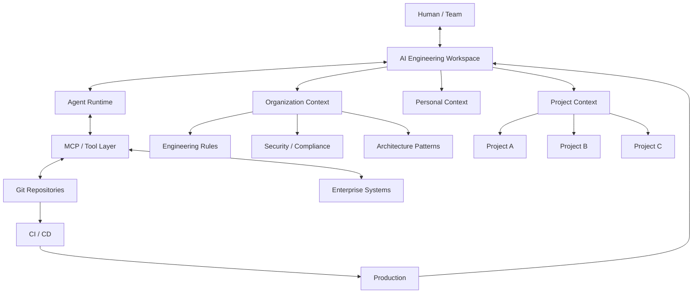

这个图里最重要的不是组件数量，而是关系：

```text
Human
  ↕
Workspace
  ↕
Context
  ↕
Agent
  ↕
MCP
  ↕
Git / Enterprise Systems
  ↕
Runtime / Production
  ↕
Workspace
```

最终形成一个持续反馈的工程闭环。

---

# 3. 当前软件工程 VS AI Native 软件工程

## 3.1 当前模式

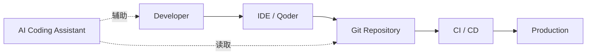

当前模式中：

- 人负责理解系统；
- 人负责把上下文告诉 AI；
- Git 主要负责代码版本；
- AI 是开发辅助工具。

---

## 3.2 AI Native 模式

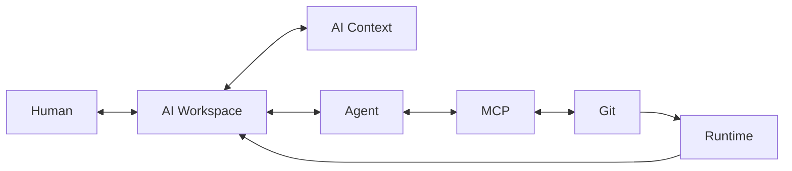

核心变化：

> AI 不再只是“读取代码”，而是进入软件工程系统本身。

---

# 4. 第一阶段：单项目 AI Context

这是当前最重要、最现实的起点。

一个普通项目：

```text
trading-os/

├── src/
├── docs/
├── README.md
└── CLAUDE.md
```

演进为：

```text
trading-os/

├── src/
├── docs/
│
├── .ai/
│   ├── README.md
│   ├── architecture.md
│   ├── domain.md
│   ├── decisions.md
│   ├── memory.md
│   ├── rules.md
│   └── dependency.yaml
│
├── CLAUDE.md
└── README.md
```

---

## 4.1 单项目 Context 数据流

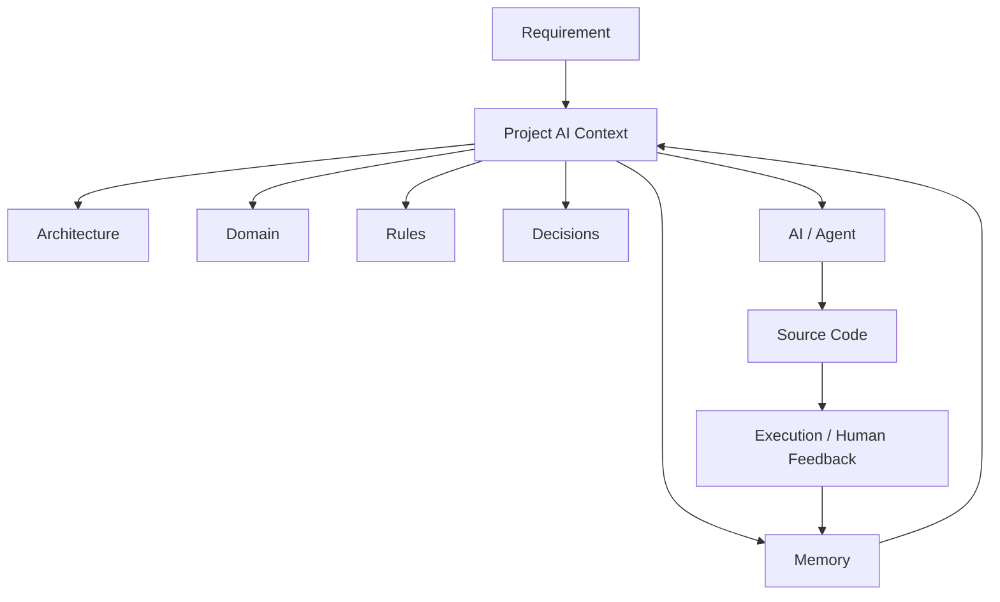

关键不是“把文档放到 `.ai`”。

真正目标是：

> **让项目自身携带足够的信息，使 AI 可以理解项目为什么存在、如何运行、哪些事情可以改变、哪些事情不能改变。**

---

# 5. Git 如何管理 AI Context

这是从单项目走向团队共享的关键。

传统 Git：

```text
Git
 |
 +-- Source Code
 +-- Documents
 +-- Configuration
```

AI Native Git：

```text
Git
 |
 +-- Source Code
 +-- Documents
 +-- AI Context
 +-- Decisions
 +-- Project Memory
 +-- Metadata
```

---

## 5.1 Git 管理对象演进

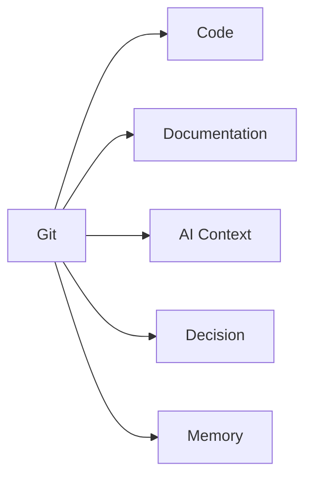

因此：

> Git 不需要被 Workspace 替代。

相反：

> Git 仍然是最重要的版本控制基础设施，只是被管理的软件资产从“代码”扩展为“代码 + AI 可理解上下文”。

---

# 6. 第二阶段：一个 Workspace 管理多个项目

你的 ADAI 实践可以作为这个阶段的真实实验。

目标不是简单创建 Monorepo，而是：

> **让多个独立项目进入同一个 AI 理解空间。**

例如：

```text
adai-workspace/

├── workspace.ai/
│   ├── README.md
│   ├── architecture.md
│   ├── technology.md
│   ├── engineering-rules.md
│   └── project-map.yaml
│
├── adai-app/
│   ├── .ai/
│   └── ...
│
├── trading-os/
│   ├── .ai/
│   └── ...
│
├── life-os/
│   ├── .ai/
│   └── ...
│
└── health-os/
    ├── .ai/
    └── ...
```

---

## 6.1 Workspace 与 Project 的关系

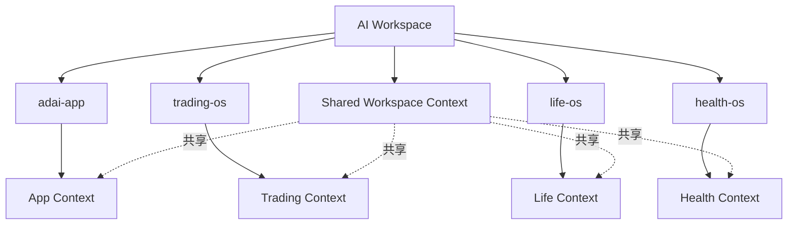

这里出现一个重要概念：

```text
Workspace Context
        +
Project Context
```

AI 在处理任务时，需要同时理解两者。

---

# 7. 跨项目沟通

真正有价值的地方，是项目之间开始产生关系。

例如：

```text
用户输入
   ↓
adai-app
   ↓
Trading Domain
   ↓
trading-os
   ↓
Memory
```

可以表达为：

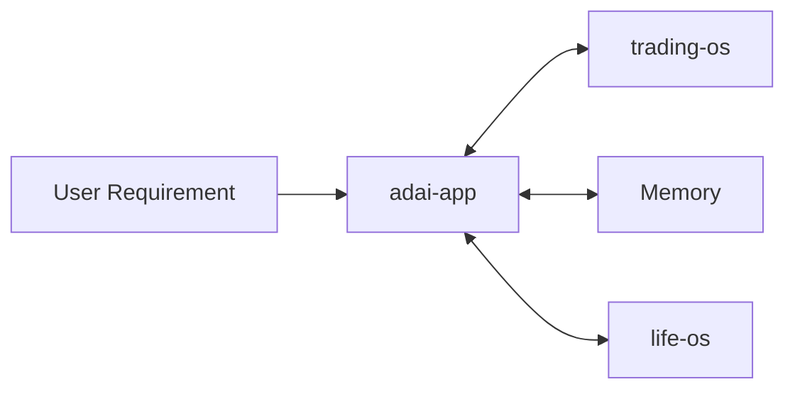

这时候 Workspace 不只是“多个目录”。

它开始成为：

> **项目关系和上下文关系的协调空间。**

---

# 8. 团队共享：Git + Workspace

企业环境中，不应该要求所有人共享同一个 AI Agent。

更合理的是共享：

```text
AI Context Assets
```

例如：

```text
company-ai-workspace/

├── organization/
│   ├── engineering-rules.md
│   ├── security-rules.md
│   ├── architecture-patterns.md
│   └── technology-stack.md
│
├── projects/
│   ├── project-a/
│   ├── project-b/
│   └── project-c/
│
└── teams/
    ├── backend/
    ├── frontend/
    └── qa/
```

---

## 8.1 企业共享模型

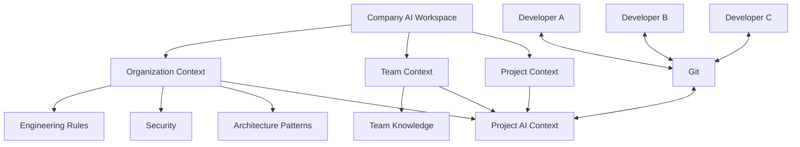

---

# 9. Qoder 在企业中的位置

当前企业已经有 Qoder，这并不与上述方向冲突。

可以把 Qoder 看作：

```text
AI Development Interface
```

而 Workspace 是：

```text
AI Engineering Context
```

关系：

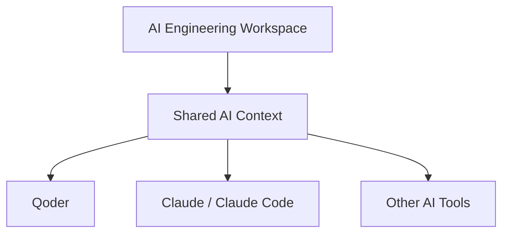

因此未来即使企业继续使用 Qoder：

> Qoder 仍然可以是主要 AI 开发入口。

Workspace 不一定取代 Qoder。

它解决的是更上层的问题：

> **AI 在不同工具之间如何获得一致的项目和组织上下文。**

---

# 10. Agent 到底在哪里

Agent 不应该成为整个体系的中心。

它的位置是：

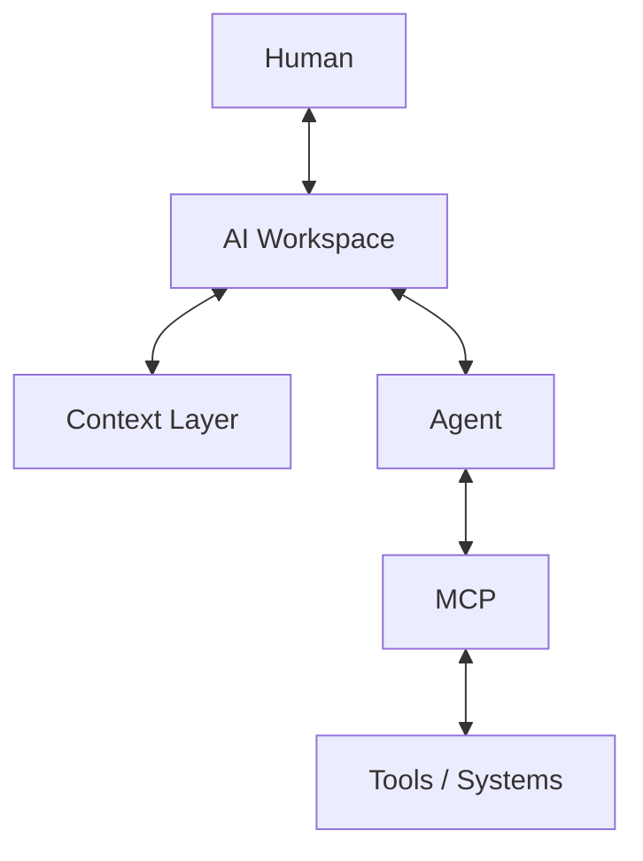

职责边界：

| 层 | 核心职责 |
|---|---|
| Human | 目标、判断、反馈 |
| Workspace | 协调、上下文、项目关系 |
| Context | 项目知识、规则、历史 |
| Agent | 分析、规划、执行 |
| MCP | 工具连接与能力调用 |
| Git | 版本与协作 |
| Runtime | 实际运行与反馈 |

---

# 11. MCP 到底在哪里

MCP 更像“连接协议层”。

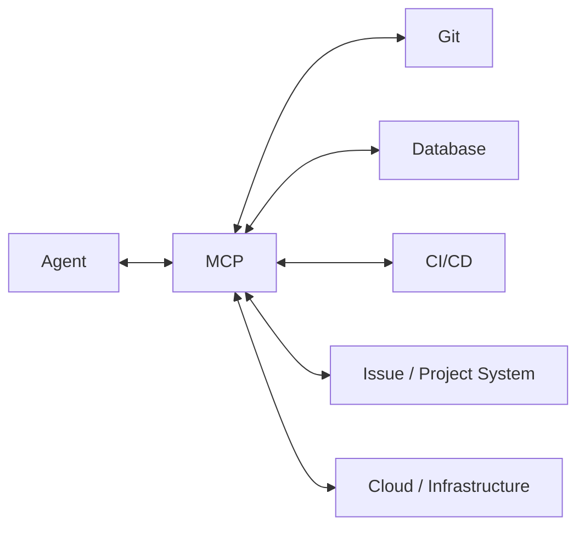

因此：

> Agent 决定“做什么”。

> MCP 负责“怎么连接外部能力”。

这也是为什么当前阶段没有必要先做 MCP。

如果 Context 还没有建立，Agent 即使拥有很多工具，也可能只是：

> 一个会调用很多工具、但并不真正理解项目的执行器。

---

# 12. 完整未来数据流：真正的双向闭环

这是整个架构最重要的一张图。

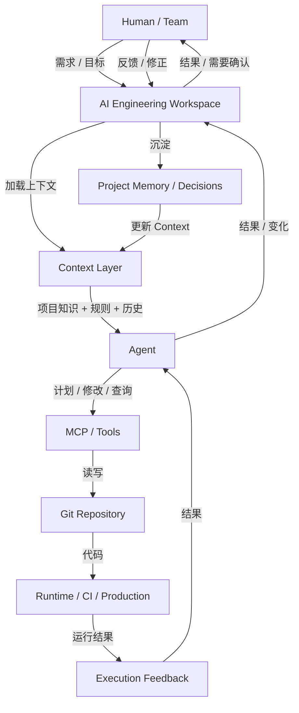

这里真正形成的是：

```text
              ┌───────────────┐
              │     Human     │
              └───────┬───────┘
                      │
                Goal / Feedback
                      │
                      ↓
              ┌───────────────┐
              │   Workspace   │
              └───────┬───────┘
                      │
                 Context
                      │
                      ↓
              ┌───────────────┐
              │     Agent     │
              └───────┬───────┘
                      │
                   Tools
                      │
                      ↓
              ┌───────────────┐
              │ Git / Runtime │
              └───────┬───────┘
                      │
                   Result
                      │
                      ↓
              ┌───────────────┐
              │ Memory/Context│
              └───────┬───────┘
                      │
                      └──────────→ 下一次任务
```

最终不是：

```text
Human → AI → Code
```

而是：

```text
Human
  ↓
Context
  ↓
Agent
  ↓
Tools / Code
  ↓
Runtime
  ↓
Feedback
  ↓
Memory
  ↓
Context
  ↓
下一次任务
```

这就是 AI Native Software Engineering 的核心闭环。

---

# 13. Git 在双向闭环中的位置

Git 仍然是基础设施。

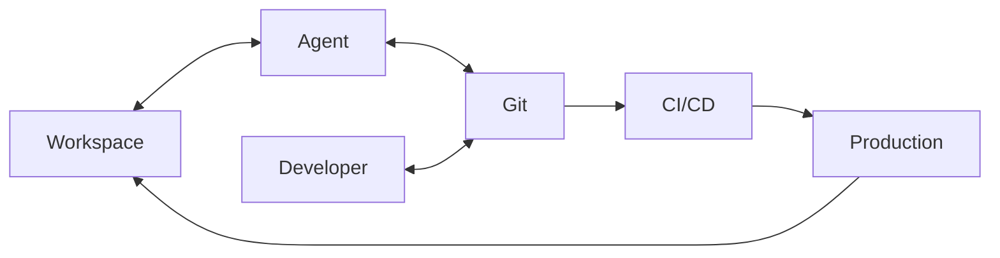

未来 Git 不需要被重新发明。

真正发生变化的是：

```text
Git Repository
=
Code
+
Docs
+
Context
+
Decisions
+
History
```

---

# 14. 从单项目到企业级的演进

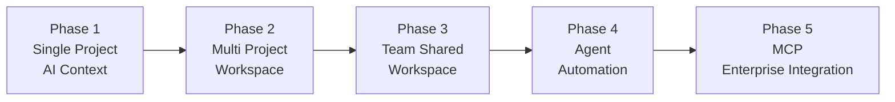

---

# 15. 每一个阶段解决什么问题

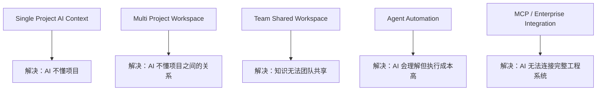

---

# 16. 当前真正应该做什么

当前阶段不需要先做：

```text
Agent Platform
MCP Server
Multi-Agent
Vector Database
```

而应该验证：

```text
Project
  ↓
AI Context
  ↓
AI Understanding
  ↓
AI Development
  ↓
Context Update
```

最小可行验证：

1. 选择一个真实项目；
2. 建立 `.ai/`；
3. 明确项目边界；
4. 明确架构；
5. 明确关键决策；
6. 让 Claude / Qoder 使用这些 Context；
7. 观察 AI 修改代码的质量；
8. 记录 AI 不理解的地方；
9. 把这些问题沉淀回 Context；
10. 形成 Context Evolution。

---

# 17. 核心判断

整个体系可以浓缩为：

```text
Human
定义目标

Workspace
协调项目与上下文

Context
让 AI 理解软件

Agent
执行软件变化

MCP
连接外部世界

Git
记录软件变化

Runtime
产生真实反馈

Memory
沉淀新的认知
```

最终：

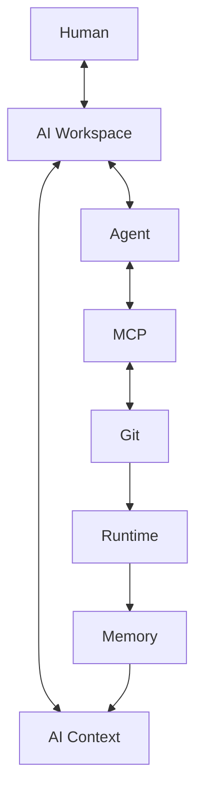

> **AI Native Software Engineering 的核心，不是让 AI 更会写代码，而是让软件工程第一次拥有一个 AI 可以持续理解、参与和学习的上下文系统。**

---

# 18. 后续设计方向

下一阶段可以继续拆成三个实际设计：

### A. Single Project AI Context Specification

定义：

- `.ai/` 结构
- 文件边界
- YAML Metadata
- Context 加载规则
- Memory 更新规则
- Claude / Qoder 使用方式

### B. Multi Project AI Workspace Specification

定义：

- Workspace 目录
- Project Registry
- Project Relationship
- Shared Context
- Cross-project Communication
- Git 管理方式

### C. Team AI Workspace Specification

定义：

- Organization Context
- Team Context
- Project Context
- Git 权限
- Context Review
- Knowledge / Decision 沉淀
- Qoder / Claude 等不同 AI 工具接入

Agent / MCP 可以在上述基础稳定之后再进入设计。

---

# Appendix：核心概念关系

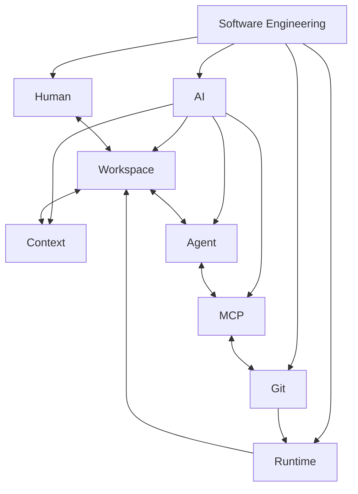

最终抽象：

```text
Workspace = 协调空间
Context   = 理解基础
Agent     = 执行主体
MCP       = 能力连接
Git       = 版本与协作
Runtime   = 现实反馈
Human     = 目标与判断
```
